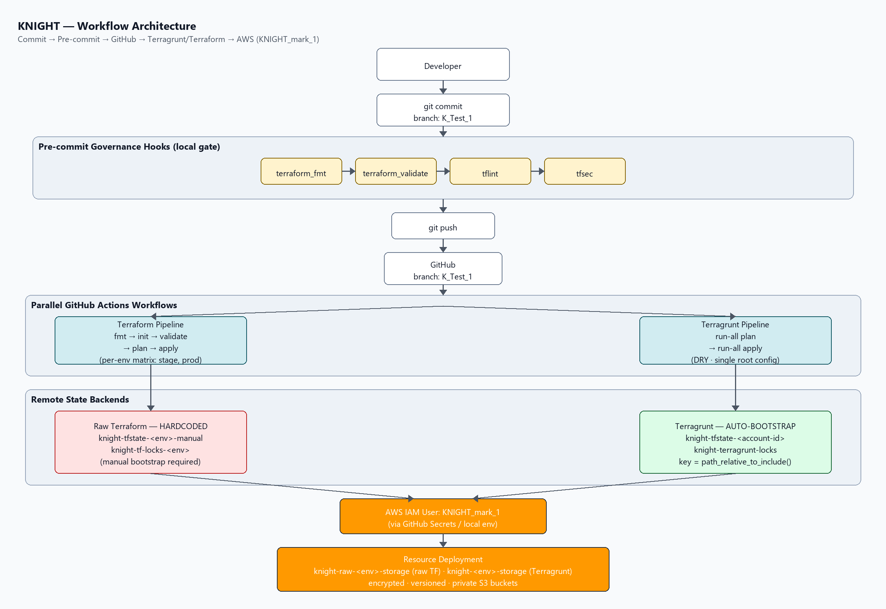
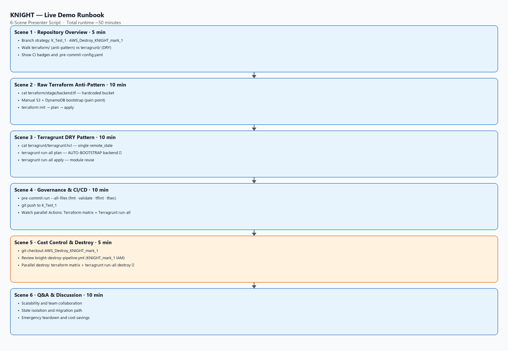

# KNIGHT

> **K**olappan · **N**ishit · **I**nfrastructure · **G**itHub · **H**ybrid · **T**erraform

[](https://github.com/Kureti-Venkat-Nishit-Pvt/KNIGHT/actions/workflows/terraform-pipeline.yml?query=branch%3AK_Test_1)
[](https://github.com/Kureti-Venkat-Nishit-Pvt/KNIGHT/actions/workflows/terragrunt-pipeline.yml?query=branch%3AK_Test_1)

---

## What is KNIGHT?

KNIGHT is a small, hands-on demonstration of **why teams adopt Terragrunt on top of
plain Terraform**. It ships the *same* piece of infrastructure — an AWS S3 storage
bucket, deployed to a `stage` and a `prod` environment — in two different ways so you
can compare them side by side:

| Approach | Folder | The idea |
|----------|--------|----------|
| **Raw Terraform** | [`terraform/`](terraform/) | Each environment is its own directory with a **hardcoded, copy-pasted** `backend.tf`. Simple, but repetitive and error-prone. This is the "anti-pattern". |
| **Terragrunt (DRY)** | [`terragrunt/`](terragrunt/) | A **single root** `terragrunt.hcl` defines the backend once. Every environment inherits it with an `include` block, and the state backend is **auto-provisioned** on first run. |

Both approaches are wired into their own GitHub Actions pipeline (see the badges above). So the
two can be applied to the same account without clashing, they use **distinct** bucket names:
raw Terraform creates `knight-raw-<env>-storage`, Terragrunt creates `knight-<env>-storage`.

## Architecture & CI/CD flow

The end-to-end flow of Project KNIGHT — from a local commit through the governance
gates, into GitHub, and out to AWS via the `KNIGHT_mark_1` IAM user:



## Live demo runbook

Six-scene presenter script for the KNIGHT walkthrough (~50 minutes total):



> Regenerate these diagrams locally: `python scripts/render-mermaid-diagrams.py`

## Repository layout

```
.
├── terraform/                     # Zone A — raw Terraform (the anti-pattern)
│   ├── stage/                     #   backend.tf is hardcoded here...
│   │   ├── main.tf                #   S3 bucket (encrypted, versioned, private)
│   │   ├── variables.tf
│   │   ├── outputs.tf
│   │   └── backend.tf             #   ...and copy-pasted into prod/ below
│   └── prod/
│       ├── main.tf
│       ├── variables.tf
│       ├── outputs.tf
│       └── backend.tf             #   same block, duplicated (the smell)
│
├── terragrunt/                    # Zone A — Terragrunt (DRY)
│   ├── terragrunt.hcl             #   root: remote_state + provider, defined ONCE
│   ├── stage/terragrunt.hcl       #   include "root" → inherits everything
│   ├── prod/terragrunt.hcl        #   include "root" → inherits everything
│   └── modules/s3-bucket/         #   one reusable module for every environment
│
├── .github/workflows/
│   ├── terraform-pipeline.yml     #   plan + apply per environment (K_Test_1 only)
│   ├── terragrunt-pipeline.yml    #   run-all plan + run-all apply (K_Test_1 only)
│   └── knight-destroy-pipeline.yml #  parallel destroy (AWS_Destroy_KNIGHT_mark_1 only)
│
├── .pre-commit-config.yaml        # terraform_fmt, terraform_validate, tflint, tfsec
├── scripts/                       #   local PNG diagram renderer
├── workflow_architecture.png      #   CI/CD flow diagram
├── live_demo_runbook.png          #   6-scene presenter runbook
└── README.md
```

## The core idea: DRY backends

**Raw Terraform** forces you to hardcode the backend in every directory:

```hcl
# terraform/stage/backend.tf   AND   terraform/prod/backend.tf (duplicated!)
terraform {
  backend "s3" {
    bucket         = "knight-tfstate-stage-manual"
    key            = "stage/s3-bucket/terraform.tfstate"
    region         = "us-east-1"
    dynamodb_table = "knight-tf-locks-stage"
  }
}
```

You must also **manually** create that bucket and lock table before `terraform init` works.

**Terragrunt** defines it once and derives each environment's state path dynamically:

```hcl
# terragrunt/terragrunt.hcl  (the ONLY place the backend is declared)
remote_state {
  backend = "s3"
  config = {
    bucket = "knight-tfstate-${get_aws_account_id()}"
    key    = "${path_relative_to_include()}/terraform.tfstate"   # → stage/... or prod/...
    region = "us-east-1"
    encrypt        = true
    dynamodb_table = "knight-terragrunt-locks"
  }
}
```

`path_relative_to_include()` expands to the child directory name, so `stage` and `prod`
get isolated state keys automatically — and Terragrunt **creates the S3 bucket and lock
table for you** on the first run.

## Prerequisites

**AWS**
- An AWS account and an IAM user (this project uses **`KNIGHT_mark_1`**) with permissions
  for S3 and DynamoDB (to create/manage state) and to create the demo S3 buckets.
- Credentials exported locally, or stored as the GitHub Actions secrets
  `AWS_ACCESS_KEY_ID` and `AWS_SECRET_ACCESS_KEY`:

  ```bash
  export AWS_ACCESS_KEY_ID="..."
  export AWS_SECRET_ACCESS_KEY="..."
  export AWS_DEFAULT_REGION="us-east-1"
  ```

**Local CLI tools**

| Tool | Version | Install |
|------|---------|---------|
| Terraform | ≥ 1.5.0 | https://developer.hashicorp.com/terraform/install |
| Terragrunt | ≥ 0.50.0 | https://terragrunt.gruntwork.io/docs/getting-started/install/ |
| pre-commit | latest | `pip install pre-commit` |
| tflint | latest | https://github.com/terraform-linters/tflint |
| tfsec | latest | https://github.com/aquasecurity/tfsec |

Then enable the git hooks:

```bash
pre-commit install
```

## Branching layout

All work for this demo lives on the **`K_Test_1`** branch. Both CI pipelines are
configured to trigger **only** on pushes and pull requests targeting `K_Test_1`, so the
status badges above always reflect that branch.

## Workflow triggers (step by step)

### Local

```bash
# Format & validate the raw Terraform
terraform fmt -recursive
cd terraform/stage && terraform init -backend=false && terraform validate && cd -
cd terraform/prod  && terraform init -backend=false && terraform validate && cd -

# Dry-run every environment through Terragrunt (auto-bootstraps the backend)
cd terragrunt && terragrunt run-all plan && cd -

# Run every linter / security scan
pre-commit run --all-files
```
---
## Terraform Workflow
```mermaid

flowchart TD
    A["Developer writes Terraform code"] --> B["Run terraform fmt"]
    B --> C["Run terraform validate"]
    C --> D["Run TFLint"]
    D --> E["Run tfsec"]
    E --> F{"Issues found?"}
    F -->|"Yes"| G["Fix Terraform code"]
    G --> B
    F -->|"No"| H["Run terraform plan"]
    H --> I["Review planned changes"]
    I --> J["Run terraform apply"]

  ```

---

# What Is TFLint?

> TFlint is a linter for Terraform.

> A linter checks your code for:

1. Possible errors
2. Bad practices
3. Deprecated syntax
4. Provider-specific mistakes
5. Invalid or unsupported configuration values
6. Custom team rules

> It does not usually check deep security risks. That is where tools like tfsec are useful.

---

---

### CI/CD (GitHub Actions)

1. Push commits to `K_Test_1` (or open a PR into it).
2. **Terraform Pipeline** — runs `fmt` → `init` → `validate` → `plan` for `stage` and
   `prod`. On direct pushes it also runs `apply`.
3. **Terragrunt Pipeline** — runs `terragrunt run-all plan` across all environments. On
   direct pushes it runs `terragrunt run-all apply`.
4. Watch progress in the **Actions** tab, or via the badges at the top of this README.

> Pull requests run **plan only** — `apply` is gated behind `push` events for safety.
