# ⚔️ KNIGHT

> **K**olappan · **N**ishit · **I**nfrastructure · **G**itHub · **H**ybrid · **T**erraform

---

# 🚀 Project Badges


---
# Pipeline Status

[](https://github.com/Kureti-Venkat-Nishit-Pvt/KNIGHT/actions/workflows/terraform-pipeline.yml?query=branch%3AK_Test_2)
[](https://github.com/Kureti-Venkat-Nishit-Pvt/KNIGHT/actions/workflows/terragrunt-pipeline.yml?query=branch%3AK_Test_2)

---

# 📖 What is KNIGHT?

KNIGHT is a hands-on **Infrastructure as Code (IaC)** demonstration project designed to showcase **why modern DevOps teams adopt Terragrunt on top of Terraform**.

The repository intentionally implements the **same AWS infrastructure twice**, allowing engineers to compare the traditional Terraform approach with the Terragrunt DRY approach.

Instead of simply explaining the concepts, KNIGHT demonstrates them side-by-side through real infrastructure deployments, GitHub Actions pipelines, and security validation.

---

# 🎯 Project Objectives

- ✅ Learn Terraform Fundamentals
- ✅ Understand Infrastructure as Code
- ✅ Compare Terraform vs Terragrunt
- ✅ Understand Remote State Management
- ✅ Build Reusable Infrastructure Modules
- ✅ Learn GitHub Actions CI/CD
- ✅ Implement Security & Quality Gates
- ✅ Deploy AWS Infrastructure Automatically

---

# ⚖️ Terraform vs Terragrunt

| Feature | 🌍 Terraform | 🚀 Terragrunt |
|----------|--------------|---------------|
| Backend Configuration | Duplicate | Centralized |
| DRY Principle | ❌ | ✅ |
| Auto Backend Creation | ❌ | ✅ |
| Environment Management | Manual | Automatic |
| State Key Generation | Manual | Automatic |
| Module Reusability | ✅ | ✅ |
| GitHub Actions Support | ✅ | ✅ |
| Enterprise Scalability | ⭐⭐⭐ | ⭐⭐⭐⭐⭐ |

---

# 🏗️ Overall Architecture

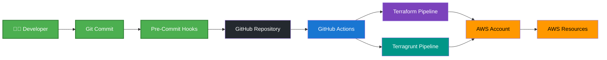

---

# 📂 Repository Layout

```mermaid
flowchart TB

ROOT["📁 KNIGHT Repository"]

ROOT --> TF["📁 terraform"]

ROOT --> TG["📁 terragrunt"]

ROOT --> GH["📁 .github"]

ROOT --> DOCS["📁 docs"]

ROOT --> CFG["⚙️ Configuration Files"]

%% -----------------------------
%% Terraform Structure
%% -----------------------------

TF --> TF_STAGE["📁 stage"]

TF --> TF_PROD["📁 prod"]

TF_STAGE --> TF_MAIN["main.tf"]

TF_STAGE --> TF_VAR["variables.tf"]

TF_STAGE --> TF_OUT["outputs.tf"]

TF_STAGE --> TF_BACK["backend.tf"]

TF_PROD --> PROD_MAIN["main.tf"]

TF_PROD --> PROD_VAR["variables.tf"]

TF_PROD --> PROD_OUT["outputs.tf"]

TF_PROD --> PROD_BACK["backend.tf"]

%% -----------------------------
%% Terragrunt Structure
%% -----------------------------

TG --> ROOT_HCL["terragrunt.hcl"]

TG --> MODULES["📁 modules"]

TG --> TG_STAGE["📁 stage"]

TG --> TG_PROD["📁 prod"]

MODULES --> MOD_S3["📁 s3-bucket"]

MOD_S3 --> MOD_MAIN["main.tf"]

MOD_S3 --> MOD_VAR["variables.tf"]

MOD_S3 --> MOD_OUT["outputs.tf"]

MOD_S3 --> MOD_VER["versions.tf"]

%% -----------------------------
%% GitHub Workflows
%% -----------------------------

GH --> TF_PIPE["terraform-pipeline.yml"]

GH --> TG_PIPE["terragrunt-pipeline.yml"]

%% -----------------------------
%% Documentation
%% -----------------------------

DOCS --> DOC1["Terraform Guide"]

DOCS --> DOC2["Terragrunt Guide"]

DOCS --> DOC3["Comparison Matrix"]

%% -----------------------------
%% Configuration Files
%% -----------------------------

CFG --> PRE[".pre-commit-config.yaml"]

CFG --> README["README.md"]

%% -----------------------------
%% Colors
%% -----------------------------

classDef terraform fill:#7B42BC,color:white,stroke:#512DA8

classDef terragrunt fill:#009688,color:white,stroke:#00695C

classDef github fill:#24292F,color:white

classDef docs fill:#2196F3,color:white

classDef config fill:#607D8B,color:white

class TF,TF_STAGE,TF_PROD,TF_MAIN,TF_VAR,TF_OUT,TF_BACK,PROD_MAIN,PROD_VAR,PROD_OUT,PROD_BACK terraform

class TG,ROOT_HCL,MODULES,TG_STAGE,TG_PROD,MOD_S3,MOD_MAIN,MOD_VAR,MOD_OUT,MOD_VER terragrunt

class GH,TF_PIPE,TG_PIPE github

class DOCS,DOC1,DOC2,DOC3 docs

class CFG,PRE,README config
```

---

# 📂 Repository Layout

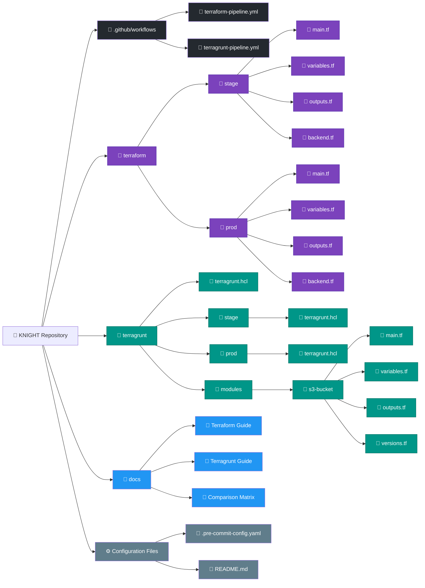

---
# 💡 The Core Idea — DRY Backends

One of the biggest challenges with traditional Terraform is backend duplication.

Every environment contains its own `backend.tf`. As environments grow, maintaining identical backend configurations becomes repetitive and error-prone.

Terragrunt eliminates this duplication by defining the backend once and allowing every environment to inherit it automatically.

---

# 🌍 Traditional Terraform

## Backend Configuration

Each environment owns an independent backend configuration.

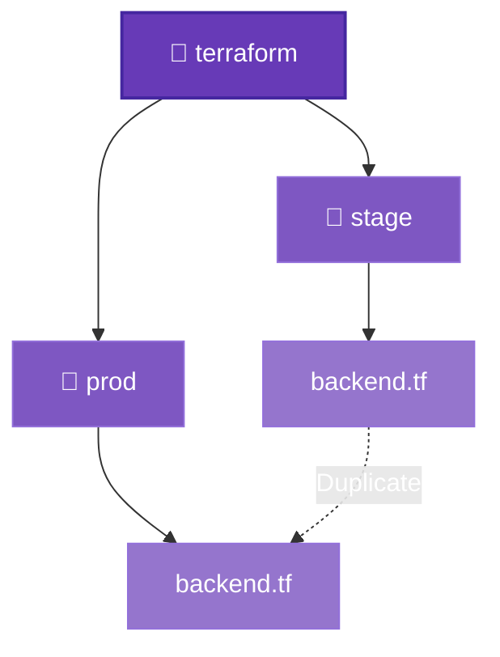

### Example

```hcl
terraform {
  backend "s3" {
    bucket         = "knight-tfstate-stage"
    key            = "stage/terraform.tfstate"
    region         = "us-east-1"
    dynamodb_table = "knight-lock-stage"
  }
}
```

### Challenges

- ❌ Duplicate backend configuration
- ❌ Manual state management
- ❌ Repeated maintenance
- ❌ Configuration drift
- ❌ Higher operational overhead

---

# 🚀 Terragrunt

## Backend Configuration

Terragrunt centralizes backend configuration into a single root file.

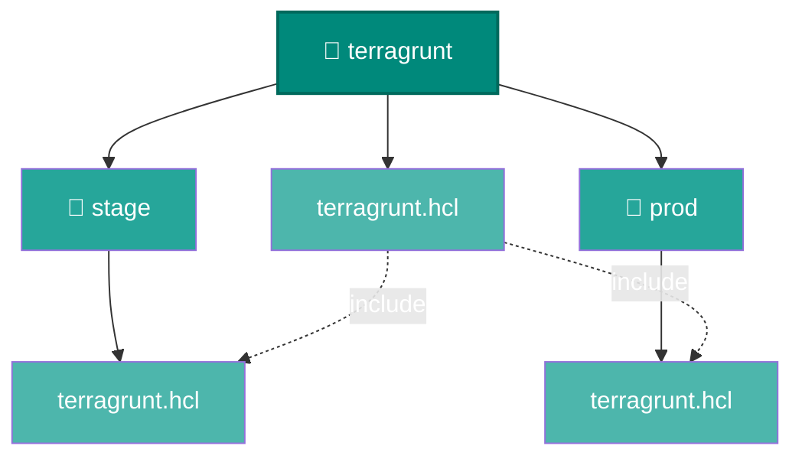

### Example

```hcl
remote_state {

  backend = "s3"

  config = {

    bucket = "knight-tfstate-${get_aws_account_id()}"

    key = "${path_relative_to_include()}/terraform.tfstate"

    region = "us-east-1"

    encrypt = true

    dynamodb_table = "knight-locks"

  }

}
```

### Advantages

- ✅ Backend defined once
- ✅ Automatic inheritance
- ✅ Dynamic state paths
- ✅ DRY architecture
- ✅ Easier maintenance
- ✅ Enterprise scalability

---

# 📊 Terraform vs Terragrunt

| Feature | 🟣 Terraform | 🟢 Terragrunt |
|----------|--------------|---------------|
| 🌍 Backend Configuration | Duplicate `backend.tf` files | Centralized backend configuration |
| 🔑 State Management | Manual state keys | Automatic state key generation |
| 📂 Configuration | Repeated across environments | Inherited using `include` |
| ♻️ Code Reuse | Limited | High (DRY principle) |
| 🚀 Deployment | Per environment | `run-all` across environments |
| 🏗️ Module Management | Manual | Built-in dependency management |
| 📈 Scalability | Good | Excellent for large infrastructures |
| 🔧 Maintenance | Higher | Lower |
| 👨‍💻 Learning Curve | Easier | Slightly steeper |
| 🏢 Recommended For | Small to medium projects | Medium to enterprise-scale projects |---

# ☁️ AWS Prerequisites

## Required AWS Services


---

## Required GitHub Repository Secrets


---

# 🛠 Required Software


---

# 🔐 AWS Environment Variables

```bash
export AWS_ACCESS_KEY_ID="xxxxxxxxxxxxxxxx"
```
```bash
export AWS_SECRET_ACCESS_KEY="xxxxxxxxxxxxxxxx"
```
```bash
export AWS_DEFAULT_REGION="us-east-1"
```

---

# 🔧 Install Git Hooks

Install the local Git hooks before committing any code.

```bash
pre-commit install
```

Once installed, every commit automatically executes:

- ✅ Terraform Format
- ✅ Terraform Validate
- ✅ TFLint
- ✅ tfsec
- ✅ Checkov
- ✅ Terrascan
- ✅ terraform-docs

This ensures every commit passes the repository quality gates before reaching GitHub.

---

# 🖥️ Local Development Workflow

Every infrastructure change begins on your local machine.

Before any code reaches GitHub, KNIGHT enforces multiple validation, formatting, security, and documentation checks to ensure high-quality Infrastructure as Code.


---

# 🚀 Local Terraform Workflow

The traditional Terraform workflow is executed individually for each environment.


---

# 🔒 Local Quality Gates

Every commit passes through multiple quality checks before reaching GitHub.

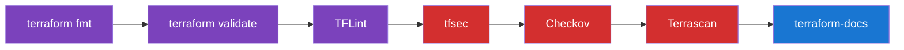

---

# 🪝 Git Pre-Commit Hooks

KNIGHT automatically executes validation checks before allowing a commit.

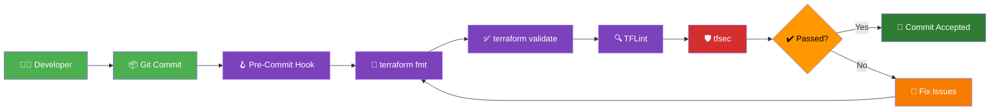

---

# 📊 Tool Execution Order

The following tools execute sequentially during local validation.

| Category          | Tool               | Purpose                                       |
| ----------------- | ------------------ | --------------------------------------------- |
| 📝 Formatting     | terraform fmt      | Standardizes Terraform code formatting        |
| ⚙️ Initialization | terraform init     | Initializes providers and backend             |
| ✅ Validation      | terraform validate | Validates Terraform configuration             |
| 🔍 Linting        | TFLint             | Enforces Terraform best practices             |
| 🛡️ Security      | tfsec              | Scans for Terraform security vulnerabilities  |
| 🔒 Policy         | Checkov            | Policy-as-Code and compliance validation      |
| 🔐 Compliance     | Terrascan          | Security, governance, and compliance scanning |
| 📖 Documentation  | terraform-docs     | Automatically generates module documentation  |

---

# 🚀 GitHub Actions CI/CD Workflow

After the local quality gates pass, every push to the **K_Test_2** branch automatically triggers the GitHub Actions pipelines.

The workflow validates the Terraform code, performs security scanning, generates documentation, and deploys the infrastructure to AWS.

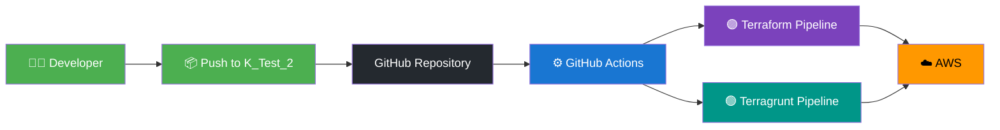

---

# 🟣 Terraform GitHub Actions Pipeline

The Terraform workflow validates each environment independently before deployment.

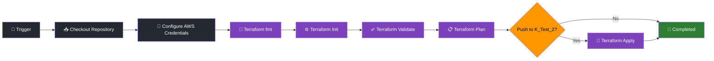
---

# 🔒 Security Validation Pipeline

Every workflow executes a series of security and compliance tools before deployment.

```mermaid
flowchart LR

FMT["📝 terraform fmt"]

VAL["✅ terraform validate"]

LINT["🔍 TFLint"]

TFSEC["🛡️ tfsec"]

CHECKOV["🔒 Checkov"]

TERRASCAN["🔐 Terrascan"]

DOCS["📖 terraform-docs"]

PLAN["📊 Terraform Plan"]

APPLY["🚀 Deployment"]

FMT --> VAL

VAL --> LINT

LINT --> TFSEC

TFSEC --> CHECKOV

CHECKOV --> TERRASCAN

TERRASCAN --> DOCS

DOCS --> PLAN

PLAN --> APPLY

classDef terraform fill:#7B42BC,color:white

classDef security fill:#D32F2F,color:white

classDef docs fill:#1976D2,color:white

classDef deploy fill:#2E7D32,color:white

class FMT,VAL,LINT terraform

class TFSEC,CHECKOV,TERRASCAN security

class DOCS docs

class PLAN,APPLY deploy
```

---

# 📦 Complete CI/CD Flow

The complete KNIGHT automation workflow.


---

# ☁️ AWS Deployment Architecture

KNIGHT uses **GitHub Actions**, **Terraform**, and **Terragrunt** to provision and manage AWS infrastructure using a secure remote backend.

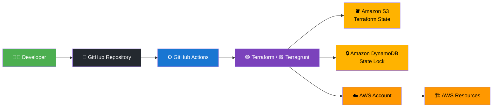

---

# 🌎 End-to-End KNIGHT Workflow

The following diagram illustrates the complete Infrastructure-as-Code lifecycle from development to deployment.


---

# 📋 Repository Highlights


---

# 📈 Future Roadmap

| Status | Feature |
|--------|---------|
| ⏳ | Multi-Region AWS Deployment |
| ⏳ | Multi-Account AWS Support |
| ⏳ | GitHub OIDC Authentication |
| ⏳ | Automated Cost Estimation |
| ⏳ | Drift Detection |
| ⏳ | Infrastructure Testing with Terratest |
| ⏳ | Infracost Integration |
| ⏳ | AWS Well-Architected Best Practices |
| ⏳ | Reusable Enterprise Modules |
| ⏳ | Complete GitHub Actions Reusable Workflows |

---

# 📜 License

This project is licensed under the **MIT License**.

---

# 👨‍💻 Author

**Kureti Venkat Nishit**

Cloud • DevOps • GitHub Actions • Terraform • Terragrunt • AWS

---

<div align="center">

## ⭐ If you found this repository helpful, please consider giving it a Star!

**Happy Learning and Happy Automating! 🚀**

</div>
