# 🚀 Local Terraform & IaC Quality Gate Demo


---

# 📖 Overview

This guide provides a **step-by-step local demonstration** of the Terraform workflow and essential Infrastructure as Code (IaC) quality tools.

The objective is to understand how to:

- Format Terraform code
- Initialize a Terraform working directory
- Validate Terraform configuration
- Generate execution plans
- Deploy infrastructure
- Destroy infrastructure
- Scan Terraform code for security issues
- Enforce organizational policies
- Generate documentation
- Automate quality checks using Pre-Commit Hooks

---

# 📁 Local Demo Project Structure

```text
terraform-local-demo/
│
├── main.tf
└── hello.txt        (Created after terraform apply)
```

---

# 🛠️ Setup

Create a new folder and add the following **main.tf** file.

## main.tf

```hcl
terraform {
  required_version = ">= 1.6"

  required_providers {
    local = {
      source  = "hashicorp/local"
      version = "~> 2.5"
    }
  }
}

provider "local" {}

resource "local_file" "demo_file" {
  filename = "hello.txt"
  content  = "Hello from Terraform!"
}
```

---

# 📌 Terraform Local Workflow

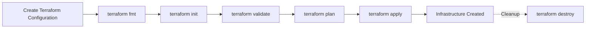

---

# 1️⃣ terraform fmt


## Overview

| Question | Answer |
|----------|--------|
| **What is it?** | Formats Terraform configuration files according to HashiCorp's standard formatting rules. |
| **What is it used for?** | Ensures consistent formatting across Terraform files. |
| **When do we use it?** | Before validation, planning, or committing code. |
| **Why are we implementing it?** | To maintain consistent coding standards and improve readability across the team. |

---

## Commands & Variations

| Purpose | Command |
|---------|---------|
| Format current directory | `terraform fmt` |
| Format recursively | `terraform fmt -recursive` |
| Check formatting only | `terraform fmt -check` |
| Show formatting differences | `terraform fmt -diff` |

---

## Sample Output

```text
main.tf
variables.tf
outputs.tf
```

---

# 2️⃣ terraform init


## Overview

| Question | Answer |
|----------|--------|
| **What is it?** | Initializes the Terraform working directory. |
| **What is it used for?** | Downloads providers, modules, and configures the backend. |
| **When do we use it?** | Before running any Terraform operation. |
| **Why are we implementing it?** | To prepare the working directory and install all required dependencies. |

---

## Initialization Workflow

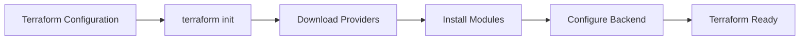

---

## Commands & Variations

| Purpose | Command |
|---------|---------|
| Initialize Terraform | `terraform init` |
| Upgrade providers | `terraform init -upgrade` |
| Reconfigure backend | `terraform init -reconfigure` |
| Disable backend initialization | `terraform init -backend=false` |

---

## Sample Output

```text
Initializing the backend...

Initializing provider plugins...

Terraform has been successfully initialized!
```

---

# 3️⃣ terraform validate


## Overview

| Question | Answer |
|----------|--------|
| **What is it?** | Validates the Terraform configuration for syntax and internal consistency. |
| **What is it used for?** | Detects syntax errors and invalid resource configurations before deployment. |
| **When do we use it?** | After initialization and before planning. |
| **Why are we implementing it?** | To catch configuration issues early before infrastructure changes are attempted. |

---

## Validation Workflow

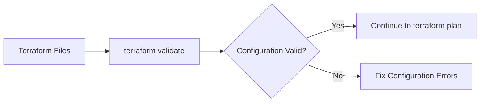

---

## Commands & Variations

| Purpose | Command |
|---------|---------|
| Validate configuration | `terraform validate` |
| Validate and output JSON | `terraform validate -json` |
| Format then validate | `terraform fmt && terraform validate` |

---

## Sample Output

```text
Success!

The configuration is valid.
```

---
# 4️⃣ terraform plan


## Overview

| Question | Answer |
|----------|--------|
| **What is it?** | Generates an execution plan that previews infrastructure changes without modifying any resources. |
| **What is it used for?** | Displays what Terraform intends to create, modify, or destroy based on the current configuration and state. |
| **When do we use it?** | After validation and before applying infrastructure changes. |
| **Why are we implementing it?** | To review and verify infrastructure changes before deployment. |

---

## Planning Workflow

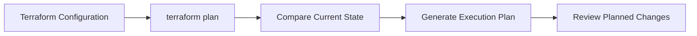

---

## Commands & Variations

| Purpose | Command |
|---------|---------|
| Generate execution plan | `terraform plan` |
| Save execution plan | `terraform plan -out=tfplan` |
| Use variable file | `terraform plan -var-file=dev.tfvars` |
| Target a specific resource | `terraform plan -target=local_file.demo_file` |
| Refresh state before planning | `terraform plan -refresh=true` |

---

## Sample Output

```text
Terraform used the selected providers to generate the following execution plan.

Plan: 1 to add, 0 to change, 0 to destroy.
```

---

# 5️⃣ terraform apply


## Overview

| Question | Answer |
|----------|--------|
| **What is it?** | Executes the Terraform execution plan and creates or updates infrastructure. |
| **What is it used for?** | Deploys the desired infrastructure defined in the Terraform configuration. |
| **When do we use it?** | After reviewing and approving the execution plan. |
| **Why are we implementing it?** | To provision or update infrastructure resources. |

---

## Apply Workflow

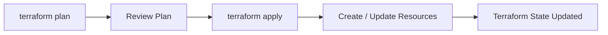

---

## Commands & Variations

| Purpose | Command |
|---------|---------|
| Apply configuration | `terraform apply` |
| Apply without confirmation | `terraform apply -auto-approve` |
| Apply saved execution plan | `terraform apply tfplan` |
| Apply using variable file | `terraform apply -var-file=dev.tfvars` |
| Target a specific resource | `terraform apply -target=local_file.demo_file` |

---

## Sample Output

```text
local_file.demo_file: Creating...

Apply complete!

Resources: 1 added, 0 changed, 0 destroyed.
```

---

# 6️⃣ terraform destroy


## Overview

| Question | Answer |
|----------|--------|
| **What is it?** | Removes infrastructure managed by Terraform. |
| **What is it used for?** | Deletes resources defined in the Terraform state. |
| **When do we use it?** | After completing demos, testing, or when infrastructure is no longer required. |
| **Why are we implementing it?** | To clean up resources and prevent unnecessary cloud costs. |

---

## Destroy Workflow

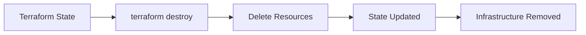

---

## Commands & Variations

| Purpose | Command |
|---------|---------|
| Destroy infrastructure | `terraform destroy` |
| Destroy without confirmation | `terraform destroy -auto-approve` |
| Destroy using variable file | `terraform destroy -var-file=dev.tfvars` |
| Destroy a specific resource | `terraform destroy -target=local_file.demo_file` |
| Refresh state before destroy | `terraform destroy -refresh=true` |

---

## Sample Output

```text
local_file.demo_file: Destroying...

Destroy complete!

Resources: 1 destroyed.
```

---

# 7️⃣ Open Policy Agent (OPA)


## Overview

| Question | Answer |
|----------|--------|
| **What is it?** | Open Policy Agent (OPA) is an open-source Policy as Code engine used to define and evaluate policies using the Rego language. |
| **What is it used for?** | Creates reusable governance, compliance, and security policies that can be applied across infrastructure and applications. |
| **When do we use it?** | After writing Terraform code and before deployment or infrastructure provisioning. |
| **Why are we implementing it?** | To standardize governance rules and automatically enforce organizational compliance requirements. |

---

## OPA Workflow

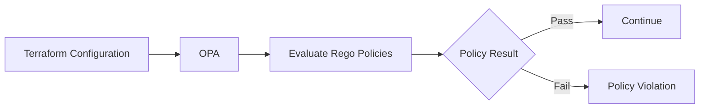

---

## Basic Rego Policy Example

Create the following file:

```text
policy/terraform.rego
```

```rego
package main

deny[msg] {
    input.resource.aws_s3_bucket
    msg = "S3 Buckets are not allowed."
}
```

---

## Commands & Variations

| Purpose | Command |
|---------|---------|
| Evaluate policy using OPA | `opa eval --data policy.rego --input input.json "data.main.deny"` |
| Check OPA version | `opa version` |
| Format Rego policy | `opa fmt policy.rego` |

---

## Sample Output

```text
[
  "S3 Buckets are not allowed."
]
```

---

# 8️⃣ Conftest


## Overview

| Question | Answer |
|----------|--------|
| **What is it?** | Conftest is a command-line tool that uses OPA policies to validate Terraform, Kubernetes, Docker, and other configuration files. |
| **What is it used for?** | Tests Infrastructure as Code against predefined Rego policies before deployment. |
| **When do we use it?** | During local development after Terraform configuration is complete. |
| **Why are we implementing it?** | To automatically detect policy violations before infrastructure changes are deployed. |

---

## Conftest Workflow

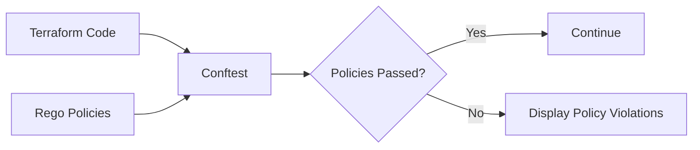

---

## Commands & Variations

| Purpose | Command |
|---------|---------|
| Test a Terraform file | `conftest test main.tf --policy policy/` |
| Test current directory | `conftest test . --policy policy/` |
| Test all namespaces | `conftest test . --policy policy/ --all-namespaces` |
| Display version | `conftest --version` |

---

## Sample Output

```text
FAIL - main.tf - S3 Buckets are not allowed.

1 test, 0 passed, 1 failed
```

---

# 📌 Terraform Lifecycle Summary

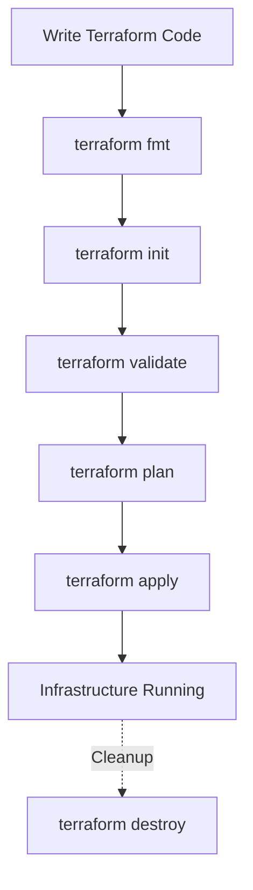

---

# 🛡️ Security Scanning & Static Code Analysis (SCA)

Infrastructure as Code (IaC) should be scanned before deployment to identify security risks, compliance violations, and configuration issues. The following tools analyze Terraform code locally without creating any cloud resources.

---

# 📌 Security Scanning Workflow

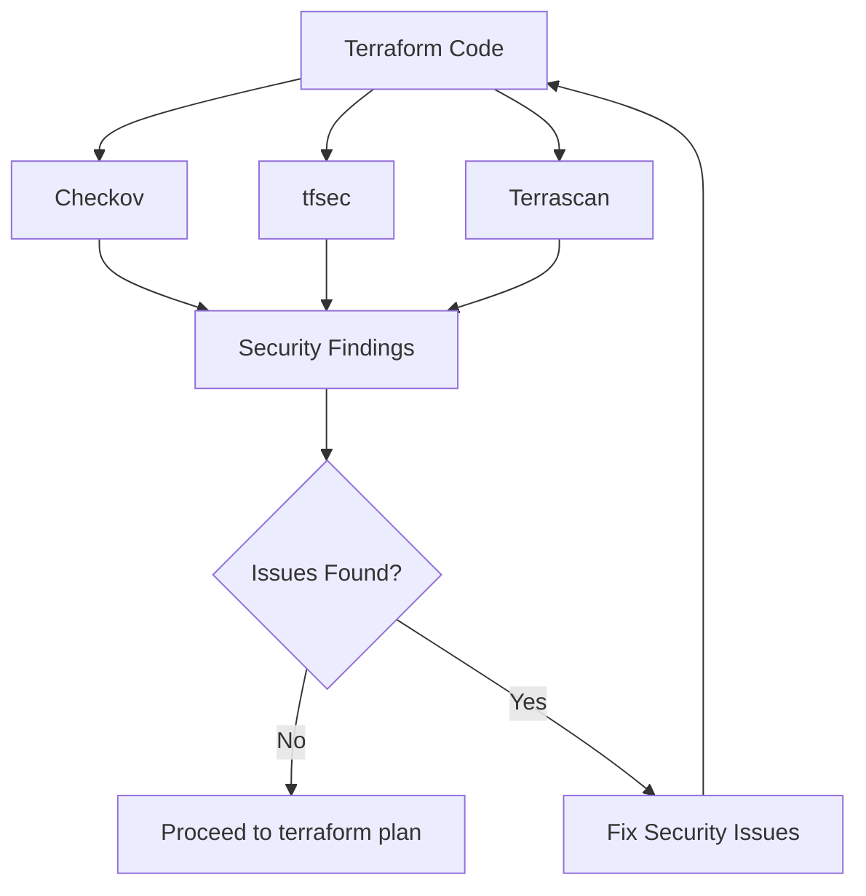

---

# 9️⃣ Checkov


## Overview

| Question | Answer |
|----------|--------|
| **What is it?** | Checkov is an Infrastructure as Code (IaC) security scanner developed by Prisma Cloud. |
| **What is it used for?** | Scans Terraform, CloudFormation, Kubernetes, Dockerfiles, GitHub Actions, and other IaC files for security and compliance issues. |
| **When do we use it?** | After writing Terraform code and before deployment. |
| **Why are we implementing it?** | To identify security misconfigurations and compliance violations before infrastructure is provisioned. |

---

## Checkov Workflow

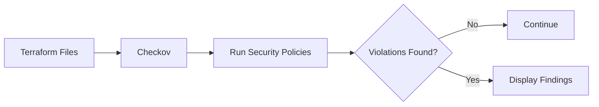

---

## Commands & Variations

| Purpose | Command |
|---------|---------|
| Scan current directory | `checkov -d .` |
| Scan a specific Terraform file | `checkov -f main.tf` |
| Output as JSON | `checkov -d . -o json` |
| Output as CLI | `checkov -d . -o cli` |
| Skip specific checks | `checkov -d . --skip-check CKV_AWS_20` |

---

## Sample Output

```text
Check: CKV_AWS_20

FAILED

Resource:
aws_s3_bucket.demo

Reason:
S3 Bucket versioning is disabled.

Passed checks: 18

Failed checks: 1
```

---

# 🔟 tfsec


## Overview

| Question | Answer |
|----------|--------|
| **What is it?** | tfsec is an open-source Terraform security scanner that detects insecure infrastructure configurations. |
| **What is it used for?** | Identifies Terraform security issues using predefined security rules. |
| **When do we use it?** | Before executing terraform plan or terraform apply. |
| **Why are we implementing it?** | To detect security risks early during Terraform development. |

---

## tfsec Workflow

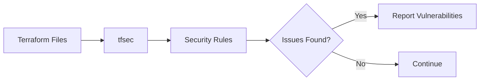

---

## Commands & Variations

| Purpose | Command |
|---------|---------|
| Scan current directory | `tfsec .` |
| Scan specific folder | `tfsec terraform/` |
| Output JSON | `tfsec . --format json` |
| Output SARIF | `tfsec . --format sarif` |
| Exclude a rule | `tfsec . --exclude AWS017` |

---

## Sample Output

```text
Result #1 HIGH

Resource

aws_security_group.demo

Description

Security group allows ingress from 0.0.0.0/0

1 Potential Problem Detected
```

---

# 1️⃣1️⃣ Terrascan


## Overview

| Question | Answer |
|----------|--------|
| **What is it?** | Terrascan is an Infrastructure as Code security and compliance scanner developed by Tenable. |
| **What is it used for?** | Detects Terraform security vulnerabilities, compliance violations, and governance issues using policy-based scanning. |
| **When do we use it?** | Before infrastructure deployment and policy validation. |
| **Why are we implementing it?** | To ensure Terraform configurations comply with organizational and regulatory requirements. |

---

## Terrascan Workflow

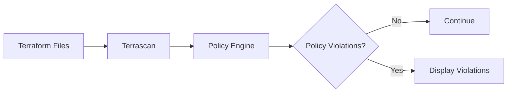

---

## Commands & Variations

| Purpose | Command |
|---------|---------|
| Scan current directory | `terrascan scan` |
| Scan Terraform directory | `terrascan scan -d .` |
| Scan specific file | `terrascan scan -f main.tf` |
| Output JSON | `terrascan scan -o json` |
| Specify IaC type | `terrascan scan -t terraform` |

---

## Sample Output

```text
Violation:

AC_AWS_0007

Severity:

HIGH

Description:

Ensure S3 Bucket Versioning is Enabled

Scan Summary

Violations : 1

Warnings : 0
```

---

# 📊 Security Scanner Comparison

| Tool | Primary Purpose | Detects | Policy Engine | Supports Terraform | Local CLI |
|------|-----------------|----------|---------------|-------------------|-----------|
| **Checkov** | Security & Compliance | Misconfigurations, Compliance | Built-in | ✅ | ✅ |
| **tfsec** | Terraform Security | Terraform Security Issues | Built-in | ✅ | ✅ |
| **Terrascan** | Security & Governance | Security & Compliance Policies | OPA-based | ✅ | ✅ |

---
# 📝 Linting

Linting helps identify potential errors, enforce coding standards, and improve the overall quality and consistency of Terraform code before deployment.

---

# 1️⃣2️⃣ TFLint


## Overview

| Question | Answer |
|----------|--------|
| **What is it?** | TFLint is a Terraform linter that analyzes Terraform configurations for syntax issues, deprecated arguments, provider-specific mistakes, and style inconsistencies. |
| **What is it used for?** | Detects potential errors and enforces Terraform coding standards before deployment. |
| **When do we use it?** | After formatting and before planning or applying infrastructure. |
| **Why are we implementing it?** | To improve Terraform code quality and catch configuration mistakes early in the development process. |

---

## TFLint Workflow

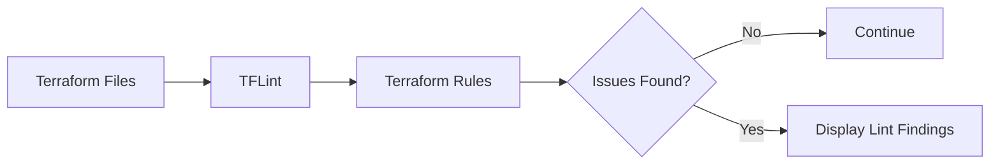

---

## Commands & Variations

| Purpose | Command |
|---------|---------|
| Scan current directory | `tflint` |
| Initialize plugins | `tflint --init` |
| Scan module recursively | `tflint --recursive` |
| Specify configuration file | `tflint --config=.tflint.hcl` |
| Output JSON | `tflint --format json` |

---

## Sample Output

```text
2 issue(s) found

Warning:

terraform_required_version

Terraform version constraint is missing.

Error:

aws_instance.demo

Instance type should not be hardcoded.
```

---

# 📚 Automated Documentation

Keeping Terraform module documentation updated ensures that variables, outputs, providers, and resources are always accurately documented.

---

# 1️⃣3️⃣ terraform-docs


## Overview

| Question | Answer |
|----------|--------|
| **What is it?** | terraform-docs automatically generates documentation for Terraform modules. |
| **What is it used for?** | Creates Markdown documentation containing inputs, outputs, providers, modules, and resources. |
| **When do we use it?** | Whenever Terraform modules are created or updated. |
| **Why are we implementing it?** | To keep Terraform documentation synchronized with the source code automatically. |

---

## Documentation Workflow

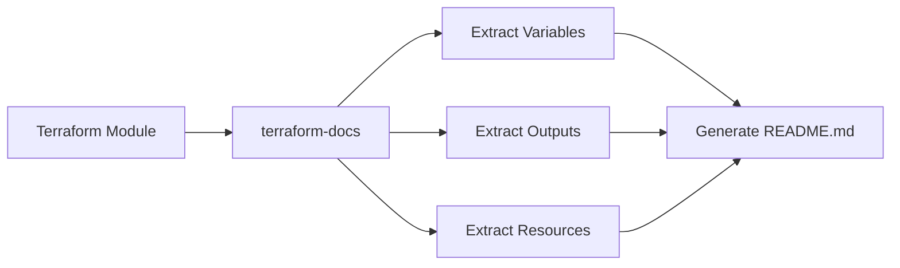

---

## Commands & Variations

| Purpose | Command |
|---------|---------|
| Generate Markdown | `terraform-docs markdown table .` |
| Update README.md | `terraform-docs markdown table . > README.md` |
| Output JSON | `terraform-docs json .` |
| Output YAML | `terraform-docs yaml .` |
| Generate AsciiDoc | `terraform-docs asciidoc .` |

---

## Sample Output

```markdown
## Requirements

| Name | Version |
|------|---------|
| terraform | >=1.6 |

## Providers

| Name | Version |
|------|---------|
| local | 2.5 |

## Resources

| Name |
|------|
| local_file.demo_file |
```

---

# 🔄 Pre-Commit Hooks

Pre-Commit automatically executes configured quality checks before every Git commit.

---

# 1️⃣4️⃣ Pre-Commit


## Overview

| Question | Answer |
|----------|--------|
| **What is it?** | Pre-Commit is a framework that runs automated checks before Git commits are created. |
| **What is it used for?** | Automatically executes formatting, linting, documentation, and security checks. |
| **When do we use it?** | Before every local Git commit. |
| **Why are we implementing it?** | To ensure code quality and consistency before code reaches the repository. |

---

## 🛡️ Local Quality Gate Workflow

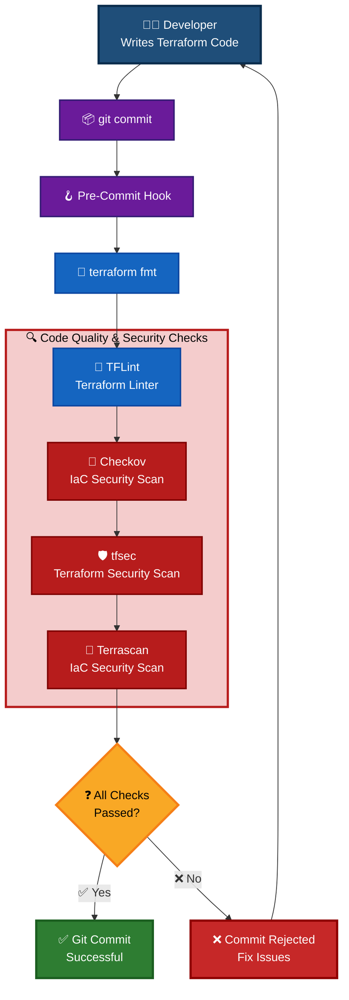

---

## Sample `.pre-commit-config.yaml`

```yaml
repos:
  - repo: https://github.com/antonbabenko/pre-commit-terraform
    rev: v1.98.0
    hooks:
      - id: terraform_fmt

      - id: terraform_validate

      - id: terraform_tflint

      - id: terraform_tfsec

      - id: terraform_checkov

      - id: terraform_docs
```

---

## Installation

| Step | Command |
|------|---------|
| Install Pre-Commit | `pip install pre-commit` |
| Install Git Hooks | `pre-commit install` |
| Run Against All Files | `pre-commit run --all-files` |
| Run Specific Hook | `pre-commit run terraform_fmt --all-files` |
| Update Hooks | `pre-commit autoupdate` |

---

## Sample Output

```text
terraform fmt........................Passed

terraform validate...................Passed

terraform tflint.....................Passed

terraform tfsec......................Passed

terraform checkov....................Passed

terraform docs.......................Passed
```

---

# 📊 Complete Tool Comparison Matrix

| Tool | Category | Primary Purpose | Trigger | Output | Local CLI | Pre-Commit | CI/CD | Terraform Support |
|------|----------|----------------|---------|--------|-----------|------------|--------|-------------------|
| **terraform fmt** | Formatting | Format Terraform files | Before Validation | Formatted Files | ✅ | ✅ | ✅ | ✅ |
| **terraform init** | Lifecycle | Initialize Providers & Backend | Start of Workflow | Initialized Workspace | ✅ | ❌ | ✅ | ✅ |
| **terraform validate** | Validation | Validate Configuration | Before Planning | Validation Result | ✅ | ✅ | ✅ | ✅ |
| **terraform plan** | Planning | Preview Infrastructure Changes | Before Apply | Execution Plan | ✅ | ❌ | ✅ | ✅ |
| **terraform apply** | Deployment | Deploy Infrastructure | Deployment | Infrastructure | ✅ | ❌ | ✅ | ✅ |
| **terraform destroy** | Cleanup | Remove Infrastructure | Cleanup | Resources Removed | ✅ | ❌ | ✅ | ✅ |
| **OPA** | Policy as Code | Policy Engine | Before Deployment | Policy Evaluation | ✅ | ❌ | ✅ | ✅ |
| **Conftest** | Policy Testing | Execute OPA Policies | Before Deployment | Policy Report | ✅ | ✅ | ✅ | ✅ |
| **Checkov** | Security | Security & Compliance Scan | Before Plan | Security Report | ✅ | ✅ | ✅ | ✅ |
| **tfsec** | Security | Terraform Security Scan | Before Plan | Security Report | ✅ | ✅ | ✅ | ✅ |
| **Terrascan** | Security | Security & Compliance Scan | Before Plan | Compliance Report | ✅ | ✅ | ✅ | ✅ |
| **TFLint** | Linting | Terraform Linting | Before Plan | Lint Report | ✅ | ✅ | ✅ | ✅ |
| **terraform-docs** | Documentation | Generate Module Documentation | After Changes | README.md | ✅ | ✅ | ✅ | ✅ |
| **Pre-Commit** | Automation | Execute Local Quality Gates | Git Commit | Pass/Fail | ✅ | N/A | ❌ | ✅ |

---

# 🚀 Complete Local Terraform Quality Gate Workflow

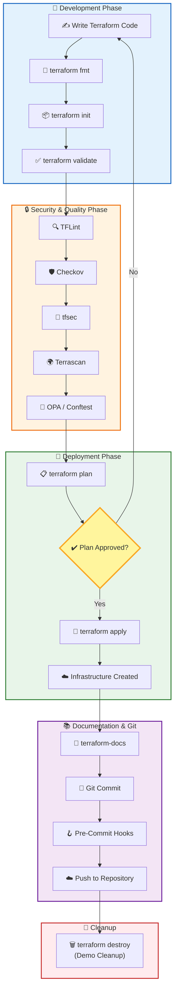
---

# 📚 Demo Execution Order

| Step | Command / Tool | Purpose |
|------|----------------|---------|
| 1 | `terraform fmt` | Format Terraform Code |
| 2 | `terraform init` | Initialize Working Directory |
| 3 | `terraform validate` | Validate Configuration |
| 4 | `tflint` | Lint Terraform Code |
| 5 | `checkov` | Security Scan |
| 6 | `tfsec` | Terraform Security Scan |
| 7 | `terrascan` | Compliance Scan |
| 8 | `conftest test` | Evaluate Policies |
| 9 | `terraform plan` | Generate Execution Plan |
| 10 | `terraform apply` | Deploy Infrastructure |
| 11 | `terraform-docs` | Generate Documentation |
| 12 | `pre-commit run --all-files` | Execute Local Quality Gates |
| 13 | `terraform destroy` | Clean Up Resources |

---

# 🎉 End of Guide

You have successfully completed the **Local Terraform & IaC Quality Gate Demo**.

This guide covered:

- ✅ Core Terraform Lifecycle Commands
- ✅ Policy as Code (OPA & Conftest)
- ✅ Security Scanning (Checkov, tfsec, Terrascan)
- ✅ Terraform Linting (TFLint)
- ✅ Automated Documentation (terraform-docs)
- ✅ Local Quality Gates using Pre-Commit Hooks
- ✅ End-to-End Local Terraform Workflow

---

