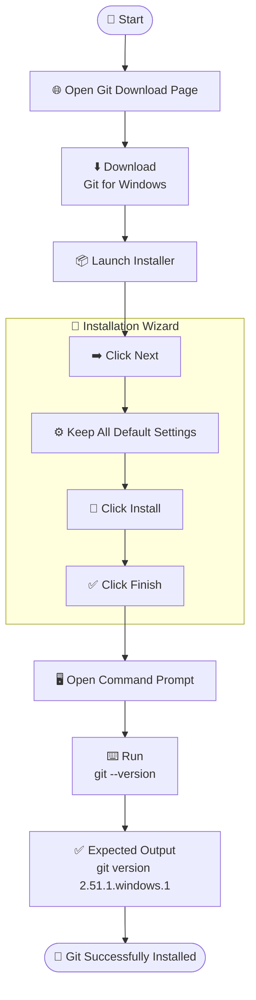
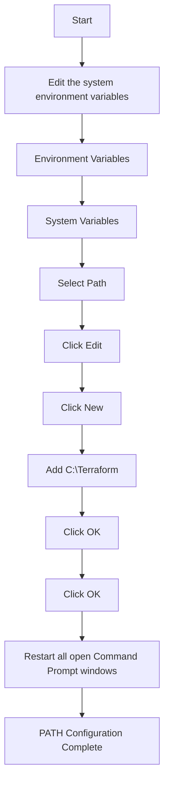
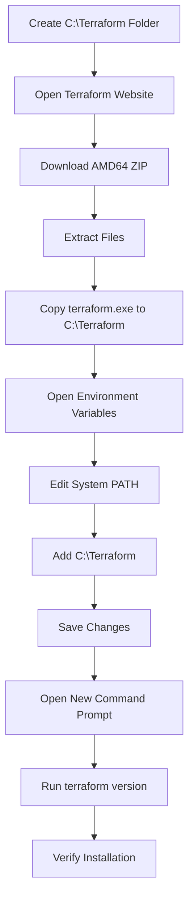

# 🖥️ KnightVM Environment Setup Guide 🔒

--- 


> **DO NOT** share, upload, commit, or distribute this document publicly.

---
## 📋 VM Access Details

| Property | Value |
|----------|-------|
| **Username** | `knightvm` |
| **Password** | `Ven13299kat@` |

---

# 📦 Git CLI Installation

## 🌐 Official Download

**Git for Windows**

https://git-scm.com/install/windows

---

# 📥 Git Installation & Verification



# 🌍 Terraform CLI Installation

## Step 1 — Create Terraform Directory

Create the following directory inside the VM C Drive.

```text
C:\Terraform
```
This folder will contain the Terraform executable.

## 🌐 Official Download

Terraform Downloads

https://developer.hashicorp.com/terraform/install > Select **Windows**.

Download the **AMD64 ZIP** package.

---

## Extract Files

Extract every file from the downloaded ZIP archive into:

```text
C:\Terraform
```

The directory should now contain:

```text
C:\Terraform
    terraform.exe
```

---

## Configure PATH Environment Variable



## Verify Installation

Open **Command Prompt** and execute:

```cmd
terraform version
```

### Expected Output

```text
Terraform v1.15.8
on windows_amd64
```

---

## Terraform Installation Workflow



---

# ✅ Installation Checklist

| Component | Status |
|-----------|--------|
| Create `C:\Terraform` | ☐ |
| Install Git | ☐ |
| Verify Git | ☐ |
| Download Terraform | ☐ |
| Extract Terraform | ☐ |
| Configure PATH | ☐ |
| Verify Terraform | ☐ |

---

# ✅ Verification Commands

## Git

```cmd
git --version
```

Expected:

```text
git version 2.51.1.windows.1
```

---

## Terraform

```cmd
terraform version
```

Expected:

```text
Terraform v1.15.8
on windows_amd64
```

---
