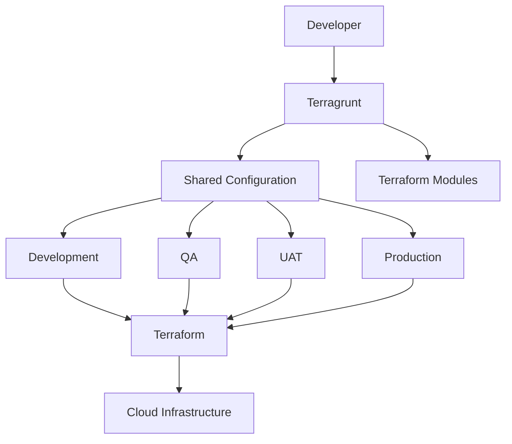
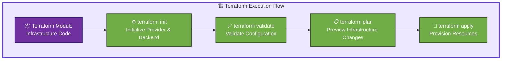
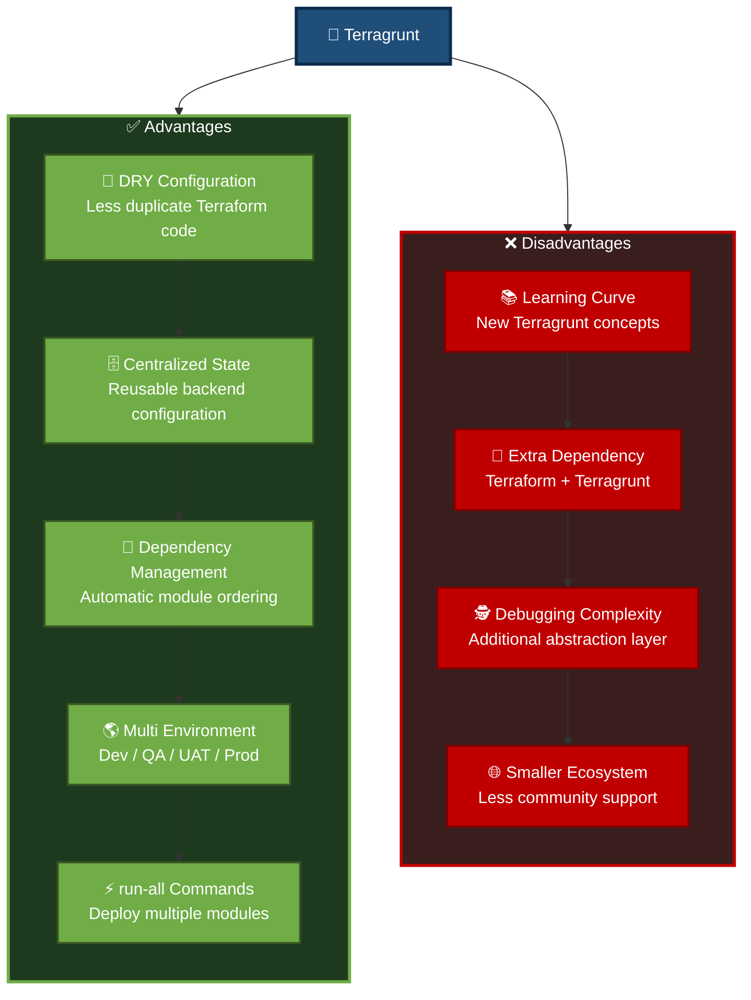

# 🌳 Terragrunt


---

# 📖 Document Information


[](https://github.com/Kureti-Venkat-Nishit-Pvt/KNIGHT)


---

## Overview

| Question | Answer |
|----------|--------|
| **What is it?** | Terragrunt is a thin wrapper for Terraform that helps reduce code duplication, manage remote state, orchestrate multiple Terraform modules, and simplify Infrastructure as Code management. |
| **What is it used for?** | It provides reusable configurations, centralized remote state management, dependency management, and the ability to execute Terraform across multiple environments and modules. |
| **When do we use it?** | When managing multiple environments (Development, QA, UAT, Production), multiple AWS/Azure accounts, or large infrastructure deployments with many Terraform modules. |
| **Why are we implementing it?** | To improve maintainability, reduce duplicated code (DRY principle), standardize Terraform deployments, and simplify infrastructure management at scale. |

---

## Terragrunt Architecture



---

## Typical Folder Structure

# 📂 Terragrunt Folder Structure

```mermaid
flowchart LR

%% ==============================
%% Styling Configuration
%% ==============================

classDef root fill:#1f4e79,stroke:#0b2d4d,color:#ffffff,stroke-width:2px
classDef environment fill:#2f75b5,stroke:#1f4e79,color:#ffffff,stroke-width:2px
classDef folder fill:#70ad47,stroke:#385723,color:#ffffff,stroke-width:2px
classDef file fill:#ffc000,stroke:#bf9000,color:#000000,stroke-width:2px
classDef module fill:#7030a0,stroke:#351c75,color:#ffffff,stroke-width:2px


%% ==============================
%% Live Environment Structure
%% ==============================

subgraph LIVE["📂 live/ (Environment Configuration)"]
direction TB

    LIVE_ROOT["📄 terragrunt.hcl<br/>Root Configuration"]:::file


    subgraph DEV["📁 dev/"]
    direction TB

        DEV_NETWORK["📁 network/"]:::folder
        DEV_NETWORK_FILE["📄 terragrunt.hcl"]:::file

        DEV_COMPUTE["📁 compute/"]:::folder
        DEV_COMPUTE_FILE["📄 terragrunt.hcl"]:::file


        DEV_NETWORK --> DEV_NETWORK_FILE
        DEV_COMPUTE --> DEV_COMPUTE_FILE

    end


    subgraph QA["📁 qa/"]
    direction TB
        QA_FOLDER["Environment Configuration"]:::environment
    end


    subgraph UAT["📁 uat/"]
    direction TB
        UAT_FOLDER["Environment Configuration"]:::environment
    end


    subgraph PROD["📁 prod/"]
    direction TB
        PROD_FOLDER["Environment Configuration"]:::environment
    end


    LIVE_ROOT --> DEV
    LIVE_ROOT --> QA
    LIVE_ROOT --> UAT
    LIVE_ROOT --> PROD

end


%% ==============================
%% Terraform Modules Structure
%% ==============================

subgraph MODULES["📦 modules/ (Reusable Terraform Modules)"]
direction TB

    NETWORK_MODULE["📁 network/"]:::module
    STORAGE_MODULE["📁 storage/"]:::module
    COMPUTE_MODULE["📁 compute/"]:::module
    DATABASE_MODULE["📁 database/"]:::module

end


%% ==============================
%% Architecture Flow
%% ==============================

LIVE --> MODULES


%% ==============================
%% Container Styling
%% ==============================

style LIVE fill:#eaf3ff,stroke:#1f4e79,stroke-width:3px
style MODULES fill:#f3e5ff,stroke:#7030a0,stroke-width:3px

style DEV fill:#d9eaf7,stroke:#2f75b5,stroke-width:2px
style QA fill:#d9ead3,stroke:#70ad47,stroke-width:2px
style UAT fill:#fff2cc,stroke:#bf9000,stroke-width:2px
style PROD fill:#f4cccc,stroke:#cc0000,stroke-width:2px
```



---

## Commands & Variations

| Purpose | Command |
|---------|---------|
| Initialize Terraform using Terragrunt | `terragrunt init` |
| Generate execution plan | `terragrunt plan` |
| Apply infrastructure | `terragrunt apply` |
| Destroy infrastructure | `terragrunt destroy` |
| Run command across all modules | `terragrunt run-all plan` |
| Apply all modules | `terragrunt run-all apply` |
| Destroy all modules | `terragrunt run-all destroy` |
| Validate all modules | `terragrunt run-all validate` |
| Format all Terragrunt files | `terragrunt hclfmt` |

---

## Sample Output

```text
INFO[0000] Downloading Terraform configurations...

INFO[0002] Initializing Terraform...

INFO[0005] Running command:

terraform plan

Plan: 3 to add, 0 to change, 0 to destroy.
```

---

# 📊 Terraform vs Terragrunt

| Feature | Terraform | Terragrunt |
|---------|-----------|------------|
| Infrastructure Provisioning | ✅ | ✅ (uses Terraform internally) |
| State Management | Manual Configuration | Automated & Centralized |
| Code Reusability | Modules | Modules + Shared Configuration |
| Multi-Environment Support | Manual | Built-in |
| Dependency Management | Limited | Built-in |
| DRY (Don't Repeat Yourself) | Limited | Excellent |
| Remote State Configuration | Repeated in every project | Centralized |
| Execute Multiple Modules | Manual | `run-all` Commands |
| Learning Curve | Easy | Moderate |
| Suitable For | Small to Medium Projects | Medium to Enterprise Projects |

---

## 🔄 Terraform vs Terragrunt Workflow

## 🏗️ Terraform Workflow



---

## 🚀 Terragrunt Workflow

```mermaid
flowchart LR

%% ==============================
%% Styling Configuration
%% ==============================

classDef terragrunt fill:#00AEEF,stroke:#006699,color:#ffffff,stroke-width:2px
classDef config fill:#FFC000,stroke:#BF9000,color:#000000,stroke-width:2px
classDef module fill:#7030A0,stroke:#351C75,color:#ffffff,stroke-width:2px
classDef command fill:#70AD47,stroke:#385723,color:#ffffff,stroke-width:2px


%% ==============================
%% Terragrunt Workflow
%% ==============================

subgraph TERRAGRUNT["🚀 Terragrunt Orchestration Flow"]
direction LR

    TG_CONFIG["📄 terragrunt.hcl<br/>Shared Configuration"]:::config

    TG_ENV["📂 Live Environment<br/>dev / qa / uat / prod"]:::terragrunt

    TG_MODULES["📦 Terraform Modules<br/>network / compute / storage / database"]:::module

    TG_INIT["⚙️ terragrunt init<br/>Initialize Modules"]:::command

    TG_PLAN["📋 terragrunt run-all plan<br/>Validate Complete Stack"]:::command

    TG_APPLY["🚀 terragrunt run-all apply<br/>Deploy Multiple Modules"]:::command


    TG_CONFIG --> TG_ENV
    TG_ENV --> TG_MODULES
    TG_MODULES --> TG_INIT
    TG_INIT --> TG_PLAN
    TG_PLAN --> TG_APPLY

end


%% ==============================
%% Container Styling
%% ==============================

style TERRAGRUNT fill:#e0f7ff,stroke:#00AEEF,stroke-width:3px
```



---

# 📊 Terragrunt Advantages & Disadvantages


---