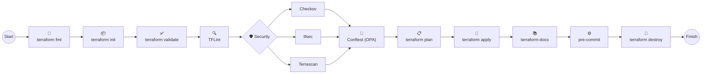

# 📊 Terraform & IaC Quality Tools Comparison Matrix

| Tool / Command | Category | Primary Purpose | Typical Output | Local CLI | Pre-Commit | CI/CD | Supports Terraform | Policy Based | Open Source | Typical Workflow Stage |
|---------------|----------|-----------------|----------------|:---------:|:----------:|:-----:|:-----------------:|:------------:|:-----------:|------------------------|
| **terraform fmt** | Formatting | Format Terraform configuration files | Formatted `.tf` files | ✅ | ✅ | ✅ | ✅ | ❌ | ✅ | Code Formatting |
| **terraform init** | Initialization | Initialize providers, modules, and backend | Initialized working directory | ✅ | ❌ | ✅ | ✅ | ❌ | ✅ | Project Initialization |
| **terraform validate** | Validation | Validate Terraform configuration | Validation Report | ✅ | ✅ | ✅ | ✅ | ❌ | ✅ | Configuration Validation |
| **terraform plan** | Planning | Preview infrastructure changes | Execution Plan | ✅ | ❌ | ✅ | ✅ | ❌ | ✅ | Change Review |
| **terraform apply** | Deployment | Provision infrastructure | Infrastructure Deployment | ✅ | ❌ | ✅ | ✅ | ❌ | ✅ | Infrastructure Deployment |
| **terraform destroy** | Cleanup | Remove infrastructure | Resource Deletion | ✅ | ❌ | ✅ | ✅ | ❌ | ✅ | Resource Cleanup |
| **Terragrunt** | Infrastructure Automation | Wrapper for Terraform that manages DRY configuration, dependencies, remote state, and multi-environment deployments | Terraform Execution Across Modules | ✅ | ❌ | ✅ | ✅ | ❌ | ✅ | Multi-Environment Orchestration |
| **OPA** | Policy as Code | Define governance policies | Policy Evaluation | ✅ | ❌ | ✅ | ✅ | ✅ | ✅ | Governance |
| **Conftest** | Policy Testing | Execute OPA policies | Policy Validation Report | ✅ | ✅ | ✅ | ✅ | ✅ | ✅ | Policy Validation |
| **Checkov** | Security | Security & Compliance Scan | Security Report | ✅ | ✅ | ✅ | ✅ | ✅ | ✅ | Security Scanning |
| **tfsec** | Security | Terraform Security Scan | Security Findings | ✅ | ✅ | ✅ | ✅ | ❌ | ✅ | Security Scanning |
| **Terrascan** | Security & Compliance | Security & Compliance Validation | Compliance Report | ✅ | ✅ | ✅ | ✅ | ✅ | ✅ | Security & Governance |
| **TFLint** | Linting | Terraform Linting | Lint Report | ✅ | ✅ | ✅ | ✅ | ❌ | ✅ | Code Quality |
| **terraform-docs** | Documentation | Generate Terraform Module Documentation | README.md | ✅ | ✅ | ✅ | ✅ | ❌ | ✅ | Documentation |
| **Pre-Commit** | Workflow Automation | Execute Local Quality Gates | Pass / Fail Status | ✅ | N/A | ❌ | ✅ | Depends on Hooks | ✅ | Source Control |

---
# 📌 Tool Classification Summary

### 🌍 Terraform Lifecycle

### 🎨 Formatting

### 🔍 Linting

### 📜 Policy as Code

### 🔐 Security Scanning

### 📚 Documentation

### ⚙️ Workflow Automation

# 📌 Recommended Local Execution Order

# 📊 Complete Terraform, Terragrunt & IaC Tools Comparison Matrix

---

# 📊 Terraform vs Terragrunt Feature Matrix

| Capability | Terraform | Terragrunt |
|------------|:---------:|:----------:|
| Infrastructure Provisioning | ✅ | ✅ *(Uses Terraform internally)* |
| Infrastructure as Code (IaC) | ✅ | ✅ |
| Multi-Environment Management | ⚠️ Manual | ✅ Native |
| DRY Configuration | ⚠️ Limited | ✅ Excellent |
| Remote State Management | ⚠️ Manual | ✅ Centralized |
| Dependency Management | ⚠️ Manual | ✅ Built-in |
| Shared Variables | ⚠️ Manual | ✅ Built-in |
| Execute Multiple Modules | ❌ | ✅ `run-all` |
| Orchestrate Module Dependencies | ❌ | ✅ |
| Automatic Backend Generation | ❌ | ✅ |
| Automatic Provider Generation | ❌ | ✅ |
| Environment Inheritance | ❌ | ✅ |
| Module Reusability | ✅ | ✅ Enhanced |
| Suitable for Small Projects | ⭐⭐⭐⭐⭐ | ⭐⭐⭐ |
| Suitable for Enterprise Projects | ⭐⭐ | ⭐⭐⭐⭐⭐ |
| Learning Curve | ⭐⭐ Easy | ⭐⭐⭐ Moderate |
| Installation Required | Terraform | Terraform + Terragrunt |

---

# 📊 When Should We Use Terraform vs Terragrunt?

| Scenario | Terraform | Terragrunt | Recommendation |
|----------|:---------:|:----------:|----------------|
| Learning Terraform | ⭐⭐⭐⭐⭐ | ⭐⭐ | Terraform |
| Proof of Concept (PoC) | ⭐⭐⭐⭐⭐ | ⭐⭐ | Terraform |
| Single Environment Deployment | ⭐⭐⭐⭐⭐ | ⭐⭐ | Terraform |
| Small Infrastructure | ⭐⭐⭐⭐ | ⭐⭐⭐ | Terraform |
| Multiple Environments (Dev/QA/UAT/Prod) | ⭐⭐⭐ | ⭐⭐⭐⭐⭐ | Terragrunt |
| Shared Infrastructure Modules | ⭐⭐⭐ | ⭐⭐⭐⭐⭐ | Terragrunt |
| Multiple Cloud Accounts | ⭐⭐ | ⭐⭐⭐⭐⭐ | Terragrunt |
| Large Enterprise Projects | ⭐⭐ | ⭐⭐⭐⭐⭐ | Terragrunt |
| Hundreds of Terraform Modules | ⭐ | ⭐⭐⭐⭐⭐ | Terragrunt |
| Centralized Remote State | ⭐⭐ | ⭐⭐⭐⭐⭐ | Terragrunt |
| Minimize Code Duplication | ⭐⭐ | ⭐⭐⭐⭐⭐ | Terragrunt |
| Infrastructure Standardization | ⭐⭐⭐ | ⭐⭐⭐⭐⭐ | Terragrunt |