# 🛠️ KNIGHT Tools Installation Guide

This guide provides the complete installation workflow for all tools required to set up the **KNIGHT Local Terraform Quality Gate** on a Windows machine.

---

# 📑 Table of Contents

[](#-overview)
[](#️-prerequisites)

[](#-demo-project-setup)
[](#-installation-order)

[](#️-tool-installation-workflows)

[](#-configure-the-windows-path)

[](#-verification-commands)

[](#-expected-output)

[](#-knight-local-terraform-quality-gate)

[](#-official-resources)

---

# 📦 Overview

The **KNIGHT Local Terraform Quality Gate** combines multiple open-source tools to validate, secure, lint, document, and enforce policy for Terraform Infrastructure as Code before deployment.

Instead of installing each tool independently, this guide provides a single workflow that installs every required tool for local development and demonstrations.

After completing this guide, your workstation will be capable of:

- ✅ Formatting Terraform code
- ✅ Initializing Terraform projects
- ✅ Validating Terraform configurations
- ✅ Performing Terraform lint analysis
- ✅ Running Infrastructure as Code security scans
- ✅ Enforcing Policy-as-Code
- ✅ Generating Terraform documentation automatically

---

# 🛠️ Prerequisites

Before starting the installation, ensure the following software and requirements are available.


-1565C0?style=for-the-badge)


---

# 📂 Demo Project Setup

The following project structure will be used throughout this guide.

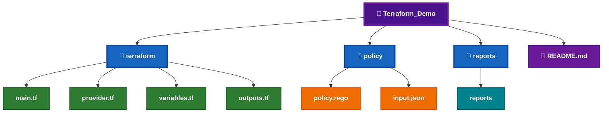

---

# 📋 Installation Order

The following installation order is recommended for the **KNIGHT Local Terraform Quality Gate**.


---

# ⚙️ Tool Installation Workflows

The following sections contain the installation workflows for each tool required by the **KNIGHT Local Terraform Quality Gate**.

Each workflow follows a consistent approach:

- Download the latest release.
- Extract the package.
- Copy the executable to **`C:\KNIGHT\Tools`** (where applicable).
- Configure the Windows **PATH**.
- Verify the installation.
- Confirm the tool is ready for use.

---

# ⚙️ Terraform Installation Workflow

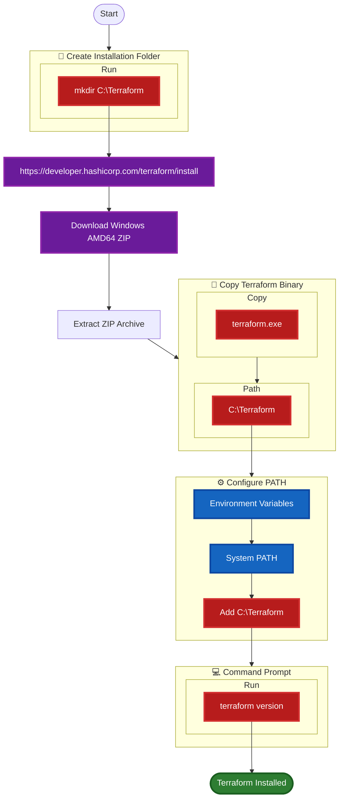

---

# 🐍 Python Installation Workflow

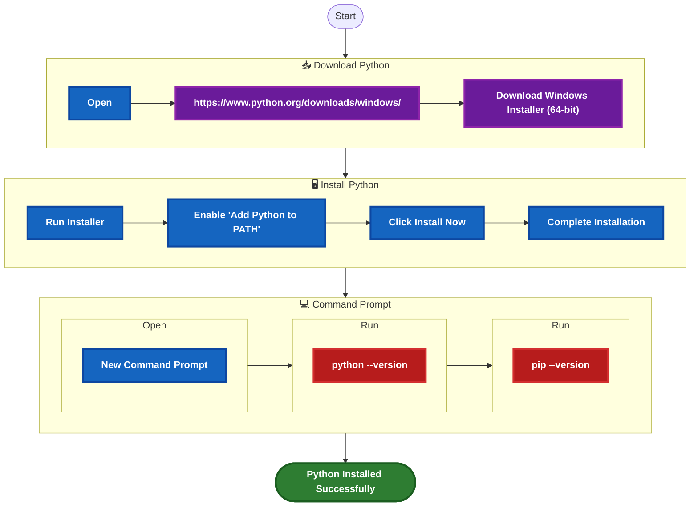

---

# ⚖️ OPA Installation Workflow

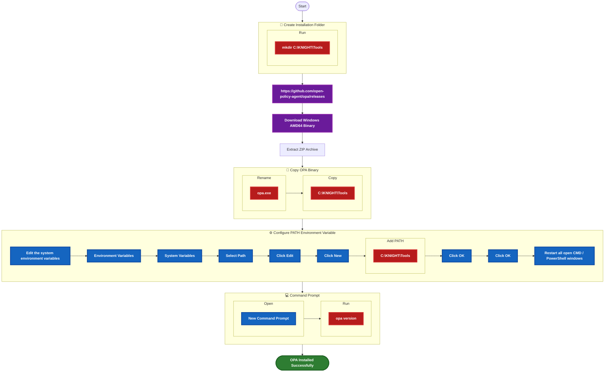

---

# 🔍 Checkov Installation Workflow

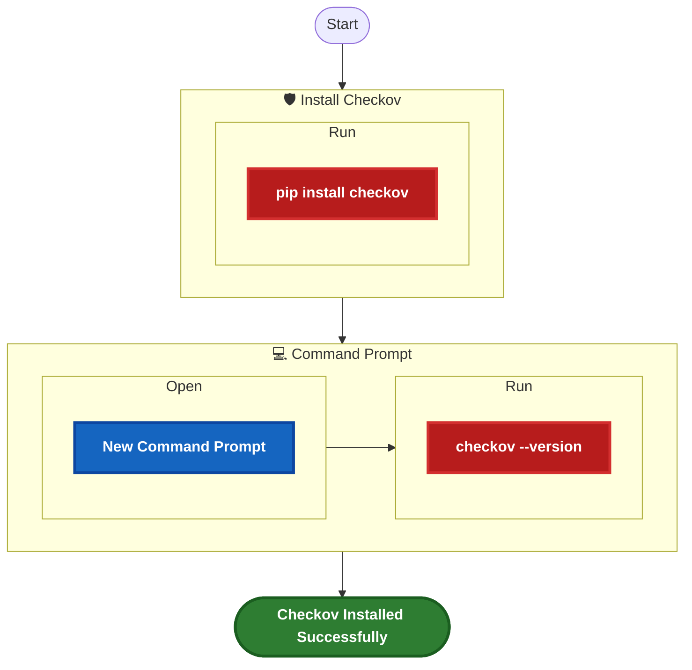

---

# 🔐 tfsec Installation Workflow

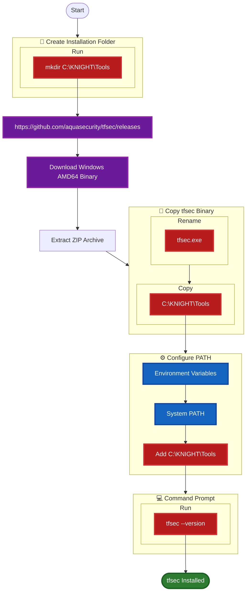

---

# 🛡️ Terrascan Installation Workflow

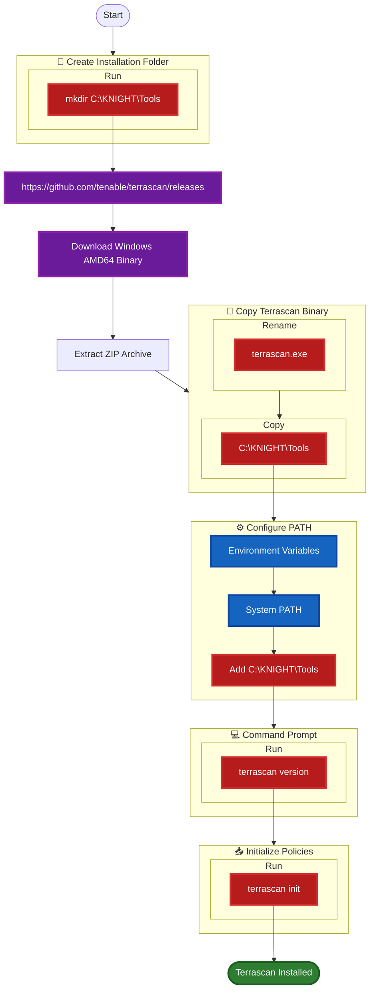

---

# 📝 TFLint Installation Workflow

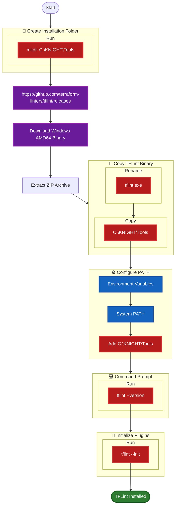

---

# 📖 terraform-docs Installation Workflow

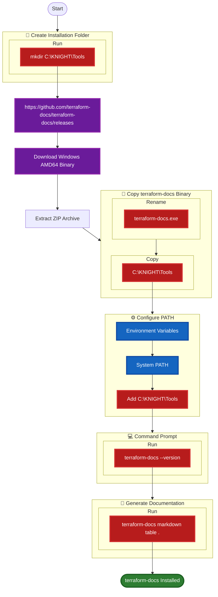

---

# 🪟 Configure the Windows PATH

After installing all required tools, add the following directories to the Windows **PATH Environment Variable**.

```text
C:\Terraform

C:\KNIGHT\Tools

C:\Users\<Your_User_Name>\AppData\Local\Programs\Python\Python313

C:\Users\<Your_User_Name>\AppData\Local\Programs\Python\Python313\Scripts
```

> **Note**
>
> Replace **`<Your_User_Name>`** with your Windows user profile name.
>
> Replace **`Python313`** with your installed Python version if different.

---

# 📋 Windows PATH Configuration Workflow

```mermaid
flowchart LR

A([Start])

-->

B["🪟 Open Windows Search"]

-->

C["⚙️ Edit the System Environment Variables"]

-->

D["📋 Environment Variables"]

-->

E["📂 System Variables"]

-->

F["📝 Select Path"]

-->

G["➕ Click Edit"]

-->

H["➕ Click New"]

-->

I["📂 Add Required Paths"]

-->

J["💾 Click OK"]

-->

K["🔄 Restart Command Prompt"]

-->

L([PATH Configured])

classDef system fill:#1565C0,stroke:#0D47A1,stroke-width:3px,color:#ffffff,font-weight:bold;

classDef path fill:#EF6C00,stroke:#E65100,stroke-width:3px,color:#ffffff,font-weight:bold;

classDef success fill:#2E7D32,stroke:#1B5E20,stroke-width:3px,color:#ffffff,font-weight:bold;

class B,C,D,E,F,G,H,J,K system;

class I path;

class L success;
```

---

# 📂 Required PATH Entries

| Tool | PATH |
|------|------|
| Terraform | `C:\Terraform` |
| OPA | `C:\KNIGHT\Tools` |
| tfsec | `C:\KNIGHT\Tools` |
| Terrascan | `C:\KNIGHT\Tools` |
| TFLint | `C:\KNIGHT\Tools` |
| terraform-docs | `C:\KNIGHT\Tools` |
| Python | `C:\Users\<Your_User_Name>\AppData\Local\Programs\Python\Python313` |
| pip | `C:\Users\<Your_User_Name>\AppData\Local\Programs\Python\Python313\Scripts` |

> 💡 **Recommendation**
>
> Store all executable tools inside **`C:\KNIGHT\Tools`** to simplify maintenance and PATH configuration.

---

# 💻 Verification Commands

Run the following commands one by one in **Command Prompt (CMD)** to verify that all tools have been installed successfully.

```cmd
terraform version

python --version

pip --version

opa version

checkov --version

tfsec --version

terrascan version

tflint --version

terraform-docs --version
```

---

# 📷 Expected Output

```text
Terraform v1.xx.x

Python 3.xx.x

pip xx.x.x

Version: x.x.x
Build Commit: xxxxxxxxxxxxxxxxx

Checkov xx.x.x

==================================================

tfsec v1.xx.x

Version: v1.xx.x

TFLint version 0.xx.x

terraform-docs version v0.xx.x
```

---

# 📋 Verification Checklist

- [ ] Terraform installed successfully.
- [ ] Python installed successfully.
- [ ] pip installed successfully.
- [ ] OPA installed successfully.
- [ ] Checkov installed successfully.
- [ ] tfsec installed successfully.
- [ ] Terrascan installed successfully.
- [ ] TFLint installed successfully.
- [ ] terraform-docs installed successfully.
- [ ] Windows PATH configured successfully.
- [ ] Command Prompt restarted.
- [ ] All verification commands executed successfully.
- [ ] KNIGHT Local Terraform Quality Gate is ready.

---

# 🎯 Installation Summary

| Category | Status |
|----------|:------:|
| Terraform CLI | ✅ Installed |
| Python Runtime | ✅ Installed |
| Policy as Code (OPA) | ✅ Installed |
| Security Scanner (Checkov) | ✅ Installed |
| Security Scanner (tfsec) | ✅ Installed |
| Compliance Scanner (Terrascan) | ✅ Installed |
| Terraform Linter (TFLint) | ✅ Installed |
| Documentation Generator (terraform-docs) | ✅ Installed |


---

# 🚀 KNIGHT Local Terraform Quality Gate

After installing all required tools, the recommended local execution order is shown below.

```mermaid
flowchart LR

A["📝 terraform fmt"]

-->

B["⚙️ terraform init"]

-->

C["✅ terraform validate"]

-->

D["📝 TFLint"]

-->

E["🔍 Checkov"]

-->

F["🔐 tfsec"]

-->

G["🛡️ Terrascan"]

-->

H["⚖️ OPA"]

-->

I["📖 terraform-docs"]

-->

J["🚀 Ready for Deployment"]

%% ===================================
%% Styles
%% ===================================

classDef terraform fill:#623CE4,stroke:#4A148C,stroke-width:3px,color:#ffffff,font-weight:bold;

classDef quality fill:#1565C0,stroke:#0D47A1,stroke-width:3px,color:#ffffff,font-weight:bold;

classDef security fill:#00838F,stroke:#006064,stroke-width:3px,color:#ffffff,font-weight:bold;

classDef policy fill:#6A1B9A,stroke:#4A148C,stroke-width:3px,color:#ffffff,font-weight:bold;

classDef docs fill:#EF6C00,stroke:#E65100,stroke-width:3px,color:#ffffff,font-weight:bold;

classDef success fill:#2E7D32,stroke:#1B5E20,stroke-width:3px,color:#ffffff,font-weight:bold;

class A,B,C terraform;

class D quality;

class E,F,G security;

class H policy;

class I docs;

class J success;
```

---

# 📊 KNIGHT Tool Comparison Matrix

| Tool | Category | Purpose | Primary Command |
|------|----------|---------|-----------------|
| **Terraform** | Infrastructure as Code | Builds and manages infrastructure | `terraform apply` |
| **OPA** | Policy as Code | Enforces custom organizational policies | `opa eval` |
| **Checkov** | Security Scanner | Detects Infrastructure as Code security issues | `checkov -d .` |
| **tfsec** | Security Scanner | Identifies Terraform security vulnerabilities | `tfsec .` |
| **Terrascan** | Governance & Compliance | Validates security and compliance policies | `terrascan scan` |
| **TFLint** | Code Quality | Detects Terraform configuration issues | `tflint` |
| **terraform-docs** | Documentation | Generates Terraform module documentation | `terraform-docs markdown table .` |

---

# 📚 Official Resources

| Tool | Documentation | GitHub | Releases |
|------|---------------|---------|----------|
| **Terraform** | https://developer.hashicorp.com/terraform/docs | https://github.com/hashicorp/terraform | https://developer.hashicorp.com/terraform/install |
| **OPA** | https://www.openpolicyagent.org/docs | https://github.com/open-policy-agent/opa | https://github.com/open-policy-agent/opa/releases |
| **Checkov** | https://www.checkov.io | https://github.com/bridgecrewio/checkov | https://github.com/bridgecrewio/checkov/releases |
| **tfsec** | https://aquasecurity.github.io/tfsec | https://github.com/aquasecurity/tfsec | https://github.com/aquasecurity/tfsec/releases |
| **Terrascan** | https://runterrascan.io | https://github.com/tenable/terrascan | https://github.com/tenable/terrascan/releases |
| **TFLint** | https://github.com/terraform-linters/tflint | https://github.com/terraform-linters/tflint | https://github.com/terraform-linters/tflint/releases |
| **terraform-docs** | https://terraform-docs.io | https://github.com/terraform-docs/terraform-docs | https://github.com/terraform-docs/terraform-docs/releases |

---

# 📋 Final Verification Checklist

- [ ] Terraform CLI installed successfully.
- [ ] Python installed successfully.
- [ ] pip installed successfully.
- [ ] OPA installed successfully.
- [ ] Checkov installed successfully.
- [ ] tfsec installed successfully.
- [ ] Terrascan installed successfully.
- [ ] TFLint installed successfully.
- [ ] terraform-docs installed successfully.
- [ ] Windows PATH configured successfully.
- [ ] All verification commands executed successfully.
- [ ] KNIGHT Local Terraform Quality Gate completed successfully.

---

# 🏆 KNIGHT Environment Ready

🎉 Congratulations 🎉

You have successfully configured the complete **KNIGHT Local Terraform Quality Gate**.

Your local development environment now includes:

- ✅ Terraform CLI
- ✅ OPA
- ✅ Checkov
- ✅ tfsec
- ✅ Terrascan
- ✅ TFLint
- ✅ terraform-docs

This toolchain enables you to:

- 📝 Format Terraform code.
- ⚙️ Initialize Terraform projects.
- ✅ Validate Terraform configurations.
- 📝 Improve Terraform code quality.
- 🛡️ Perform Infrastructure as Code security scanning.
- ⚖️ Enforce organizational policies.
- 📖 Automatically generate Terraform documentation.
- 🚀 Build deployment-ready Infrastructure as Code.

---

# 🎯 Complete Local Validation Workflow


---

# 🙌 Thank You

Thank you for using the **KNIGHT Tools Installation Guide**.

This guide provides a unified installation workflow for the tools used throughout the **KNIGHT** project. Once your environment is configured, you're ready to explore the remaining KNIGHT documentation, execute the Local Terraform Quality Gate, and build secure, well-documented Infrastructure as Code.

**Happy Learning and Happy Automating! 🚀**
---