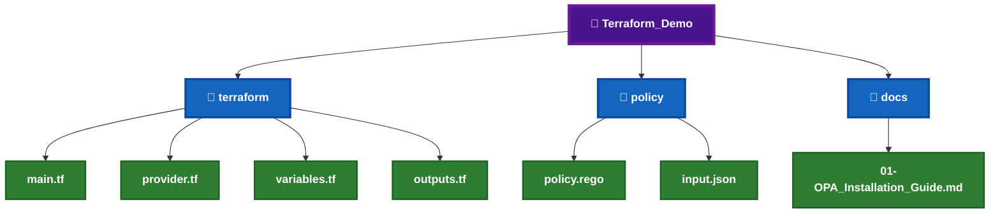
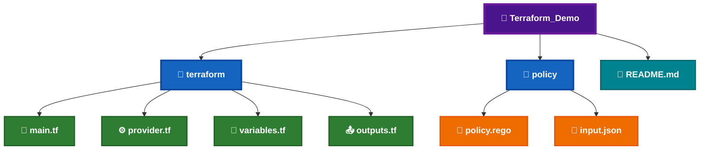
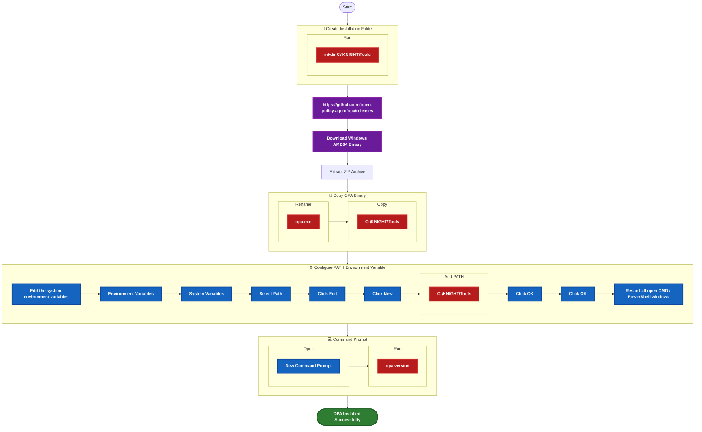
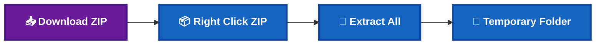
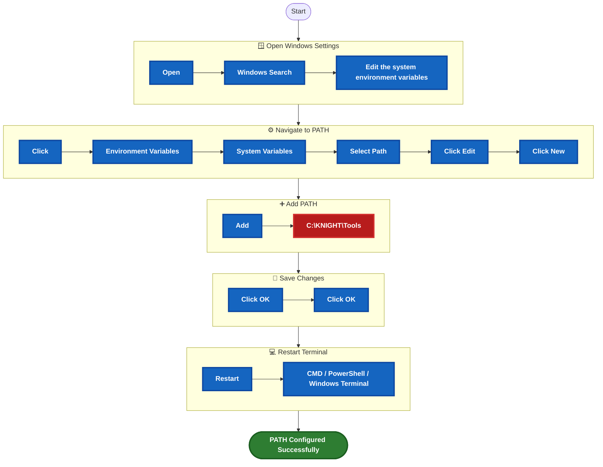

# 📜 OPA Installation Guide

OPA (Open Policy Agent) is an open-source **Policy-as-Code** engine used to define and enforce policies across cloud infrastructure, Kubernetes, APIs, CI/CD pipelines, and Infrastructure as Code (IaC). Within the KNIGHT framework, OPA evaluates Terraform resources against custom Rego policies before infrastructure is deployed, helping ensure that organizational governance and compliance requirements are consistently enforced.


## 📑 Table of Contents

[](#-overview)
[](#️-prerequisites)

[](#-local-demo-project-setup)
[](#-demo-files-required)

[](#-download-information)
[](#-installation-workflow)
[](#-installation-steps)

[](#-commands--variations)
[](#-sample-output)
[](#-demo-commands)
[](#-expected-result)

[](#️-troubleshooting)
[](#-installation-checklist)

---

# 🎯 Tool Information


---

# 📊 Overview

| Question | Answer |
|----------|--------|
| **What is it?** | Open Policy Agent (OPA) is an open-source Policy-as-Code engine used to evaluate policies written in the Rego language. |
| **What is it used for?** | It validates infrastructure, cloud resources, Kubernetes manifests, APIs, and Terraform configurations against predefined organizational policies. |
| **When do we use it?** | OPA is executed after Terraform validation and security scanning, but before deployment, ensuring infrastructure complies with governance requirements. |
| **Why are we implementing it?** | To demonstrate Policy-as-Code within the KNIGHT Framework by validating Terraform resources before they are committed or deployed. |

---

# 🛠️ Prerequisites

Before installing **OPA**, ensure the following software and prerequisites are available on your local machine.


_|_Required-1565C0?style=for-the-badge&logo=windows-terminal&logoColor=white)


---

# 📂 Local Demo Project Setup

The following project structure will be used throughout the OPA demonstration.



---

# 📄 Demo Files Required

The following files will be created specifically for the OPA demonstration.

| File | Required | Purpose |
|------|:--------:|---------|
| `policy.rego` | ✅ | Contains the Policy-as-Code rules written in Rego. |
| `input.json` | ✅ | Sample JSON input evaluated against the Rego policy. |
| `main.tf` | ✅ | Sample Terraform resource used during the demonstration. |
| `README.md` | ✅ | Documentation for the demo project. |

---

# 📁 Demo File Structure



---

# 🌐 Download Information

| Property | Value |
|----------|-------|
| **Tool Name** | Open Policy Agent |
| **Category** | Governance |
| **Latest Binary** | Windows AMD64 |
| **Executable Name** | `opa.exe` |
| **Installation Location** | `C:\KNIGHT\Tools` |
| **Environment Variable** | Add `C:\KNIGHT\Tools` to the Windows PATH |
| **Verification Command** | `opa version` |

---

# 🌍 Official Resources

[](https://www.openpolicyagent.org/docs/latest/)
[](https://github.com/open-policy-agent/opa)
[](https://github.com/open-policy-agent/opa/releases)

---

➡️ **Next:** **Part 2 – Installation Workflow & Step-by-Step Installation**


---

# 📋 Installation Workflow



---

# 📝 Step 1 – Download OPA

Download the latest **Windows AMD64** binary from the official OPA GitHub Releases page below is the link.

[](https://github.com/open-policy-agent/opa/releases)

### 📌 Expected Download

## 📦 Download Details


> **Note:** The executable filename may vary depending on the OPA release version.
---

# 📝 Step 2 – Extract the Archive

Extract the downloaded ZIP file using Windows Explorer or any archive manager.



---

# 📝 Step 3 – Rename the Executable

Rename the extracted executable to:

```text
opa.exe
```

This provides a consistent executable name across documentation and demonstrations.

---

# 📝 Step 4 – Copy the Executable

Create the KNIGHT tools directory if it does not already exist.

```cmd
mkdir C:\KNIGHT\Tools
```

Copy the executable into the folder.

```text
C:\KNIGHT\Tools\opa.exe
```

---

# 📝 Step 5 – Configure the Windows PATH

Add the KNIGHT tools folder to the Windows **Environment Variables**.

## ⚙️ Configure PATH Environment Variable



---

# 📝 Step 6 – Restart the Command Prompt

After updating the **Windows PATH Environment Variable**, any currently open **Command Prompt (CMD)** windows must be restarted to load the updated environment variables.

## 📌 Restart Command Prompt

1. Close all open **`Command Prompt (CMD)`** windows.
2. Open a **`NEW` Command Prompt (CMD)** window.

> **⚠️ Important:** Existing Command Prompt windows will **not** detect the updated **PATH** automatically. Always open a **new Command Prompt** before proceeding to the verification step.

---

# 📝 Step 7 – Verify the Installation

Run the following command:

```cmd
opa version
```

---

# 📷 Expected Verification Output

```text
Version: 1.x.x
Build Commit: xxxxxxxxx
Build Timestamp: 2026-xx-xx
Go Version: go1.xx.x
Platform: windows/amd64
```
```text
C:\Users\Kureti Venkat Nishit>opa version
Version: 1.19.0
Build Commit: 1e32c796e8979b1bda2f768138500b1deb95ff24-dirty
Build Timestamp: 2026-07-30T19:38:54Z
Build Hostname:
Go Version: go1.26.5
Platform: windows/amd64
Rego Version: v1
WebAssembly: available
```

---

# 🎯 Verification Checklist

| Check | Expected Result |
|--------|-----------------|
| `opa version` executes | ✅ |
| No "command not recognized" error | ✅ |
| Version information displayed | ✅ |
| PATH configured correctly | ✅ |
| Ready for policy evaluation | ✅ |

---

# 💡 Installation Tips

- Always download the latest stable Windows AMD64 release.
- Keep all third-party CLI tools in `C:\KNIGHT\Tools` for consistency.
- Restart the terminal after modifying the PATH.
- Verify the installation immediately before proceeding with the demo.
- Use a consistent folder structure across all KNIGHT tool installations.
