# ⚖️ Conftest Installation Guide
 


 
> Conftest is a utility for testing structured configuration data using policies written in Rego. It can be used with Terraform, Kubernetes, YAML, JSON, HCL and other supported configuration formats. 1
 
---
 
# 📑 Table of Contents
 
[](#-overview)
[](#️-prerequisites)
 
[](#-local-demo-project-setup)
[](#-demo-files-required)

[](#-official-resources)
[](#-installation-workflow)
 
[](#-commands--variations)
[](#-sample-output)
[](#-demo-commands)
 
[](#️-troubleshooting)
[](#-installation-checklist)
 
---
 
# 🎯 Tool Information
 
| Property | Description |
|----------|-------------|
| **Tool** | Conftest |
| **Category** | Policy as Code |
| **Technology** | Rego / Open Policy Agent |
| **Primary Purpose** | Test structured configuration files against policies |
| **Supported Use Cases** | Terraform, Kubernetes, YAML, JSON, HCL and other structured configuration |
| **Policy Location** | `policy` directory by default |
| **Primary Command** | `conftest test` |
| **Policy Language** | Rego |
 
Conftest allows developers to write automated policy tests against configuration files. It relies on the **Rego policy language** from Open Policy Agent and evaluates rules such as `deny`, `violation`, and `warn`. 2
 
---
 
# 📊 Overview
 
| Question | Answer |
|----------|--------|
| **What is it?** | A configuration testing tool that evaluates structured configuration data against Rego policies. |
| **What is it used for?** | Testing Terraform and other configuration files against custom organizational policies. |
| **When do we use it?** | After Terraform configuration validation and during the policy/compliance stage of the KNIGHT quality gate. |
| **Why are we implementing it?** | To demonstrate custom Policy as Code enforcement using Rego and provide an additional policy-testing layer alongside OPA. |
 
---
 
# 🛠️ Prerequisites
 
Before installing **Conftest**, ensure the following requirements are available.
 

-1565C0?style=for-the-badge)


 
---
 
# 📂 Local Demo Project Setup
 
The Conftest demonstration will use a small Terraform project together with a Rego policy.
 
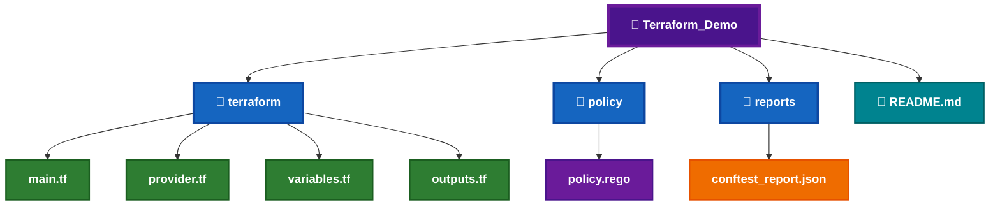
 
---
 
# 📄 Demo Files Required
 
| File | Required | Purpose |
|------|:--------:|---------|
| `main.tf` | ✅ | Terraform configuration to test |
| `provider.tf` | ✅ | Terraform provider configuration |
| `variables.tf` | ✅ | Terraform variables |
| `outputs.tf` | ✅ | Terraform outputs |
| `policy.rego` | ✅ | Custom Conftest Rego policy |
| `conftest_report.json` | ⭐ | Optional JSON policy-test report |
| `README.md` | ⭐ | Demo documentation |
 
---
 
# 📁 Demo File Structure
 
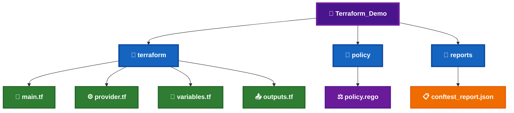
 
---
 
# 🔗 Official Resources
 
[](https://www.conftest.dev/)
 
[](https://github.com/open-policy-agent/conftest)
[](https://github.com/open-policy-agent/conftest/releases)
 
[](https://www.openpolicyagent.org/docs/latest/policy-language/)
 
The official Conftest documentation confirms that the tool is available for Windows and that policies are normally placed in a `policy` directory, although the location can be overridden with `--policy`. 3
 
---
 
# 📋 Installation Workflow
 
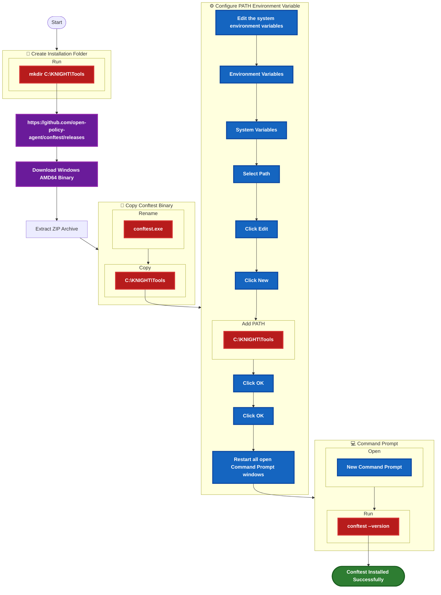
 
---
 
# 📝 Step 1 – Create the Installation Folder
 
Create the standard KNIGHT tools directory.
 
```cmd
mkdir C:\KNIGHT\Tools
```
 
---
 
# 📝 Step 2 – Download Conftest
 
Download the latest Windows AMD64 release from the official Conftest releases page.
 
[](https://github.com/open-policy-agent/conftest/releases)
 

 

 

 

 
---
 
# 📝 Step 3 – Extract the ZIP Archive
 
Extract the downloaded Conftest ZIP archive to a temporary location.
 
After extraction, verify that the executable is available:
 
```text
conftest.exe
```
 
---
 
# 📝 Step 4 – Copy the Conftest Binary
 
Copy:
 
```text
conftest.exe
```
 
to:
 
```text
C:\KNIGHT\Tools
```
 
The final location should be:
 
```text
C:\KNIGHT\Tools\conftest.exe
```
 
---
 
# 📝 Step 5 – Configure the Windows PATH
 
Add the KNIGHT tools directory to the Windows **PATH Environment Variable**:
 
```text
C:\KNIGHT\Tools
```
 
The same directory is used by the other standalone KNIGHT CLI tools, including:
 
```text
C:\KNIGHT\Tools
├── opa.exe
├── conftest.exe
├── tfsec.exe
├── terrascan.exe
├── tflint.exe
└── terraform-docs.exe
```
 
> **⚠️ Important:** Restart all open **Command Prompt (CMD)** windows after modifying the PATH.
 
---
 
# 📝 Step 6 – Restart Command Prompt
 
Close all currently open **Command Prompt (CMD)** windows.
 
Open a **new Command Prompt** before verifying Conftest.
 
---
 
# 📝 Step 7 – Verify the Installation
 
Run:
 
```cmd
conftest --version
```
 
---
 
# 📷 Expected Verification Output
 
The exact version depends on the release installed.
 
```text
Conftest: 0.x.x
```
 
The important verification is that the command executes successfully and returns a Conftest version.
 
---
 
# 📋 Installation Checklist
 
- [ ] Created `C:\KNIGHT\Tools`.
- [ ] Downloaded the Windows AMD64 Conftest release.
- [ ] Extracted the ZIP archive.
- [ ] Located `conftest.exe`.
- [ ] Copied `conftest.exe` to `C:\KNIGHT\Tools`.
- [ ] Added `C:\KNIGHT\Tools` to the Windows PATH.
- [ ] Restarted Command Prompt.
- [ ] Executed `conftest --version`.
- [ ] Confirmed Conftest is available from CMD.
- [ ] Ready to create the Rego policy for the Conftest demonstration.
 
---
 
# 💡 Important
 
Conftest installation itself does **not** require Python or pip.
 
Conftest is distributed as a standalone executable, so the installation follows the same **`C:\KNIGHT\Tools` + Windows PATH** pattern used by OPA, tfsec, Terrascan, TFLint, and terraform-docs.
 
---
 
# 💻 Commands & Variations
 
The following commands are used to verify Conftest and execute the local Policy as Code demonstration.
 
| Purpose | Command |
|---|---|
| Verify Installation | `conftest --version` |
| Test Current Directory | `conftest test .` |
| Specify Policy Directory | `conftest test . --policy policy/` |
| Evaluate All Policy Namespaces | `conftest test . --policy policy/ --all-namespaces` |
| Show Help | `conftest --help` |
 
---
 
# 🧪 Demo Workflow

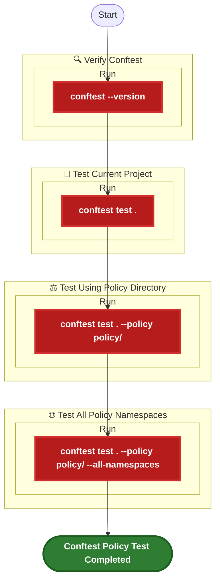
 
---
 
# ⚖️ Demo Policy
 
Create the following file:
 
```text
policy\policy.rego
```
 
The policy below demonstrates a simple Terraform configuration check.
 
```rego
package main
 
deny contains msg if {
    resource := input.resource.aws_instance[_]
    not resource.instance_type
    msg := "AWS instance must define an instance_type."
}
```
 
> **Note:** The exact structure available to the Rego policy depends on the input format produced by Conftest for the configuration being tested.
 
---
 
# 📄 Demo Terraform Configuration
 
Create:
 
```text
terraform\main.tf
```
 
Example:
 
```hcl
resource "aws_instance" "example" {
  ami = "ami-12345678"
}
```
 
The configuration intentionally omits the `instance_type` argument so that the policy can demonstrate a policy violation.
 
---
 
# 📁 Demo File Structure
 
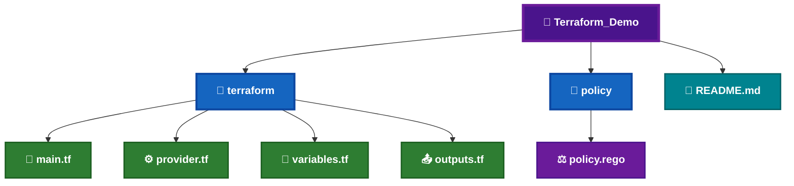
 
---
 
# 🧪 Demo Commands
 
## 📌 Verify Installation
 
```cmd
conftest --version
```
 
---
 
## 📌 Test the Current Project
 
From the root of the demo project:
 
```cmd
conftest test .
```
 
---
 
## 📌 Test Using the Policy Directory
 
```cmd
conftest test . --policy policy/
```
 
This explicitly tells Conftest to load policies from:
 
```text
policy/
```
 
---
 
## 📌 Test All Policy Namespaces
 
```cmd
conftest test . --policy policy/ --all-namespaces
```
 
This is useful when the policy directory contains multiple Rego namespaces and you want Conftest to evaluate policies across all namespaces.
 
---
 
# 📊 Command Comparison
 
| Command | Policy Directory | All Namespaces | Use Case |
|---|:---:|:---:|---|
| `conftest test .` | Default | ❌ | Basic project test |
| `conftest test . --policy policy/` | Explicit | ❌ | Recommended controlled demo |
| `conftest test . --policy policy/ --all-namespaces` | Explicit | ✅ | Evaluate all policy namespaces |
 
---
 
# 📷 Sample Output
 
## ✅ Successful Policy Test
 
When the Terraform configuration satisfies the policy:
 
```text
$ conftest test . --policy policy/
 
0 tests, 0 passed, 0 warnings, 0 failures
```
 
The exact summary format can vary by Conftest version.
 
---
 
## ❌ Policy Violation
 
When a policy violation is detected:
 
```text
FAIL - terraform/main.tf - AWS instance must define an instance_type.
 
1 test, 0 passed, 0 warnings, 1 failure
```
 
The important result is the **FAIL** status and the policy message.
 
---
 
# 🎯 Expected Result
 
After completing this demonstration:
 
- ✅ Conftest installation is verified.
- ✅ The Terraform demo project is available.
- ✅ The Rego policy is loaded.
- ✅ The project can be tested using the default policy location.
- ✅ A specific policy directory can be supplied using `--policy`.
- ✅ Multiple policy namespaces can be evaluated using `--all-namespaces`.
- ✅ Policy violations are displayed in the Command Prompt.
- ✅ Conftest is ready for integration into the **KNIGHT Local Terraform Quality Gate**.
 
---
 
# 🔄 Conftest Policy Testing Flow
 
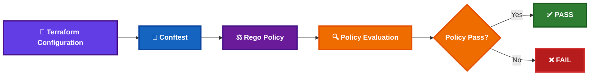
 
---
 
# 💡 Demo Tips
 
- Start with `conftest --version` to prove that the installation is working.
- Run `conftest test .` to demonstrate the basic workflow.
- Use `--policy policy/` when you want the demo to explicitly identify the policy directory.
- Use `--all-namespaces` when demonstrating multiple policy namespaces.
- Keep the demo policy intentionally simple so the audience can understand the policy evaluation result.
- Demonstrate both a **passing** and a **failing** configuration.
- Explain that Conftest provides the testing workflow while **Rego** defines the policy logic.
- Keep **OPA** and **Conftest** conceptually separate in the KNIGHT demonstration:
  - **OPA** → Policy engine / Rego evaluation.
  - **Conftest** → Configuration testing framework using Rego policies.
 
---
 
# ⚠️ Troubleshooting
 
The following issues are common when installing or using **Conftest** on Windows.
 
| Error / Issue | Possible Cause | Resolution |
|---|---|---|
| `'conftest' is not recognized as an internal or external command` | `C:\KNIGHT\Tools` is not available in PATH | Verify that `conftest.exe` exists in `C:\KNIGHT\Tools`, add the directory to PATH, and restart CMD. |
| `policy directory not found` | Incorrect policy path | Verify that `policy\policy.rego` exists and run `conftest test . --policy policy/`. |
| `no tests found` | No applicable Rego policy was loaded | Verify the policy file location, package name, and command being used. |
| `0 tests, 0 passed...` | Policy did not match the supplied configuration or no applicable rule was evaluated | Review the policy and the configuration structure being tested. |
| `FAIL` | A Conftest policy rule returned a violation | Review the policy message and modify the Terraform configuration or policy as appropriate. |
| Policy changes are not reflected | Incorrect policy directory or namespace | Run the command with `--policy policy/` and, when required, `--all-namespaces`. |
| Conftest works in one CMD but not another | PATH was changed after the terminal was opened | Close the existing CMD window and open a new Command Prompt. |
 
---
 
# 💡 Common Resolution Commands
 
```mermaid
flowchart LR
   direction LR
    A([Start])
 
    --> B1
 
    subgraph B["🔍 Verify Conftest Installation"]
 
        subgraph B2["Run"]
            direction LR
            B1["conftest --version"]
        end
 
    end
 
    B1
    --> C1
 
    subgraph C["📂 Verify Demo Files"]
 
        subgraph C2["Run"]
            direction LR
            C1["dir"]
        end
 
    end
 
    C1
    --> D1
 
    subgraph D["⚖️ Test Default Policy"]
 
        subgraph D2["Run"]
            direction LR
            D1["conftest test ."]
        end
 
    end
 
    D1
    --> E1
 
    subgraph E["📁 Specify Policy Directory"]
 
        subgraph E2["Run"]
            direction LR
            E1["conftest test . --policy policy/"]
        end
 
    end
 
    E1
    --> F1
 
    subgraph F["🌐 Test All Namespaces"]
 
        subgraph F2["Run"]
            direction LR
            F1["conftest test . --policy policy/ --all-namespaces"]
        end
 
    end
 
    F1
    --> G([Policy Test Completed])
 
    %% ===================================
    %% Styles
    %% ===================================
 
    classDef command fill:#B71C1C,stroke:#D32F2F,stroke-width:3px,color:#ffffff,font-weight:bold;
 
    classDef success fill:#2E7D32,stroke:#1B5E20,stroke-width:3px,color:#ffffff,font-weight:bold;
 
    class B1,C1,D1,E1,F1 command;
 
    class G success;
```
 
---
 
# 📝 Common Resolution Commands
 
## 📌 Verify Conftest
 
```cmd
conftest --version
```
 
---
 
## 📌 Verify Conftest Location
 
```cmd
where conftest
```
 
Expected location:
 
```text
C:\KNIGHT\Tools\conftest.exe
```
 
---
 
## 📌 Verify Demo Directory
 
From the root of the demo project:
 
```cmd
dir
```
 
Verify that the project contains:
 
```text
terraform
policy
README.md
```
 
---
 
## 📌 Verify Policy Directory
 
```cmd
dir policy
```
 
Expected:
 
```text
policy.rego
```
 
---
 
## 📌 Test Using the Default Policy Location
 
```cmd
conftest test .
```
 
---
 
## 📌 Explicitly Specify the Policy Directory
 
```cmd
conftest test . --policy policy/
```
 
---
 
## 📌 Evaluate All Policy Namespaces
 
```cmd
conftest test . --policy policy/ --all-namespaces
```
 
---
 
# 🔧 PATH Resolution
 
If the following command:
 
```cmd
conftest --version
```
 
returns:
 
```text
'conftest' is not recognized as an internal or external command
```
 
Verify that the executable exists:
 
```cmd
dir C:\KNIGHT\Tools\conftest.exe
```
 
If the file exists, verify the PATH:
 
```cmd
where conftest
```
 
If `where conftest` returns no result:
 
1. Add the following directory to the Windows PATH:
 
```text
C:\KNIGHT\Tools
```
 
2. Close the current Command Prompt.
3. Open a **new Command Prompt**.
4. Run:
 
```cmd
conftest --version
```
 
---
 
# 📋 Installation & Demo Checklist
 
- [ ] Downloaded the Conftest Windows AMD64 binary.
- [ ] Extracted the ZIP archive.
- [ ] Located `conftest.exe`.
- [ ] Copied `conftest.exe` to `C:\KNIGHT\Tools`.
- [ ] Added `C:\KNIGHT\Tools` to the Windows PATH.
- [ ] Restarted Command Prompt.
- [ ] Verified Conftest using `conftest --version`.
- [ ] Verified the executable using `where conftest`.
- [ ] Created the `policy` directory.
- [ ] Created `policy.rego`.
- [ ] Created the Terraform demo configuration.
- [ ] Executed `conftest test .`.
- [ ] Executed `conftest test . --policy policy/`.
- [ ] Executed `conftest test . --policy policy/ --all-namespaces`.
- [ ] Demonstrated a passing policy result.
- [ ] Demonstrated a failing policy result.
- [ ] Ready for Conftest integration into the KNIGHT Local Terraform Quality Gate.
 
---
 
# 🎯 Expected Final State
 
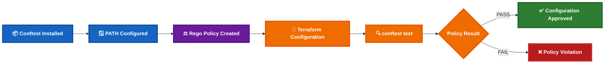
 
---
 
➡️ **Next:** **Part E – References, Conclusion & Conftest in the KNIGHT Quality Gate**
AI Tools Directory - dealsbe.com
Find useful AI tools for content, code, design, research, and automation.
 
---
 
# 📚 References
 
[](https://www.conftest.dev/)
 
[](https://github.com/open-policy-agent/conftest)
 
[](https://github.com/open-policy-agent/conftest/releases)
 
[](https://www.openpolicyagent.org/docs/latest/policy-language/)
 
---
 
# ⚖️ Conftest in the KNIGHT Quality Gate
 
Conftest extends the KNIGHT Policy as Code workflow by allowing Terraform and other structured configuration files to be tested against custom **Rego policies**.
 
```mermaid
flowchart LR
 
A["📝 Terraform Configuration"]
 
-->
 
B["⚙️ terraform validate"]
 
-->
 
C["🔍 TFLint"]
 
-->
 
D["🛡️ Security Scanning"]
 
-->
 
E["⚖️ OPA"]
 
-->
 
F["🧪 Conftest"]
 
-->
 
G["📖 terraform-docs"]
 
-->
 
H["🚀 Ready for Deployment"]
 
%% ===================================
%% Styles
%% ===================================
 
classDef terraform fill:#623CE4,stroke:#4A148C,stroke-width:3px,color:#ffffff,font-weight:bold;
 
classDef quality fill:#1565C0,stroke:#0D47A1,stroke-width:3px,color:#ffffff,font-weight:bold;
 
classDef security fill:#00838F,stroke:#006064,stroke-width:3px,color:#ffffff,font-weight:bold;
 
classDef policy fill:#6A1B9A,stroke:#4A148C,stroke-width:3px,color:#ffffff,font-weight:bold;
 
classDef docs fill:#EF6C00,stroke:#E65100,stroke-width:3px,color:#ffffff,font-weight:bold;
 
classDef success fill:#2E7D32,stroke:#1B5E20,stroke-width:3px,color:#ffffff,font-weight:bold;
 
class A,B terraform;
 
class C quality;
 
class D security;
 
class E,F policy;
 
class G docs;
 
class H success;
```
 
---
 
# 🔄 OPA vs Conftest
 
OPA and Conftest are related but serve different purposes in the KNIGHT demonstration.
 
| Tool | Role | Primary Purpose | Example |
|------|------|-----------------|---------|
| **OPA** | Policy Engine | Evaluates Rego policies and policy decisions | `opa eval` |
| **Conftest** | Configuration Testing | Tests structured configuration against Rego policies | `conftest test .` |
 
### 🧠 KNIGHT Concept
 
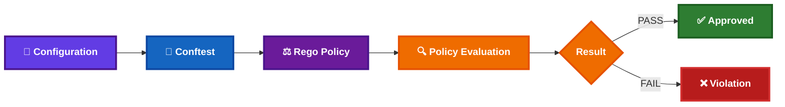
 
---
 
# 📋 Final Verification Checklist
 
- [ ] Conftest installed successfully.
- [ ] `conftest --version` executed successfully.
- [ ] `where conftest` returns the expected executable path.
- [ ] `C:\KNIGHT\Tools` is configured in Windows PATH.
- [ ] Demo Terraform configuration created.
- [ ] `policy\policy.rego` created.
- [ ] `conftest test .` executed successfully.
- [ ] `conftest test . --policy policy/` executed successfully.
- [ ] `conftest test . --policy policy/ --all-namespaces` executed successfully.
- [ ] Passing policy result demonstrated.
- [ ] Failing policy result demonstrated.
- [ ] Conftest Policy as Code workflow understood.
- [ ] Ready for integration into the KNIGHT Local Terraform Quality Gate.
 
---
 
# 🏁 Conclusion
 
Congratulations! 🎉
 
You have successfully completed the **Conftest Installation and Local Policy Testing Guide**.
 
You have:
 
- ✅ Installed Conftest on Windows.
- ✅ Configured the KNIGHT tools PATH.
- ✅ Verified the Conftest installation.
- ✅ Created a Rego policy.
- ✅ Created a Terraform demonstration configuration.
- ✅ Tested the configuration against a policy.
- ✅ Used an explicit policy directory.
- ✅ Tested multiple policy namespaces.
- ✅ Demonstrated both policy success and policy failure.
- ✅ Integrated Conftest into the KNIGHT Policy as Code workflow.
 
Conftest is now ready to be used as an additional **Policy as Code testing layer** within the KNIGHT Terraform quality process.
 
---
 
# 🏆 Conftest Demo Ready
 
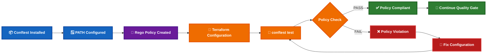
 
---
 
# 📚 KNIGHT Installation Guide Series
 
| Guide | Tool | Status |
|-------|------|:------:|
| `01-OPA_Installation_Guide.md` | ⚖️ OPA | ✅ |
| `01.1-Conftest_Installation_Guide.md` | 🧪 Conftest | ✅ |
| `02-Checkov_Installation_Guide.md` | 🔍 Checkov | ✅ |
| `03-tfsec_Installation_Guide.md` | 🔐 tfsec | ✅ |
| `04-Terrascan_Installation_Guide.md` | 🛡️ Terrascan | ✅ |
| `05-TFLint_Installation_Guide.md` | 📝 TFLint | ✅ |
| `06-Terraform_Docs_Installation_Guide.md` | 📖 terraform-docs | ✅ |
 
---
 
# 🎯 KNIGHT Policy as Code Summary
 
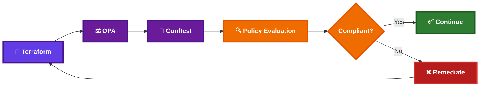
 
---
 
# 🚀 Final Status
 

 

 

 

 
---
 
**Conftest installation and demonstration completed successfully.** 🎉
 
---
 
