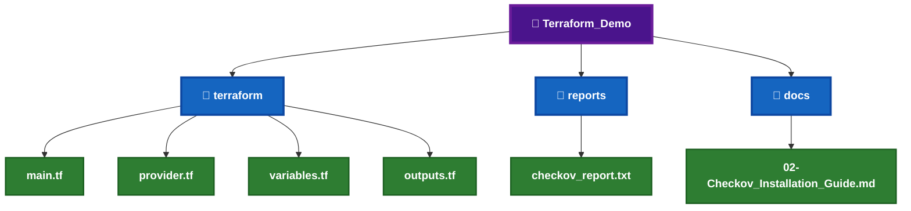
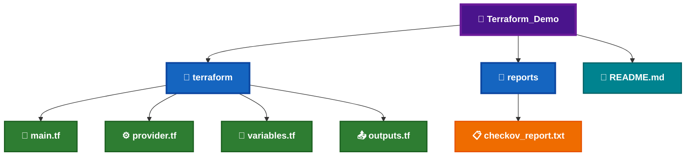
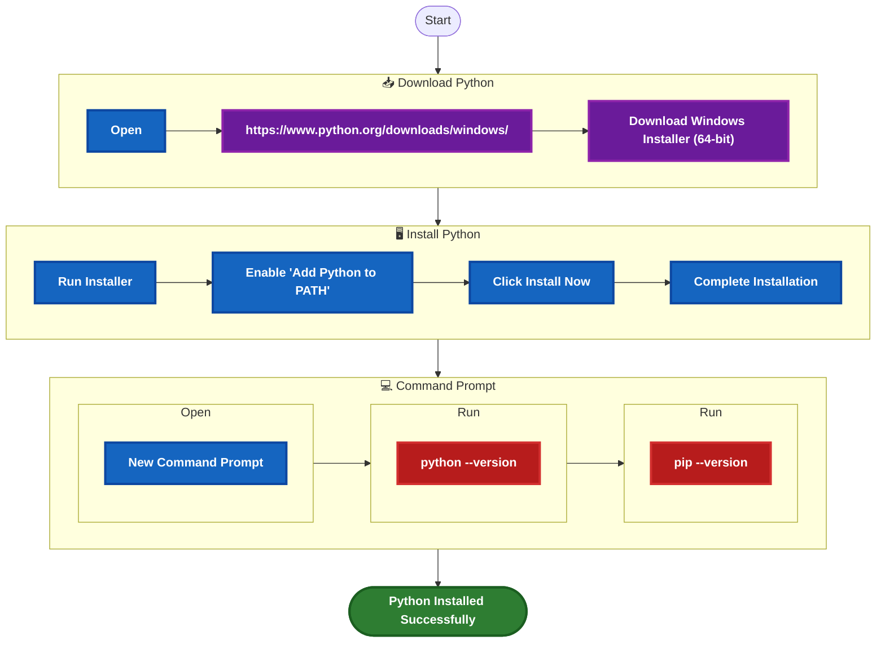
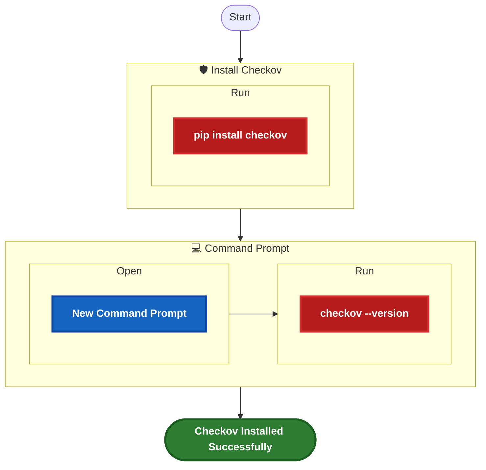
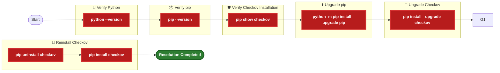

# 🛡️ Checkov Installation Guide


**`Checkov`** is an open-source **Infrastructure as Code (IaC) `Security Scanner`** developed by Bridgecrew (Palo Alto Networks). It scans Terraform, Kubernetes, ARM Templates, CloudFormation, Dockerfiles, GitHub Actions and other Infrastructure as Code frameworks for security vulnerabilities, compliance violations and misconfigurations.

Within the **KNIGHT Framework**, Checkov performs static security analysis of Terraform code before infrastructure deployment, ensuring that security best practices are enforced during the Local Terraform Quality Gate.


# 📑 Table of Contents

[](#-overview)
[](#️-prerequisites)

[](#-local-demo-project-setup)
[](#-demo-files-required)

[](#-python-installation)

[](#-checkov-installation)

[](#-commands--variations)
[](#-sample-output)
[](#-demo-commands)
[](#-expected-result)

[](#️-troubleshooting)
[](#-installation-checklist)

---

## 📊 Overview

| Question | Answer |
|----------|--------|
| **What is it?** | Checkov is an open-source Infrastructure as Code (IaC) `Security Scanner`. |
| **What is it used for?** | It scans Terraform and other IaC files for `security vulnerabilities`, `compliance violations` and `configuration issues`. |
| **When do we use it?** | `After` Terraform `validation` and `before` `deployment`. |
| **Why are we implementing it?** | To `identify` Terraform `security issues` before infrastructure is provisioned and demonstrate Infrastructure as Code security scanning within the KNIGHT Framework. |

---

# 🛠️ Prerequisites

Before installing **Checkov**, ensure the following requirements are met.


_|_Required-1565C0?style=for-the-badge)


> **Note:** Python and **pip** are **not required before starting this guide**. They will be installed as part of the Checkov installation process.

---

# 📂 Local Demo Project Setup

The following project structure will be used throughout the Checkov demonstration.



---

# 📄 Demo Files Required

| File | Required | Purpose |
|------|:--------:|---------|
| `main.tf` | ✅ | Terraform configuration to scan |
| `provider.tf` | ✅ | Terraform provider configuration |
| `variables.tf` | ✅ | Terraform variables |
| `outputs.tf` | ✅ | Terraform outputs |
| `checkov_report.txt` | ⭐ | Generated Checkov scan report |
| `README.md` | ✅ | Project documentation |

---

# 📁 Demo File Structure



---

# 🌐 Download Information


---

# 🌍 Official Resources

[](https://www.checkov.io/)

[](https://github.com/bridgecrewio/checkov)

[](https://pypi.org/project/checkov/)

---

# 🐍 Python Installation

Before installing **Checkov**, Python and **pip** must be installed on the local machine.

---

# 📋 Python Installation Workflow



---

# 📝 Step 1 – Download Python

Download the latest **Windows 64-bit Installer** from the official Python website.

[](https://www.python.org/downloads/windows/)

## 📦 Download Details


-EF6C00?style=for-the-badge)


> **Note:** Always download the latest stable Windows release unless your organization specifies a particular Python version.

---

# 📝 Step 2 – Install Python

Run the downloaded installer.

## ⚠️ Important

Before clicking **Install Now**, enable the following option:

✅ **Add Python to PATH**

This ensures that both **Python** and **pip** are available from **Command Prompt (CMD)**.

Continue with the default installation settings until the installation completes.

---

# 📝 Step 3 – Verify Python Installation

Open a **new Command Prompt (CMD)** window.

Run the following command:

```cmd
python --version
```

### 📷 Expected Output

```text
Python 3.x.x
```

---

# 📝 Step 4 – Verify pip Installation

Run the following command:

```cmd
pip --version
```

### 📷 Expected Output

```text
pip xx.x.x from C:\Users\<username>\AppData\Local\Programs\Python\Python3xx\Lib\site-packages\pip (python 3.x)
```

---

# 🎯 Verification Checklist

| Check | Expected Result |
|--------|-----------------|
| Python installed successfully | ✅ |
| "Add Python to PATH" selected | ✅ |
| `python --version` executes | ✅ |
| `pip --version` executes | ✅ |
| Ready to install Checkov | ✅ |

---

# 💡 Installation Tips

- Always install the latest stable version of Python.
- Ensure **Add Python to PATH** is selected during installation.
- Restart **Command Prompt (CMD)** after installation.
- Verify both **Python** and **pip** before installing Checkov.
- Do not proceed to the Checkov installation until both verification commands execute successfully.

---

# 🛡️ Checkov Installation

After successfully installing **Python** and **pip**, you can now install **Checkov**.

---

# 📋 Checkov Installation Workflow



---

# 📝 Step 1 – Install Checkov

Install the latest stable version of **Checkov** using **pip**.

Run the following command:

```cmd
pip install checkov
```

---

## 📦 Installation Command


> **Note:** An active internet connection is required to download the package from **PyPI**.

---

# 📝 Step 2 – Upgrade Checkov (Optional)

To upgrade an existing installation to the latest version, run:

```cmd
pip install --upgrade checkov
```

---

## 📦 Upgrade Command


---

# 📝 Step 3 – Restart the Command Prompt

After installing **Checkov**, close the current **Command Prompt (CMD)** window.

## 📌 Restart Command Prompt

1. Close all open **`Command Prompt (CMD)`** windows.
2. Open a **`NEW` Command Prompt (CMD)** window.

> **⚠️ Important:** Restarting **Command Prompt** ensures that the newly installed **Checkov** executable is available for verification.

---

# 📝 Step 4 – Verify the Installation

Run the following command:

```cmd
checkov --version
```

---

## 📷 Expected Verification Output

```text
3.x.x
```

or

```text
Checkov 3.x.x
```

depending on the installed version.

---

## 📋 Verification Details


---

# 🎯 Verification Checklist

- [ ] `pip install checkov` completed successfully.
- [ ] No installation errors were reported.
- [ ] Closed the existing Command Prompt (CMD).
- [ ] Opened a new Command Prompt (CMD).
- [ ] `checkov --version` executed successfully.
- [ ] Checkov version information displayed.
- [ ] Ready to perform Terraform security scanning.

---

# 💡 Installation Tips

- Install the latest stable release of **Checkov**.
- Ensure the installation completes without errors.
- Restart **Command Prompt (CMD)** before verification.
- Use `pip install --upgrade checkov` periodically to stay on the latest version.
- Verify the installation before scanning Terraform code.

---

# 💻 Commands & Variations

The following commands are commonly used while working with **Checkov**.

| Purpose | Command |
|----------|---------|
| Display Version | `checkov --version` |
| Scan Current Directory | `checkov -d .` |
| Scan Specific Folder | `checkov -d terraform` |
| Scan Single Terraform File | `checkov -f main.tf` |
| Quiet Mode | `checkov -d . --quiet` |
| Compact Output | `checkov -d . --compact` |
| Output as JSON | `checkov -d . -o json` |
| Output as CLI | `checkov -d . -o cli` |
| Output as JUnit XML | `checkov -d . -o junitxml` |
| Show Help | `checkov --help` |

---

# 📷 Sample Output

## ✅ Successful Scan

```text
       _               _
   ___| |__   ___  ___| | _____   __
  / __| '_ \ / _ \/ __| |/ / _ \ / /
 | (__| | | |  __/ (__|   < (_) / /
  \___|_| |_|\___|\___|_|\_\___/_/

By Bridgecrew.io | version: 3.x.x

terraform scan results:

Passed checks: 18

Failed checks: 2

Skipped checks: 0

Check: CKV_AWS_20
Resource: aws_s3_bucket.demo

Check: CKV_AWS_21
Resource: aws_security_group.demo
```

---

## 📊 Scan Summary


---

# 🧪 Demo Commands

```mermaid
flowchart LR

    A([Start])

    --> B1

    subgraph B["🔍 Verify Installation"]
        B1["checkov --version"]
    end

    B1 --> C1

    subgraph C["📂 Scan Current Project"]
        C1["checkov -d ."]
    end

    C1 --> D1

    subgraph D["📁 Scan Terraform Folder"]
        D1["checkov -d terraform"]
    end

    D1 --> E1

    subgraph E["📄 Scan Single Terraform File"]
        E1["checkov -f main.tf"]
    end

    E1 --> F1

    subgraph F["📊 Generate JSON Report"]
        F1["checkov -d . -o json"]
    end

    F1 --> G1

    subgraph G["💾 Save CLI Report"]
        G1["checkov -d . -o cli > checkov_report.txt"]
    end

    G1 --> H([Demo Completed])

    %% Styles

    classDef command fill:#B71C1C,stroke:#D32F2F,stroke-width:3px,color:#ffffff,font-weight:bold;
    classDef success fill:#2E7D32,stroke:#1B5E20,stroke-width:3px,color:#ffffff,font-weight:bold;

    class B1,C1,D1,E1,F1,G1 command;
    class H success;
```



---

# 🎯 Expected Result

After completing the installation and running the demo commands:

- ✅ Checkov launches successfully.
- ✅ Terraform files are scanned without errors.
- ✅ Security findings are displayed.
- ✅ Passed, Failed, and Skipped checks are summarized.
- ✅ Reports can be exported in multiple formats.
- ✅ Ready to integrate into the KNIGHT Local Terraform Quality Gate.

---

# 📋 Verification Checklist

- [ ] `checkov --version` executed successfully.
- [ ] Current directory scanned successfully.
- [ ] Terraform folder scanned successfully.
- [ ] Security findings displayed.
- [ ] JSON report generated successfully.
- [ ] Report exported to `checkov_report.txt`.
- [ ] Ready for the KNIGHT security demonstration.

---

# 💡 Demo Tips

- Begin the demonstration with `checkov --version`.
- Scan the entire project using `checkov -d .`.
- Explain the meaning of **Passed**, **Failed**, and **Skipped** checks.
- Highlight one failed security check and discuss why it is important.
- Demonstrate exporting the scan results to a report file.
- Explain how Checkov fits into the KNIGHT Local Terraform Quality Gate before deployment.

---

# ⚠️ Troubleshooting

The following are common issues encountered during the installation and usage of **Checkov**.

| Error | Possible Cause | Resolution |
|--------|----------------|------------|
| `'python' is not recognized as an internal or external command` | Python is not installed or PATH is not configured | Install Python and ensure **Add Python to PATH** is selected during installation. |
| `'pip' is not recognized as an internal or external command` | pip is missing or PATH is not configured | Reinstall Python and verify pip is included in the installation. |
| `'checkov' is not recognized as an internal or external command` | Checkov installation failed or Command Prompt was not restarted | Restart Command Prompt and verify the installation using `pip show checkov`. |
| `ERROR: Could not find a version that satisfies the requirement checkov` | Internet connection unavailable or outdated Python version | Verify your internet connection and install the latest stable version of Python. |
| `Access is denied` | Insufficient permissions | Run **Command Prompt** as Administrator and retry the installation. |

---

# 💡 Common Resolution Commands



---

# 📋 Installation Checklist

- [ ] Downloaded the latest Python installer.
- [ ] Installed Python successfully.
- [ ] Enabled **Add Python to PATH** during installation.
- [ ] Verified the Python installation using `python --version`.
- [ ] Verified the pip installation using `pip --version`.
- [ ] Installed Checkov using `pip install checkov`.
- [ ] Restarted **Command Prompt (CMD)**.
- [ ] Verified the installation using `checkov --version`.
- [ ] Successfully scanned a Terraform project using `checkov -d .`.
- [ ] Generated a Checkov report successfully.

---

# 📚 References

[](https://www.checkov.io/)

[](https://github.com/bridgecrewio/checkov)

[](https://pypi.org/project/checkov/)

[](https://docs.python.org/3/)

[](https://www.python.org/downloads/windows/)

---

