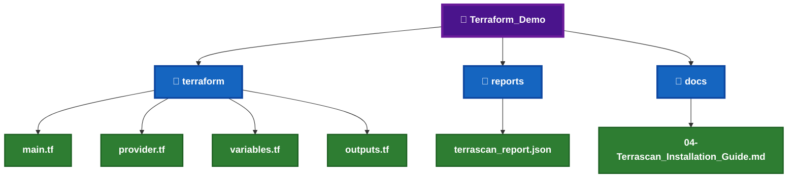
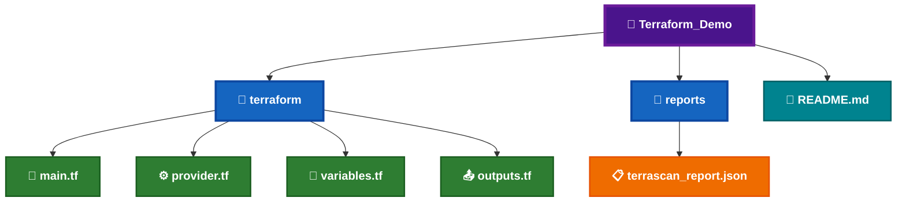
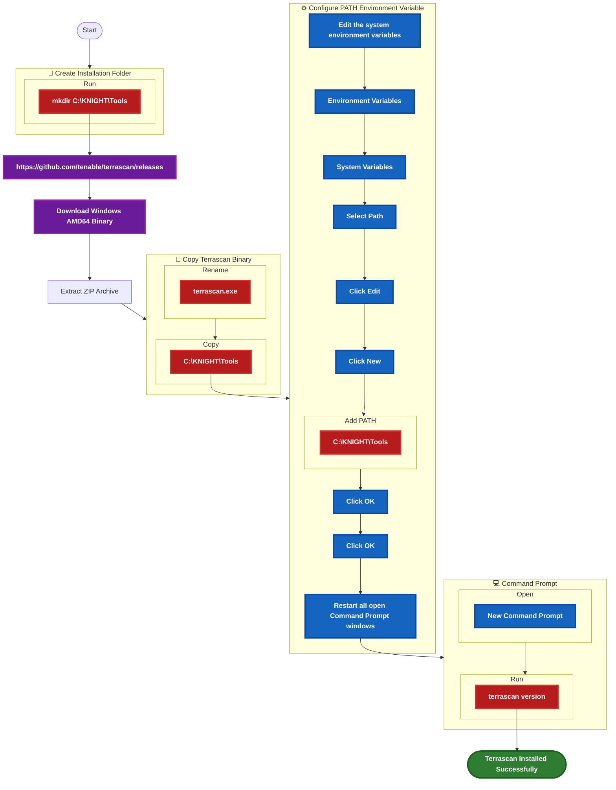

# 🛡️ Terrascan Installation Guide


Terrascan is an open-source **Infrastructure as Code (IaC) Security and Compliance Scanner** developed by Tenable. It scans Terraform, Kubernetes, CloudFormation, ARM Templates, Kustomize and other Infrastructure as Code frameworks against security, governance, and compliance policies.

Within the **KNIGHT Framework**, Terrascan performs policy-based Infrastructure as Code analysis after Terraform validation, helping identify security vulnerabilities, compliance violations, and governance issues before infrastructure deployment.

---

# 📑 Table of Contents

[](#-overview)
[](#️-prerequisites)

[](#-local-demo-project-setup)
[](#-demo-files-required)

[](#-download-information)
[](#-installation-workflow)
[](#-installation-steps)

[](#-commands--variations)
[](#-sample-output)
[](#-demo-commands)
[](#-expected-result)

[](#️-troubleshooting)
[](#-installation-checklist)

---

# 📊 Overview

| Question | Answer |
|----------|--------|
| **What is it?** | Terrascan is an open-source Infrastructure as Code (IaC) security and compliance scanner. |
| **What is it used for?** | It scans Infrastructure as Code files against built-in security, governance, and compliance policies. |
| **When do we use it?** | After Terraform validation and before infrastructure deployment. |
| **Why are we implementing it?** | To identify security vulnerabilities, governance violations, and compliance issues within the KNIGHT Local Terraform Quality Gate. |

---

# 🛠️ Prerequisites

Before installing **Terrascan**, ensure the following requirements are available.


_|_Required-1565C0?style=for-the-badge)


---

# 📂 Local Demo Project Setup

The following project structure will be used throughout the Terrascan demonstration.



---

# 📄 Demo Files Required

| File | Required | Purpose |
|------|:--------:|---------|
| `main.tf` | ✅ | Terraform configuration to scan |
| `provider.tf` | ✅ | Terraform provider configuration |
| `variables.tf` | ✅ | Terraform variables |
| `outputs.tf` | ✅ | Terraform outputs |
| `terrascan_report.json` | ⭐ | Generated Terrascan report |
| `README.md` | ✅ | Demo documentation |

---

# 📁 Demo File Structure



---

# 🌐 Download Information


---

# 🌍 Official Resources

[](https://runterrascan.io/)

[](https://github.com/tenable/terrascan)

[](https://github.com/tenable/terrascan/releases)

---

# 🛡️ Terrascan Installation

Before using **Terrascan**, download the Windows binary, configure the executable, and verify the installation.

---

# 📋 Installation Workflow


---

# 📝 Step 1 – Download Terrascan

Download the latest **Windows AMD64** release from the official GitHub Releases page.

[](https://github.com/tenable/terrascan/releases)

## 📦 Download Details


> **Note:** Download the latest stable Windows AMD64 release.

---

# 📝 Step 2 – Extract the ZIP Archive

Extract the downloaded ZIP archive to a temporary location.

---

# 📝 Step 3 – Copy the Binary

Copy **`terrascan.exe`** to the following directory:

```text
C:\KNIGHT\Tools
```

---

# 📝 Step 4 – Configure the PATH Environment Variable

Add the following directory to the Windows **PATH** environment variable.

```text
C:\KNIGHT\Tools
```

> **⚠️ Important:** Restart **Command Prompt (CMD)** after updating the PATH environment variable.

---

# 📝 Step 5 – Restart the Command Prompt

After updating the **Windows PATH Environment Variable**, any currently open **Command Prompt (CMD)** windows must be restarted.

## 📌 Restart Command Prompt

1. Close all open **Command Prompt (CMD)** windows.
2. Open a **new Command Prompt (CMD)** window.

> **⚠️ Important:** Existing Command Prompt windows will **not** detect the updated **PATH** automatically.

---

# 📝 Step 6 – Verify the Installation

Open a **new Command Prompt (CMD)**.

Run the following command:

```cmd
terrascan version
```

---

# 📷 Expected Verification Output

```text
Version: v1.xx.x
```

---

# 📋 Verification Checklist

| Check | Expected Result |
|--------|-----------------|
| `terrascan.exe` copied successfully | ✅ |
| PATH configured correctly | ✅ |
| Command Prompt restarted | ✅ |
| `terrascan version` executes successfully | ✅ |
| Terrascan version displayed | ✅ |

---

# 💡 Installation Tips

- Download the latest stable **Windows AMD64** release.
- Store all KNIGHT CLI tools under **`C:\KNIGHT\Tools`**.
- Restart **Command Prompt (CMD)** after updating the PATH.
- Verify the installation before scanning Terraform code.
- Keep Terrascan updated by downloading the latest release from GitHub.

---
---

# 💻 Commands & Variations

The following commands are commonly used while working with **Terrascan**.

| Purpose | Command |
|----------|---------|
| Display Version | `terrascan version` |
| Initialize Policy Database | `terrascan init` |
| Scan Current Directory | `terrascan scan` |
| Scan Terraform Folder | `terrascan scan -d terraform` |
| Scan Single Terraform File | `terrascan scan -f main.tf` |
| Generate JSON Report | `terrascan scan -o json` |
| Generate YAML Report | `terrascan scan -o yaml` |
| Show Help | `terrascan help` |

---

# 📷 Sample Output

## ✅ Successful Scan

```text
2026-08-06T18:40:12.123Z  info  loading policies...
2026-08-06T18:40:13.231Z  info  scanning Terraform files...

Violation Details

Name        : AWS S3 Bucket Encryption
Category    : Security
Severity    : High
Resource    : aws_s3_bucket.demo

Description :
S3 bucket encryption is not enabled.

-----------------------------------------------------

Scan Summary

Violated Policies : 1

Passed Policies   : 24

Skipped Policies  : 0
```

---

## 📊 Scan Summary


---

# 🧪 Demo Commands

```mermaid
flowchart LR

    A([Start])

    --> B1

    subgraph B["🔍 Verify Installation"]
        B1["terrascan version"]
    end

    B1
    --> C1

    subgraph C["📥 Initialize Policies"]
        C1["terrascan init"]
    end

    C1
    --> D1

    subgraph D["📂 Scan Current Project"]
        D1["terrascan scan"]
    end

    D1
    --> E1

    subgraph E["📁 Scan Terraform Folder"]
        E1["terrascan scan -d terraform"]
    end

    E1
    --> F1

    subgraph F["📄 Scan Single Terraform File"]
        F1["terrascan scan -f main.tf"]
    end

    F1
    --> G1

    subgraph G["📊 Generate JSON Report"]
        G1["terrascan scan -o json"]
    end

    G1
    --> H([Demo Completed])

    %% ===================================
    %% Styles
    %% ===================================

    classDef command fill:#B71C1C,stroke:#D32F2F,stroke-width:3px,color:#ffffff,font-weight:bold;

    classDef success fill:#2E7D32,stroke:#1B5E20,stroke-width:3px,color:#ffffff,font-weight:bold;

    class B1,C1,D1,E1,F1,G1 command;

    class H success;
```



---

# 🎯 Expected Result

After completing the demonstration:

- ✅ Terrascan launches successfully.
- ✅ Policy database initializes successfully.
- ✅ Terraform files are scanned without errors.
- ✅ Security and compliance violations are displayed.
- ✅ Reports can be generated in multiple output formats.
- ✅ Ready for integration into the **KNIGHT Local Terraform Quality Gate**.

---

# 📋 Verification Checklist

- [ ] `terrascan version` executed successfully.
- [ ] `terrascan init` completed successfully.
- [ ] Current project scanned successfully.
- [ ] Terraform folder scanned successfully.
- [ ] Single Terraform file scanned successfully.
- [ ] JSON report generated successfully.
- [ ] Ready for the KNIGHT Terrascan demonstration.

---

# 💡 Demo Tips

- Begin by verifying the installation using `terrascan version`.
- Run `terrascan init` before performing the first scan.
- Demonstrate scanning the current Terraform project.
- Explain the difference between **security**, **compliance**, and **governance** policies.
- Highlight one policy violation and discuss its impact.
- Generate a JSON report to demonstrate integration with automation pipelines.
- Explain how Terrascan complements **Checkov** and **tfsec** within the KNIGHT Local Terraform Quality Gate.

---

---

# ⚠️ Troubleshooting

The following are common issues encountered during the installation and usage of **Terrascan**.

| Error | Possible Cause | Resolution |
|--------|----------------|------------|
| `'terrascan' is not recognized as an internal or external command` | `terrascan.exe` is not available in the Windows PATH | Verify that `terrascan.exe` exists in `C:\KNIGHT\Tools`, add the directory to the PATH, and restart Command Prompt. |
| `Error loading policies` | Policy bundle has not been initialized | Execute `terrascan init` before running your first scan. |
| `No Terraform files found` | Incorrect working directory | Navigate to the folder containing the Terraform (`*.tf`) files. |
| `Failed to parse Terraform configuration` | Invalid Terraform syntax | Run `terraform init` and `terraform validate` before scanning. |
| `Access is denied` | Insufficient permissions | Open **Command Prompt (CMD)** as Administrator and retry. |

---

# 💡 Common Resolution Commands

```mermaid
flowchart LR

    A([Start])

    --> B1

    subgraph B["🔍 Verify Terrascan Installation"]

        subgraph B2["Run"]
            B1["terrascan version"]
        end

    end

    B1
    --> C1

    subgraph C["📥 Initialize Policies"]

        subgraph C2["Run"]
            C1["terrascan init"]
        end

    end

    C1
    --> D1

    subgraph D["📂 Verify Current Directory"]

        subgraph D2["Run"]
            D1["dir"]
        end

    end

    D1
    --> E1

    subgraph E["⚙️ Initialize Terraform"]

        subgraph E2["Run"]
            E1["terraform init"]
        end

    end

    E1
    --> F1

    subgraph F["✅ Validate Terraform"]

        subgraph F2["Run"]
            F1["terraform validate"]
        end

    end

    F1
    --> G1

    subgraph G["🛡️ Re-run Terrascan Scan"]

        subgraph G2["Run"]
            G1["terrascan scan"]
        end

    end

    G1
    --> H([Resolution Completed])

    %% ===================================
    %% Styles
    %% ===================================

    classDef command fill:#B71C1C,stroke:#D32F2F,stroke-width:3px,color:#ffffff,font-weight:bold;

    classDef success fill:#2E7D32,stroke:#1B5E20,stroke-width:3px,color:#ffffff,font-weight:bold;

    class B1,C1,D1,E1,F1,G1 command;

    class H success;
```



---

# 📋 Installation Checklist

- [ ] Downloaded the Windows AMD64 binary.
- [ ] Extracted the ZIP archive.
- [ ] Renamed the executable to **terrascan.exe**.
- [ ] Copied **terrascan.exe** to `C:\KNIGHT\Tools`.
- [ ] Added `C:\KNIGHT\Tools` to the Windows **PATH**.
- [ ] Restarted **Command Prompt (CMD)**.
- [ ] Verified the installation using `terrascan version`.
- [ ] Initialized the policy database using `terrascan init`.
- [ ] Successfully scanned a Terraform project.
- [ ] Ready for the **KNIGHT Local Terraform Quality Gate**.

---

---

# 📚 References

[](https://runterrascan.io/)

[](https://github.com/tenable/terrascan)

[](https://github.com/tenable/terrascan/releases)

[](https://www.tenable.com/)

[](https://developer.hashicorp.com/terraform/docs)

---

# 🔄 Terrascan in the KNIGHT Local Quality Gate

```mermaid
flowchart LR

A["📝 terraform fmt"]

-->

B["⚙️ terraform init"]

-->

C["✅ terraform validate"]

-->

D["🛡️ TFLint"]

-->

E["🔍 Checkov"]

-->

F["🔐 tfsec"]

-->

G["🛡️ Terrascan"]

-->

H["📖 terraform-docs"]

-->

I["🚀 Ready for Deployment"]

%% ===================================
%% Styles
%% ===================================

classDef terraform fill:#623CE4,stroke:#4A148C,stroke-width:3px,color:#ffffff,font-weight:bold;

classDef security fill:#1565C0,stroke:#0D47A1,stroke-width:3px,color:#ffffff,font-weight:bold;

classDef docs fill:#00838F,stroke:#006064,stroke-width:3px,color:#ffffff,font-weight:bold;

classDef success fill:#2E7D32,stroke:#1B5E20,stroke-width:3px,color:#ffffff,font-weight:bold;

%% ===================================
%% Apply Styles
%% ===================================

class A,B,C terraform;

class D,E,F,G security;

class H docs;

class I success;
```



---

# 📌 Key Takeaways

| Topic | Summary |
|--------|---------|
| **Tool Category** | Infrastructure as Code Security & Compliance Scanner |
| **Primary Purpose** | Detect security, governance, and compliance violations |
| **Supported Platforms** | Terraform, Kubernetes, ARM, CloudFormation, Kustomize and more |
| **Input** | Infrastructure as Code configuration files |
| **Output** | Security and compliance policy violations |
| **Integration Point** | KNIGHT Local Terraform Quality Gate |
| **Verification Command** | `terrascan version` |
| **Primary Scan Command** | `terrascan scan` |

---

