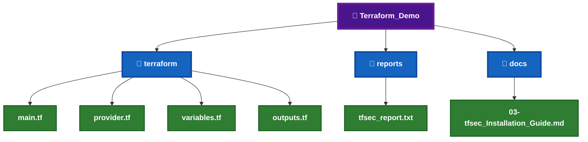
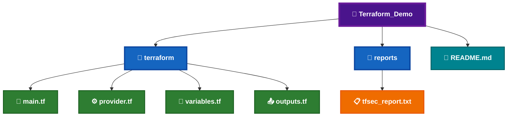
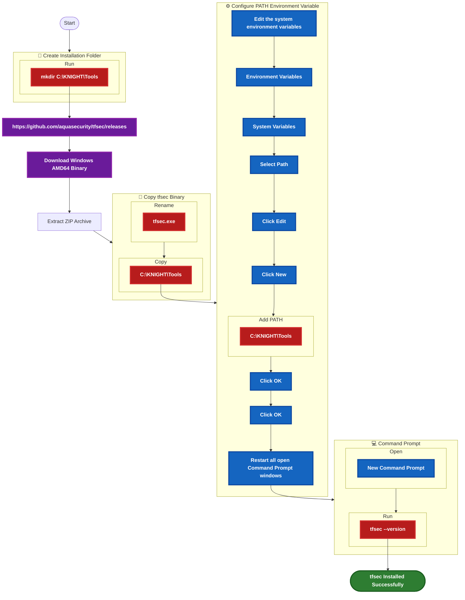
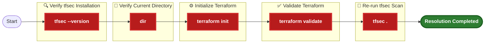

# 🔐 tfsec Installation Guide


tfsec is an open-source static analysis security scanner for **Terraform**. It analyzes Terraform configurations to identify security vulnerabilities, insecure defaults, and compliance violations before infrastructure is deployed.

Within the **KNIGHT Framework**, tfsec performs Terraform-focused security scanning immediately after validation to identify infrastructure security risks early in the Local Terraform Quality Gate.

---

# 📑 Table of Contents

[](#-overview)
[](#️-prerequisites)

[](#-local-demo-project-setup)
[](#-demo-files-required)

[](#-download-information)
[](#-installation-workflow)
[](#-installation-steps)

[](#-commands--variations)
[](#-sample-output)
[](#-demo-commands)
[](#-expected-result)

[](#️-troubleshooting)
[](#-installation-checklist)

---

# 📊 Overview

| Question | Answer |
|----------|--------|
| **What is it?** | tfsec is a static security scanner designed specifically for Terraform configurations. |
| **What is it used for?** | It scans Terraform code for security vulnerabilities and Infrastructure as Code misconfigurations. |
| **When do we use it?** | After Terraform validation and before deployment. |
| **Why are we implementing it?** | To identify Terraform security vulnerabilities early and demonstrate Infrastructure as Code security scanning within the KNIGHT Framework. |

---

# 🛠️ Prerequisites

Before installing **tfsec**, ensure the following requirements are available.


_|_Required-1565C0?style=for-the-badge)


---

# 📂 Local Demo Project Setup

The following project structure will be used throughout the tfsec demonstration.



---

# 📄 Demo Files Required

| File | Required | Purpose |
|------|:--------:|---------|
| `main.tf` | ✅ | Terraform configuration to scan |
| `provider.tf` | ✅ | Terraform provider configuration |
| `variables.tf` | ✅ | Terraform variables |
| `outputs.tf` | ✅ | Terraform outputs |
| `tfsec_report.txt` | ⭐ | tfsec scan report |
| `README.md` | ✅ | Project documentation |

---

# 📁 Demo File Structure



---

# 🌐 Download Information


---

# 🌍 Official Resources

[](https://aquasecurity.github.io/tfsec/)
[](https://github.com/aquasecurity/tfsec)
[](https://github.com/aquasecurity/tfsec/releases)

---

# 🔐 tfsec Installation

Before using **tfsec**, download the Windows binary, configure the executable, and verify the installation.

---

# 📋 Installation Workflow



---

# 📝 Step 1 – Download tfsec

Download the latest **Windows AMD64** binary from the official GitHub Releases page.

[](https://github.com/aquasecurity/tfsec/releases)

## 📦 Download Details


---

# 📝 Step 2 – Extract the Archive

Extract the downloaded ZIP archive to a temporary folder.

---

# 📝 Step 3 – Copy the Binary

Copy **tfsec.exe** to:

```text
C:\KNIGHT\Tools
```

---

# 📝 Step 4 – Configure the PATH Environment Variable

Add the following directory to the Windows **PATH** environment variable.

```text
C:\KNIGHT\Tools
```

> **⚠️ Important:** Restart **Command Prompt (CMD)** after updating the PATH environment variable.

---

# 📝 Step 5 – Verify the Installation

Open a **new Command Prompt (CMD)**.

Run the following command:

```cmd
tfsec --version
```

---

# 📷 Expected Verification Output

```text
tfsec v1.xx.x
```

---

# 🎯 Verification Checklist

- [ ] Downloaded the Windows AMD64 binary.
- [ ] Extracted the ZIP archive.
- [ ] Copied `tfsec.exe` to `C:\KNIGHT\Tools`.
- [ ] Added `C:\KNIGHT\Tools` to the PATH environment variable.
- [ ] Restarted **Command Prompt (CMD)**.
- [ ] Executed `tfsec --version`.
- [ ] tfsec version displayed successfully.
- [ ] Ready for Terraform security scanning.

---

# 💡 Installation Tips

- Always download the latest stable Windows AMD64 release.
- Keep all KNIGHT CLI tools in **`C:\KNIGHT\Tools`**.
- Restart **Command Prompt (CMD)** after updating the PATH.
- Verify the installation before scanning Terraform code.
- Use the same installation directory for all KNIGHT security tools.

---

# 💻 Commands & Variations

The following commands are commonly used while working with **tfsec**.

| Purpose | Command |
|----------|---------|
| Display Version | `tfsec --version` |
| Scan Current Directory | `tfsec .` |
| Scan Terraform Folder | `tfsec terraform` |
| Scan Single Terraform File | `tfsec main.tf` |
| Generate JSON Report | `tfsec . --format json` |
| Generate SARIF Report | `tfsec . --format sarif` |
| Exclude Specific Checks | `tfsec . --exclude <CHECK_ID>` |
| Show Help | `tfsec --help` |

---

# 📷 Sample Output

## ✅ Successful Scan

```text
======================================================
tfsec v1.xx.x

Result #1 HIGH

Resource
aws_security_group.demo

Description
Security group allows ingress from 0.0.0.0/0

Impact
Your infrastructure may be exposed publicly.

Resolution
Restrict the CIDR block.

------------------------------------------------------

Result #2 MEDIUM

Resource
aws_s3_bucket.demo

Description
Bucket versioning disabled.

------------------------------------------------------

2 potential problems detected.
```

---

## 📊 Scan Summary


---

# 🧪 Demo Commands

```mermaid
flowchart LR

    A([Start])

    --> B1

    subgraph B["🔍 Verify Installation"]
        B1["tfsec --version"]
    end

    B1 --> C1

    subgraph C["📂 Scan Current Project"]
        C1["tfsec ."]
    end

    C1 --> D1

    subgraph D["📁 Scan Terraform Folder"]
        D1["tfsec terraform"]
    end

    D1 --> E1

    subgraph E["📄 Scan Single Terraform File"]
        E1["tfsec main.tf"]
    end

    E1 --> F1

    subgraph F["📊 Generate JSON Report"]
        F1["tfsec . --format json"]
    end

    F1 --> G1

    subgraph G["📝 Generate SARIF Report"]
        G1["tfsec . --format sarif"]
    end

    G1 --> H([Demo Completed])

    %% Styles

    classDef command fill:#B71C1C,stroke:#D32F2F,stroke-width:3px,color:#ffffff,font-weight:bold;

    classDef success fill:#2E7D32,stroke:#1B5E20,stroke-width:3px,color:#ffffff,font-weight:bold;

    class B1,C1,D1,E1,F1,G1 command;

    class H success;
```



---

# 🎯 Expected Result

After completing the demonstration:

- ✅ tfsec launches successfully.
- ✅ Terraform files are scanned without errors.
- ✅ Security findings are displayed.
- ✅ High, Medium and Low severity issues are identified.
- ✅ Reports can be generated in multiple formats.
- ✅ Ready for integration into the **KNIGHT Local Terraform Quality Gate**.

---

# 📋 Verification Checklist

- [ ] `tfsec --version` executed successfully.
- [ ] Current project scanned successfully.
- [ ] Terraform folder scanned successfully.
- [ ] Single Terraform file scanned successfully.
- [ ] JSON report generated successfully.
- [ ] SARIF report generated successfully.
- [ ] Ready for the KNIGHT tfsec demonstration.

---

# 💡 Demo Tips

- Start by verifying the installed version using `tfsec --version`.
- Demonstrate scanning the current Terraform project.
- Explain the severity levels (**Critical**, **High**, **Medium**, and **Low**).
- Highlight one detected issue and discuss its security impact.
- Generate a JSON report to demonstrate automation.
- Generate a SARIF report to explain integration with GitHub Advanced Security.
- Explain where tfsec fits within the **KNIGHT Local Terraform Quality Gate**.

---

# ⚠️ Troubleshooting

The following are common issues encountered during the installation and usage of **tfsec**.

| Error | Possible Cause | Resolution |
|--------|----------------|------------|
| `'tfsec' is not recognized as an internal or external command` | `tfsec.exe` is not in the PATH or Command Prompt was not restarted | Verify `tfsec.exe` exists in `C:\KNIGHT\Tools`, ensure the directory is added to the PATH, and restart Command Prompt. |
| `Failed to load Terraform configuration` | Invalid Terraform configuration | Execute `terraform init` and `terraform validate` before running tfsec. |
| `No Terraform files found` | Incorrect working directory | Navigate to the directory containing the `.tf` files before executing tfsec. |
| `Access is denied` | Insufficient permissions | Run **Command Prompt (CMD)** as Administrator and retry. |
| `Unsupported Terraform version` | Older Terraform syntax or unsupported configuration | Upgrade Terraform or modify the configuration to a supported version. |

---

# 💡 Common Resolution Commands



---

# 📋 Installation Checklist

- [ ] Downloaded the Windows AMD64 binary.
- [ ] Extracted the ZIP archive.
- [ ] Renamed the executable to **tfsec.exe**.
- [ ] Copied **tfsec.exe** to `C:\KNIGHT\Tools`.
- [ ] Added `C:\KNIGHT\Tools` to the Windows PATH.
- [ ] Restarted **Command Prompt (CMD)**.
- [ ] Verified the installation using `tfsec --version`.
- [ ] Successfully scanned a Terraform project.
- [ ] Generated a security scan report.
- [ ] Ready for the **KNIGHT Local Terraform Quality Gate**.

---

# 📚 References

[](https://aquasecurity.github.io/tfsec/)
[](https://github.com/aquasecurity/tfsec)
[](https://github.com/aquasecurity/tfsec/releases)
[](https://www.aquasec.com/)
[](https://developer.hashicorp.com/terraform/docs)

---


# 🔄 tfsec in the KNIGHT Local Quality Gate

```mermaid
flowchart LR

A["📝 terraform fmt"]

-->

B["⚙️ terraform init"]

-->

C["✅ terraform validate"]

-->

D["🛡️ TFLint"]

-->

E["🔍 Checkov"]

-->

F["🔐 tfsec"]

-->

G["🛡️ Terrascan"]

-->

H["📖 terraform-docs"]

-->

I["🚀 Ready for Deployment"]

%% ===================================
%% Styles
%% ===================================

classDef terraform fill:#623CE4,stroke:#4A148C,stroke-width:3px,color:#ffffff,font-weight:bold;

classDef security fill:#1565C0,stroke:#0D47A1,stroke-width:3px,color:#ffffff,font-weight:bold;

classDef docs fill:#00838F,stroke:#006064,stroke-width:3px,color:#ffffff,font-weight:bold;

classDef success fill:#2E7D32,stroke:#1B5E20,stroke-width:3px,color:#ffffff,font-weight:bold;

%% ===================================
%% Apply Styles
%% ===================================

class A,B,C terraform;

class D,E,F,G security;

class H docs;

class I success;
```



---

# 📌 Key Takeaways

| Topic | Summary |
|--------|---------|
| **Tool Category** | Terraform Security Scanner |
| **Primary Purpose** | Detect Infrastructure as Code (IaC) security vulnerabilities |
| **Input** | Terraform configuration files (`*.tf`) |
| **Output** | Security findings with severity levels |
| **Integration Point** | KNIGHT Local Terraform Quality Gate |
| **Verification Command** | `tfsec --version` |
| **Primary Scan Command** | `tfsec .` |

---
