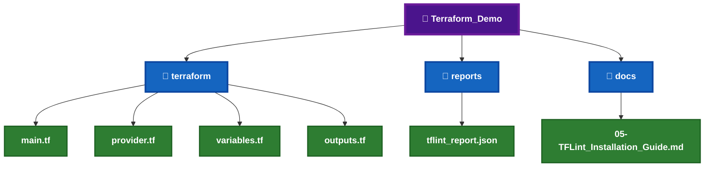
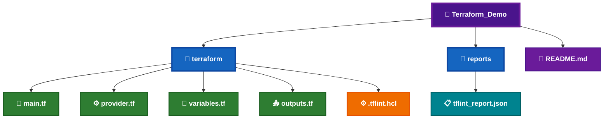
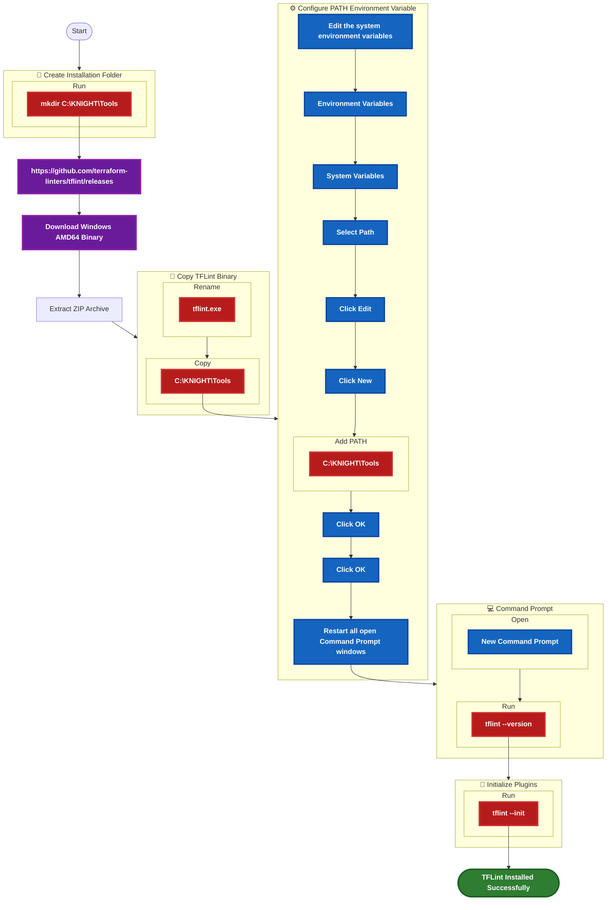

# 🛡️ TFLint Installation Guide


TFLint is an open-source **Terraform Linter** that analyzes Terraform configurations to detect syntax issues, deprecated arguments, provider-specific best practice violations, unused declarations, and potential configuration mistakes before infrastructure deployment.

Within the **KNIGHT Framework**, TFLint performs Terraform code quality analysis immediately after **terraform validate**, helping developers identify coding issues and provider-specific recommendations before security scanning begins.

---

# 📑 Table of Contents

[](#-overview)
[](#️-prerequisites)

[](#-local-demo-project-setup)
[](#-demo-files-required)

[](#-download-information)
[](#-installation-workflow)
[](#-installation-steps)

[](#-commands--variations)
[](#-sample-output)
[](#-demo-commands)
[](#-expected-result)

[](#️-troubleshooting)
[](#-installation-checklist)

---
# 📊 Overview

| Question | Answer |
|----------|--------|
| **What is it?** | TFLint is an open-source linter designed specifically for Terraform configurations. |
| **What is it used for?** | It analyzes Terraform code for syntax issues, deprecated arguments, provider best practices, and configuration quality. |
| **When do we use it?** | After `terraform validate` and before security scanning. |
| **Why are we implementing it?** | To improve Terraform code quality, detect provider-specific issues early, and enforce Infrastructure as Code best practices within the KNIGHT Local Terraform Quality Gate. |

---

# 🛠️ Prerequisites

Before installing **TFLint**, ensure the following requirements are available.


_|_Required-1565C0?style=for-the-badge)


---

# 📂 Local Demo Project Setup

The following project structure will be used throughout the TFLint demonstration.



---

# 📄 Demo Files Required

| File | Required | Purpose |
|------|:--------:|---------|
| `main.tf` | ✅ | Terraform configuration to lint |
| `provider.tf` | ✅ | Terraform provider configuration |
| `variables.tf` | ✅ | Terraform variables |
| `outputs.tf` | ✅ | Terraform outputs |
| `.tflint.hcl` | ⭐ | TFLint configuration |
| `tflint_report.json` | ⭐ | Generated lint report |
| `README.md` | ✅ | Demo documentation |

---

# 📁 Demo File Structure



---

# 🌐 Download Information


---

# 🌍 Official Resources

[](https://github.com/terraform-linters/tflint)

[](https://github.com/terraform-linters/tflint)

[](https://github.com/terraform-linters/tflint/releases)

[](https://developer.hashicorp.com/terraform/docs)

---

---

# 🛡️ TFLint Installation

Before using **TFLint**, download the Windows binary, configure the executable, initialize the plugins, and verify the installation.

---

# 📋 Installation Workflow



---

# 📝 Step 1 – Download TFLint

Download the latest **Windows AMD64** release from the official GitHub Releases page.

[](https://github.com/terraform-linters/tflint/releases)

## 📦 Download Details


---

# 📝 Step 2 – Extract the ZIP Archive

Extract the downloaded ZIP archive to a temporary location.

---

# 📝 Step 3 – Copy the Binary

Copy **`tflint.exe`** to:

```text
C:\KNIGHT\Tools
```

---

# 📝 Step 4 – Configure the PATH Environment Variable

Add the following directory to the Windows **PATH** environment variable.

```text
C:\KNIGHT\Tools
```

> **⚠️ Important:** Restart **Command Prompt (CMD)** after updating the PATH environment variable.

---

# 📝 Step 5 – Restart the Command Prompt

After updating the Windows **PATH Environment Variable**, close all open **Command Prompt (CMD)** windows.

Open a **new Command Prompt (CMD)** window before verifying the installation.

---

# 📝 Step 6 – Verify the Installation

Run the following command:

```cmd
tflint --version
```

---

# 📷 Expected Verification Output

```text
TFLint version 0.xx.x
```

---

# 📝 Step 7 – Initialize TFLint Plugins

Run the following command:

```cmd
tflint --init
```

This downloads and installs the required provider plugins defined in the **`.tflint.hcl`** configuration file.

---

# 📷 Expected Plugin Initialization Output

```text
Installing "terraform" plugin...

Plugin installed successfully.

All plugins are ready.
```

---

# 📋 Verification Checklist

- [ ] Downloaded the Windows AMD64 binary.
- [ ] Extracted the ZIP archive.
- [ ] Renamed the executable to **tflint.exe**.
- [ ] Copied **tflint.exe** to `C:\KNIGHT\Tools`.
- [ ] Added `C:\KNIGHT\Tools` to the Windows PATH.
- [ ] Restarted **Command Prompt (CMD)**.
- [ ] Verified the installation using `tflint --version`.
- [ ] Initialized the plugins using `tflint --init`.
- [ ] Ready for Terraform code quality analysis.

---

# 💡 Installation Tips

- Download the latest stable **Windows AMD64** release.
- Store all KNIGHT CLI tools under **`C:\KNIGHT\Tools`**.
- Restart **Command Prompt (CMD)** after updating the PATH.
- Always execute **`tflint --init`** before running TFLint in a new project.
- Keep your provider plugins up to date by rerunning **`tflint --init`** whenever the configuration changes.

---

---

# 💻 Commands & Variations

The following commands are commonly used while working with **TFLint**.

| Purpose | Command |
|----------|---------|
| Display Version | `tflint --version` |
| Initialize Plugins | `tflint --init` |
| Lint Current Directory | `tflint` |
| Lint Specific Terraform Folder | `tflint terraform` |
| Generate JSON Report | `tflint --format json` |
| Enable Recursive Scan | `tflint --recursive` |
| Show Help | `tflint --help` |

---

# 📷 Sample Output

## ✅ Successful Scan

```text
$ tflint

3 issue(s) found:

Warning: terraform_required_version

  on versions.tf line 1:

Terraform version constraint is missing.

------------------------------------------------------

Warning: terraform_required_providers

  on provider.tf line 2:

Provider version constraint is missing.

------------------------------------------------------

Notice: aws_instance_invalid_type

  on main.tf line 10:

Instance type should follow provider recommendations.

------------------------------------------------------

3 issue(s) detected.
```

---

## 📊 Scan Summary


---

# 🧪 Demo Commands

```mermaid
flowchart LR

    A([Start])

    --> B1

    subgraph B["🔍 Verify Installation"]

        subgraph B2["Run"]
            direction LR
            B1["tflint --version"]
        end

    end

    B1
    --> C1

    subgraph C["🔌 Initialize Plugins"]

        subgraph C2["Run"]
            direction LR
            C1["tflint --init"]
        end

    end

    C1
    --> D1

    subgraph D["📂 Lint Current Project"]

        subgraph D2["Run"]
            direction LR
            D1["tflint"]
        end

    end

    D1
    --> E1

    subgraph E["📁 Lint Terraform Folder"]

        subgraph E2["Run"]
            direction LR
            E1["tflint terraform"]
        end

    end

    E1
    --> F1

    subgraph F["📊 Generate JSON Report"]

        subgraph F2["Run"]
            direction LR
            F1["tflint --format json"]
        end

    end

    F1
    --> G([Demo Completed])

    %% ===================================
    %% Styles
    %% ===================================

    classDef command fill:#B71C1C,stroke:#D32F2F,stroke-width:3px,color:#ffffff,font-weight:bold;

    classDef success fill:#2E7D32,stroke:#1B5E20,stroke-width:3px,color:#ffffff,font-weight:bold;

    class B1,C1,D1,E1,F1 command;

    class G success;
```



---

# 🎯 Expected Result

After completing the demonstration:

- ✅ TFLint launches successfully.
- ✅ Provider plugins initialize successfully.
- ✅ Terraform configuration is analyzed.
- ✅ Syntax issues and best practice recommendations are displayed.
- ✅ JSON output is generated successfully.
- ✅ Ready for integration into the **KNIGHT Local Terraform Quality Gate**.

---

# 📋 Verification Checklist

- [ ] `tflint --version` executed successfully.
- [ ] `tflint --init` completed successfully.
- [ ] Current project linted successfully.
- [ ] Terraform folder linted successfully.
- [ ] JSON report generated successfully.
- [ ] Ready for the KNIGHT TFLint demonstration.

---

# 💡 Demo Tips

- Begin by verifying the installation using `tflint --version`.
- Execute `tflint --init` before running the first lint analysis.
- Explain that **TFLint focuses on Terraform code quality**, unlike Checkov, tfsec, and Terrascan, which focus primarily on security and compliance.
- Demonstrate linting the current Terraform project.
- Highlight one warning or recommendation and explain why it improves Terraform code quality.
- Generate a JSON report to demonstrate CI/CD integration.
- Explain where TFLint fits within the **KNIGHT Local Terraform Quality Gate**.

---
---

# ⚠️ Troubleshooting

The following are common issues encountered during the installation and usage of **TFLint**.

| Error | Possible Cause | Resolution |
|--------|----------------|------------|
| `'tflint' is not recognized as an internal or external command` | `tflint.exe` is not available in the Windows PATH | Verify that `tflint.exe` exists in `C:\KNIGHT\Tools`, add the directory to the PATH, and restart Command Prompt. |
| `Plugin not found` | Provider plugins have not been initialized | Execute `tflint --init` before running the first lint scan. |
| `No Terraform files found` | Incorrect working directory | Navigate to the folder containing the Terraform (`*.tf`) files. |
| `Failed to load Terraform configuration` | Invalid Terraform configuration | Run `terraform init` and `terraform validate` before executing TFLint. |
| `Configuration file ".tflint.hcl" not found` | TFLint configuration file is missing | Create a `.tflint.hcl` configuration file or use the default configuration. |
| `Access is denied` | Insufficient permissions | Open **Command Prompt (CMD)** as Administrator and retry. |

---

# 💡 Common Resolution Commands

```mermaid
flowchart LR

    A([Start])

    --> B1

    subgraph B["🔍 Verify TFLint Installation"]

        subgraph B2["Run"]
            direction LR
            B1["tflint --version"]
        end

    end

    B1
    --> C1

    subgraph C["🔌 Initialize Plugins"]

        subgraph C2["Run"]
            direction LR
            C1["tflint --init"]
        end

    end

    C1
    --> D1

    subgraph D["📂 Verify Current Directory"]

        subgraph D2["Run"]
            direction LR
            D1["dir"]
        end

    end

    D1
    --> E1

    subgraph E["⚙️ Initialize Terraform"]

        subgraph E2["Run"]
            direction LR
            E1["terraform init"]
        end

    end

    E1
    --> F1

    subgraph F["✅ Validate Terraform"]

        subgraph F2["Run"]
            direction LR
            F1["terraform validate"]
        end

    end

    F1
    --> G1

    subgraph G["📝 Re-run TFLint"]

        subgraph G2["Run"]
            direction LR
            G1["tflint"]
        end

    end

    G1
    --> H([Resolution Completed])

    %% ===================================
    %% Styles
    %% ===================================

    classDef command fill:#B71C1C,stroke:#D32F2F,stroke-width:3px,color:#ffffff,font-weight:bold;

    classDef success fill:#2E7D32,stroke:#1B5E20,stroke-width:3px,color:#ffffff,font-weight:bold;

    class B1,C1,D1,E1,F1,G1 command;

    class H success;
```



---

# 📋 Installation Checklist

- [ ] Downloaded the Windows AMD64 binary.
- [ ] Extracted the ZIP archive.
- [ ] Renamed the executable to **tflint.exe**.
- [ ] Copied **tflint.exe** to `C:\KNIGHT\Tools`.
- [ ] Added `C:\KNIGHT\Tools` to the Windows **PATH**.
- [ ] Restarted **Command Prompt (CMD)**.
- [ ] Verified the installation using `tflint --version`.
- [ ] Initialized the provider plugins using `tflint --init`.
- [ ] Successfully analyzed a Terraform project.
- [ ] Ready for the **KNIGHT Local Terraform Quality Gate**.

---


---

# 📚 References

[](https://github.com/terraform-linters/tflint)
[](https://github.com/terraform-linters/tflint)

[](https://github.com/terraform-linters/tflint/releases)
[](https://developer.hashicorp.com/terraform/docs)

---

# 🔄 TFLint in the KNIGHT Local Quality Gate


---

# 📌 Key Takeaways

| Topic | Summary |
|--------|---------|
| **Tool Category** | Terraform Code Quality & Linting Tool |
| **Primary Purpose** | Detect Terraform syntax issues, configuration mistakes, and provider-specific best practice violations |
| **Input** | Terraform configuration files (`*.tf`) |
| **Output** | Warnings, notices, and recommendations |
| **Plugin Support** | Terraform provider plugins |
| **Integration Point** | KNIGHT Local Terraform Quality Gate |
| **Verification Command** | `tflint --version` |
| **Plugin Initialization** | `tflint --init` |
| **Primary Analysis Command** | `tflint` |

---
