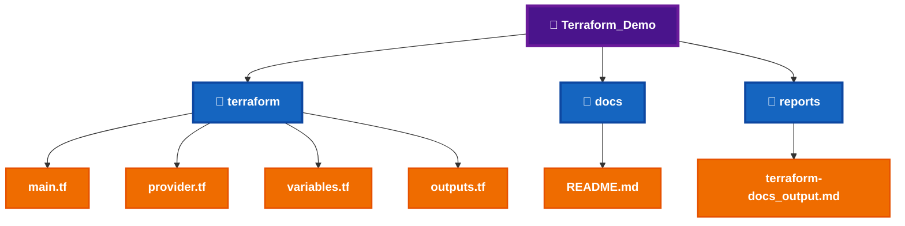
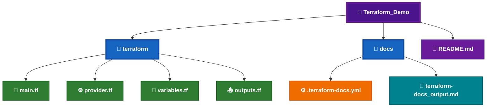
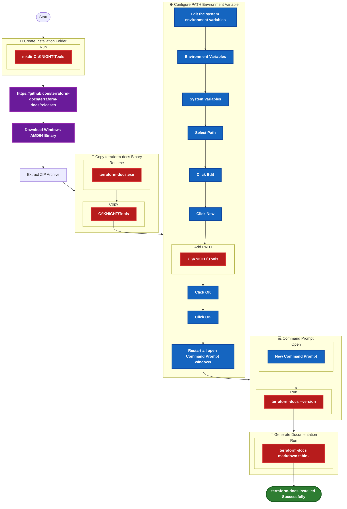

# 📖 terraform-docs Installation Guide


terraform-docs is an open-source documentation generator that automatically creates documentation for Terraform modules. It extracts variables, outputs, providers, requirements, resources, and module information directly from Terraform source code and formats it into Markdown, HTML, JSON, YAML, or other supported output formats.

Within the **KNIGHT Framework**, terraform-docs is executed after all validation, linting, security scanning, and compliance checks have completed successfully. It automatically generates consistent and up-to-date Terraform module documentation, ensuring infrastructure code remains well documented and easy to maintain.

---

# 📑 Table of Contents

[](#-overview)
[](#️-prerequisites)

[](#-local-demo-project-setup)
[](#-demo-files-required)

[](#-download-information)
[](#-installation-workflow)
[](#-installation-steps)

[](#-commands--variations)
[](#-sample-output)
[](#-demo-commands)
[](#-expected-result)

[](#️-troubleshooting)
[](#-installation-checklist)

---

# 📊 Overview

| Question | Answer |
|----------|--------|
| **What is it?** | terraform-docs is an open-source documentation generator for Terraform modules. |
| **What is it used for?** | It automatically generates documentation from Terraform source code. |
| **When do we use it?** | After validation, linting, security scanning, and before publishing or deployment. |
| **Why are we implementing it?** | To automate Terraform documentation, eliminate manual documentation effort, and maintain accurate infrastructure documentation within the KNIGHT Local Terraform Quality Gate. |

---

# 🛠️ Prerequisites

Before installing **terraform-docs**, ensure the following requirements are available.


_|_Required-1565C0?style=for-the-badge)


---

# 📂 Local Demo Project Setup

The following project structure will be used throughout the terraform-docs demonstration.



---

# 📄 Demo Files Required

| File | Required | Purpose |
|------|:--------:|---------|
| `main.tf` | ✅ | Terraform resources |
| `provider.tf` | ✅ | Terraform providers |
| `variables.tf` | ✅ | Terraform input variables |
| `outputs.tf` | ✅ | Terraform outputs |
| `README.md` | ⭐ | Generated documentation |
| `.terraform-docs.yml` | ⭐ | terraform-docs configuration |
| `terraform-docs_output.md` | ⭐ | Generated documentation output |

---

# 📁 Demo File Structure



---

# 🌐 Download Information


---

# 🌍 Official Resources

[](https://terraform-docs.io/)

[](https://github.com/terraform-docs/terraform-docs)

[](https://github.com/terraform-docs/terraform-docs/releases)

[](https://developer.hashicorp.com/terraform/docs)

---
---

# 📖 terraform-docs Installation

Before using **terraform-docs**, download the Windows binary, configure the executable, verify the installation, and generate your first Terraform module documentation.

---

# 📋 Installation Workflow



---

# 📝 Step 1 – Download terraform-docs

Download the latest **Windows AMD64** release from the official GitHub Releases page.

[](https://github.com/terraform-docs/terraform-docs/releases)

## 📦 Download Details


---

# 📝 Step 2 – Extract the ZIP Archive

Extract the downloaded ZIP archive to a temporary location.

---

# 📝 Step 3 – Copy the Binary

Copy **`terraform-docs.exe`** to:

```text
C:\KNIGHT\Tools
```

---

# 📝 Step 4 – Configure the PATH Environment Variable

Add the following directory to the Windows **PATH** environment variable.

```text
C:\KNIGHT\Tools
```

> **⚠️ Important:** Restart **Command Prompt (CMD)** after updating the PATH environment variable.

---

# 📝 Step 5 – Restart the Command Prompt

After updating the Windows **PATH Environment Variable**, close all open **Command Prompt (CMD)** windows.

Open a **new Command Prompt (CMD)** window before verifying the installation.

---

# 📝 Step 6 – Verify the Installation

Run the following command:

```cmd
terraform-docs --version
```

---

# 📷 Expected Verification Output

```text
terraform-docs version v0.xx.x
```

---

# 📝 Step 7 – Generate Documentation

Navigate to your Terraform project folder and run:

```cmd
terraform-docs markdown table .
```

This command automatically generates documentation for the Terraform module in **Markdown Table** format.

---

# 📷 Expected Output

```text
README.md generated successfully
```

or

```text
Outputs generated in Markdown format.
```

depending on the command used.

---

# 📋 Verification Checklist

- [ ] Downloaded the Windows AMD64 binary.
- [ ] Extracted the ZIP archive.
- [ ] Renamed the executable to **terraform-docs.exe**.
- [ ] Copied **terraform-docs.exe** to `C:\KNIGHT\Tools`.
- [ ] Added `C:\KNIGHT\Tools` to the Windows PATH.
- [ ] Restarted **Command Prompt (CMD)**.
- [ ] Verified the installation using `terraform-docs --version`.
- [ ] Generated Terraform documentation successfully.
- [ ] Ready for automatic Terraform documentation generation.

---

# 💡 Installation Tips

- Download the latest stable **Windows AMD64** release.
- Store all KNIGHT CLI tools under **`C:\KNIGHT\Tools`**.
- Restart **Command Prompt (CMD)** after updating the PATH.
- Generate documentation after updating Terraform resources, variables, or outputs.
- Automate documentation generation as part of your CI/CD pipeline.

---
---

# 💻 Commands & Variations

The following commands are commonly used while working with **terraform-docs**.

| Purpose | Command |
|----------|---------|
| Display Version | `terraform-docs --version` |
| Generate Markdown Table | `terraform-docs markdown table .` |
| Update README.md | `terraform-docs markdown table --output-file README.md .` |
| Generate JSON Output | `terraform-docs json .` |
| Generate YAML Output | `terraform-docs yaml .` |
| Generate HTML Output | `terraform-docs html .` |
| Generate Markdown Document | `terraform-docs markdown document .` |
| Show Help | `terraform-docs --help` |

---

# 📷 Sample Output

## ✅ Generated Terraform Documentation

````text
# Terraform Module

## Requirements

| Name | Version |
|------|---------|
| terraform | >= 1.5.0 |

---

## Providers

| Name | Version |
|------|---------|
| aws | ~> 5.0 |

---

## Resources

| Name | Type |
|------|------|
| aws_resource_group.example | Resource |

---

## Inputs

| Name | Description | Type | Default |
|------|-------------|------|---------|
| location | Azure Region | string | n/a |

---

## Outputs

| Name | Description |
|------|-------------|
| resource_group_name | Resource Group Name |

````

---

# 🧪 Demo Commands

```mermaid
flowchart LR

    A([Start])

    --> B1

    subgraph B["🔍 Verify Installation"]

        subgraph B2["Run"]
            direction LR
            B1["terraform-docs --version"]
        end

    end

    B1
    --> C1

    subgraph C["📂 Generate Markdown Table"]

        subgraph C2["Run"]
            direction LR
            C1["terraform-docs markdown table ."]
        end

    end

    C1
    --> D1

    subgraph D["📝 Update README.md"]

        subgraph D2["Run"]
            direction LR
            D1["terraform-docs markdown table --output-file README.md ."]
        end

    end

    D1
    --> E1

    subgraph E["📊 Generate JSON Output"]

        subgraph E2["Run"]
            direction LR
            E1["terraform-docs json ."]
        end

    end

    E1
    --> F1

    subgraph F["📄 Generate YAML Output"]

        subgraph F2["Run"]
            direction LR
            F1["terraform-docs yaml ."]
        end

    end

    F1
    --> G([Demo Completed])

    %% ===================================
    %% Styles
    %% ===================================

    classDef command fill:#B71C1C,stroke:#D32F2F,stroke-width:3px,color:#ffffff,font-weight:bold;

    classDef success fill:#2E7D32,stroke:#1B5E20,stroke-width:3px,color:#ffffff,font-weight:bold;

    class B1,C1,D1,E1,F1 command;

    class G success;
```


---

# 🎯 Expected Result

After completing the demonstration:

- ✅ terraform-docs launches successfully.
- ✅ Terraform module documentation is generated automatically.
- ✅ README.md is updated with the latest module information.
- ✅ Variables, outputs, providers, resources, and requirements are extracted automatically.
- ✅ Documentation is generated in multiple output formats (Markdown, JSON, YAML, HTML).
- ✅ Ready for integration into the **KNIGHT Local Terraform Quality Gate**.

---

# 📋 Verification Checklist

- [ ] `terraform-docs --version` executed successfully.
- [ ] Markdown table generated successfully.
- [ ] README.md updated successfully.
- [ ] JSON documentation generated successfully.
- [ ] YAML documentation generated successfully.
- [ ] HTML documentation generated successfully.
- [ ] Terraform variables documented successfully.
- [ ] Terraform outputs documented successfully.
- [ ] Terraform providers documented successfully.
- [ ] Ready for the **KNIGHT terraform-docs** demonstration.

---

# 💡 Demo Tips

- Begin by verifying the installation using `terraform-docs --version`.
- Demonstrate generating a **Markdown Table** from the Terraform module.
- Show how terraform-docs automatically updates the **README.md** file.
- Explain that terraform-docs extracts:
  - Variables
  - Outputs
  - Providers
  - Resources
  - Requirements
- Demonstrate generating documentation in **JSON**, **YAML**, and **HTML** formats.
- Explain how terraform-docs keeps documentation synchronized with the Terraform source code.
- Highlight that terraform-docs eliminates manual documentation updates and improves consistency across Terraform modules.
- Conclude by showing how terraform-docs integrates as the final stage of the **KNIGHT Local Terraform Quality Gate**, producing deployment-ready documentation.

---


# ⚠️ Troubleshooting

The following are common issues encountered during the installation and usage of **terraform-docs**.

| Error | Possible Cause | Resolution |
|--------|----------------|------------|
| `'terraform-docs' is not recognized as an internal or external command` | `terraform-docs.exe` is not available in the Windows PATH | Verify that `terraform-docs.exe` exists in `C:\KNIGHT\Tools`, add the directory to the PATH, and restart Command Prompt. |
| `No Terraform configuration files found` | Current directory does not contain any `.tf` files | Navigate to the Terraform module directory before running terraform-docs. |
| `README.md was not generated` | Incorrect command or output location | Verify the command syntax and ensure the output directory exists. |
| `Failed to parse Terraform configuration` | Invalid Terraform syntax | Run `terraform init` and `terraform validate` before generating documentation. |
| `Configuration file ".terraform-docs.yml" not found` | Optional configuration file is missing | Create a `.terraform-docs.yml` configuration file or use the default settings. |
| `Access is denied` | Insufficient permissions | Open **Command Prompt (CMD)** as Administrator and retry. |

---

# 💡 Common Resolution Commands

```mermaid
flowchart LR

    A([Start])

    --> B1

    subgraph B["🔍 Verify terraform-docs Installation"]

        subgraph B2["Run"]
            direction LR
            B1["terraform-docs --version"]
        end

    end

    B1
    --> C1

    subgraph C["📂 Verify Current Directory"]

        subgraph C2["Run"]
            direction LR
            C1["dir"]
        end

    end

    C1
    --> D1

    subgraph D["⚙️ Initialize Terraform"]

        subgraph D2["Run"]
            direction LR
            D1["terraform init"]
        end

    end

    D1
    --> E1

    subgraph E["✅ Validate Terraform"]

        subgraph E2["Run"]
            direction LR
            E1["terraform validate"]
        end

    end

    E1
    --> F1

    subgraph F["📖 Generate Documentation"]

        subgraph F2["Run"]
            direction LR
            F1["terraform-docs markdown table ."]
        end

    end

    F1
    --> G1

    subgraph G["📝 Update README.md"]

        subgraph G2["Run"]
            direction LR
            G1["terraform-docs markdown table --output-file README.md ."]
        end

    end

    G1
    --> H([Resolution Completed])

    %% ===================================
    %% Styles
    %% ===================================

    classDef command fill:#B71C1C,stroke:#D32F2F,stroke-width:3px,color:#ffffff,font-weight:bold;

    classDef success fill:#2E7D32,stroke:#1B5E20,stroke-width:3px,color:#ffffff,font-weight:bold;

    class B1,C1,D1,E1,F1,G1 command;

    class H success;
```



---

# 📋 Installation Checklist

- [ ] Downloaded the Windows AMD64 binary.
- [ ] Extracted the ZIP archive.
- [ ] Renamed the executable to **terraform-docs.exe**.
- [ ] Copied **terraform-docs.exe** to `C:\KNIGHT\Tools`.
- [ ] Added `C:\KNIGHT\Tools` to the Windows **PATH**.
- [ ] Restarted **Command Prompt (CMD)**.
- [ ] Verified the installation using `terraform-docs --version`.
- [ ] Generated Terraform documentation successfully.
- [ ] Updated the `README.md` file successfully.
- [ ] Generated documentation in Markdown format.
- [ ] Ready for the **KNIGHT Local Terraform Quality Gate**.

---

# 📚 References

[](https://terraform-docs.io/)
[](https://github.com/terraform-docs/terraform-docs)

[](https://github.com/terraform-docs/terraform-docs/releases)
[](https://developer.hashicorp.com/terraform/docs)

---

# 🏁 Conclusion

Congratulations! 🎉

You have successfully:

- ✅ Downloaded the **terraform-docs** Windows binary.
- ✅ Installed **terraform-docs** on your local machine.
- ✅ Configured the Windows **PATH** environment variable.
- ✅ Verified the installation using **Command Prompt (CMD)**.
- ✅ Generated Terraform module documentation automatically.
- ✅ Updated the **README.md** file directly from Terraform source code.
- ✅ Generated documentation in multiple output formats.
- ✅ Completed the final stage of the **KNIGHT Local Terraform Quality Gate**.

terraform-docs is now ready to automatically generate accurate, consistent, and up-to-date documentation for your Terraform modules, eliminating manual documentation effort and improving maintainability.

---

# 🔄 Complete KNIGHT Local Terraform Quality Gate

```mermaid
flowchart LR

A["📝 terraform fmt"]

-->

B["⚙️ terraform init"]

-->

C["✅ terraform validate"]

-->

D["🛡️ TFLint"]

-->

E["🔍 Checkov"]

-->

F["🔐 tfsec"]

-->

G["🛡️ Terrascan"]

-->

H["⚖️ OPA"]

-->

I["📖 terraform-docs"]

-->

J["🚀 Deployment Ready"]

%% ===================================
%% Styles
%% ===================================

classDef terraform fill:#623CE4,stroke:#4A148C,stroke-width:3px,color:#ffffff,font-weight:bold;

classDef quality fill:#1565C0,stroke:#0D47A1,stroke-width:3px,color:#ffffff,font-weight:bold;

classDef security fill:#00838F,stroke:#006064,stroke-width:3px,color:#ffffff,font-weight:bold;

classDef policy fill:#6A1B9A,stroke:#4A148C,stroke-width:3px,color:#ffffff,font-weight:bold;

classDef docs fill:#EF6C00,stroke:#E65100,stroke-width:3px,color:#ffffff,font-weight:bold;

classDef success fill:#2E7D32,stroke:#1B5E20,stroke-width:3px,color:#ffffff,font-weight:bold;

class A,B,C terraform;

class D quality;

class E,F,G security;

class H policy;

class I docs;

class J success;
```



---

# 📌 Complete KNIGHT Tool Summary

| Tool | Category | Purpose |
|------|----------|---------|
| **terraform fmt** | Formatting | Standardizes Terraform code formatting |
| **terraform init** | Initialization | Downloads providers and initializes the working directory |
| **terraform validate** | Validation | Validates Terraform configuration syntax |
| **TFLint** | Code Quality | Detects Terraform syntax issues and provider best practices |
| **Checkov** | Security | Identifies Infrastructure as Code security and compliance issues |
| **tfsec** | Security | Detects Terraform-specific security vulnerabilities |
| **Terrascan** | Governance | Enforces security, governance, and compliance policies |
| **OPA** | Policy as Code | Evaluates custom organizational policies |
| **terraform-docs** | Documentation | Automatically generates Terraform documentation |

---

# 🎯 KNIGHT Demo Checklist

- [ ] Terraform installed and verified.
- [ ] OPA installed and policy evaluation completed.
- [ ] Checkov installed and security scan executed.
- [ ] tfsec installed and Terraform security analysis completed.
- [ ] Terrascan installed and compliance scan completed.
- [ ] TFLint installed and Terraform lint analysis completed.
- [ ] terraform-docs installed and documentation generated.
- [ ] Local Terraform Quality Gate executed successfully.
- [ ] Demo project validated end-to-end.
- [ ] Ready for the KNIGHT live demonstration.

---
