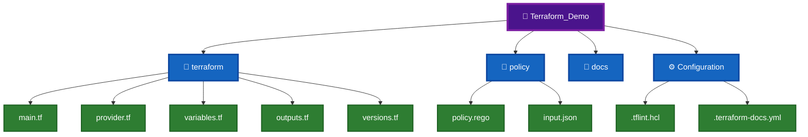

# 🛠️ Terraform KNIGHT Tools Installation Guide 📦

This folder contains the complete installation guides for all Terraform Quality, Security, Compliance, Policy-as-Code, and Documentation tools used throughout the **KNIGHT Framework**.

---


# 🎯 Tools Covered


---

# 📊 Complete Tool Comparison Matrix

| Tool              | Category       | Primary Purpose                  | Demo Files                         | Installation | Validation Command       | Output                 |
| ----------------- | -------------- | -------------------------------- | ---------------------------------- | ------------ | ------------------------ | ---------------------- |
| 🛡 OPA            | Policy as Code | Infrastructure Policy Validation | `policy.rego`, `input.json`        | Binary       | `opa version`            | Allow / Deny           |
| 🔍 Checkov        | Security       | Terraform Security Scan          | `main.tf`                          | Python (pip) | `checkov --version`      | Security Findings      |
| 🔐 tfsec          | Security       | Terraform Misconfiguration Scan  | `main.tf`                          | Binary       | `tfsec --version`        | Security Findings      |
| 🛡 Terrascan      | Compliance     | Compliance Validation            | `main.tf`                          | Binary       | `terrascan version`      | Compliance Report      |
| 📝 TFLint         | Quality        | Terraform Linting                | `.tflint.hcl`                      | Binary       | `tflint --version`       | Lint Report            |
| 📖 terraform-docs | Documentation  | Documentation Generator          | `README.md`, `.terraform-docs.yml` | Binary       | `terraform-docs version` | Markdown Documentation |

---

# 📂 Local Demo Project Setup



---

# 🔄 Complete Local Terraform Quality Gate Workflow


---

# 📚 Installation Guides

| Step | Guide                                     | Category      | Purpose                   |
| ---- | ----------------------------------------- | ------------- | ------------------------- |
| 1️⃣  | `01-OPA_Installation_Guide.md`            | Governance    | Install Open Policy Agent |
| 2️⃣  | `02-Checkov_Installation_Guide.md`        | Security      | Install Checkov           |
| 3️⃣  | `03-tfsec_Installation_Guide.md`          | Security      | Install tfsec             |
| 4️⃣  | `04-Terrascan_Installation_Guide.md`      | Compliance    | Install Terrascan         |
| 5️⃣  | `05-TFLint_Installation_Guide.md`         | Quality       | Install TFLint            |
| 6️⃣  | `06-Terraform-Docs_Installation_Guide.md` | Documentation | Install terraform-docs    |


---

# 📋 Installation Order


---

# 📚 Post installation Cumulative Verification 

```text
C:\Users\Kureti Venkat Nishit>opa version

Version: 1.19.0
Build Commit: 1e32c796e8979b1bda2f768138500b1deb95ff24-dirty
Build Timestamp: 2026-07-30T19:38:54Z
Build Hostname:
Go Version: go1.26.5
Platform: windows/amd64
Rego Version: v1
WebAssembly: available
```

```text

C:\Users\Kureti Venkat Nishit>checkov --version

File association not found for extension .py
3.3.9

C:\Users\Kureti Venkat Nishit>tfsec --version

======================================================
tfsec is joining the Trivy family

tfsec will continue to remain available
for the time being, although our engineering
attention will be directed at Trivy going forward.

You can read more here:
https://github.com/aquasecurity/tfsec/discussions/1994
======================================================
v1.28.14
```

```text
C:\Users\Kureti Venkat Nishit>terrascan version

version: v1.19.9
```

```text
C:\Users\Kureti Venkat Nishit>tflint --version

TFLint version 0.64.0
+ ruleset.terraform (0.15.0-bundled)
```

```text
C:\Users\Kureti Venkat Nishit>terraform-docs --version

terraform-docs version v0.24.0 9d44551 windows/amd64
```

---
# 📖 References

### 🌍 Terraform

[](https://developer.hashicorp.com/terraform/docs)
[](https://github.com/hashicorp/terraform)

---

### 📜 OPA

[](https://www.openpolicyagent.org/docs/latest/)
[](https://github.com/open-policy-agent/opa)

---

### 🛡️ Checkov

[](https://www.checkov.io/)
[](https://github.com/bridgecrewio/checkov)

---

### 🔐 tfsec

[](https://aquasecurity.github.io/tfsec/)
[](https://github.com/aquasecurity/tfsec)

---

### 📋 Terrascan

[](https://runterrascan.io/)
[](https://github.com/tenable/terrascan)

---

### 📝 TFLint

[](https://github.com/terraform-linters/tflint/blob/master/README.md)
[](https://github.com/terraform-linters/tflint)

---

### 📖 terraform-docs

[](https://terraform-docs.io/)
[](https://github.com/terraform-docs/terraform-docs)
---
