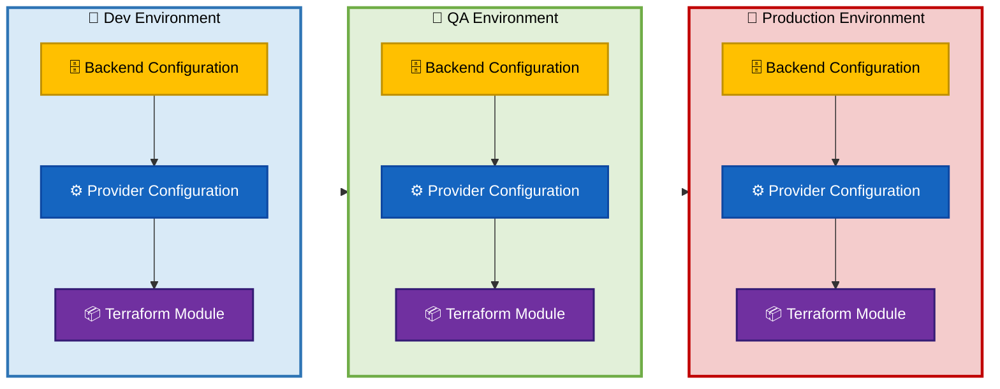
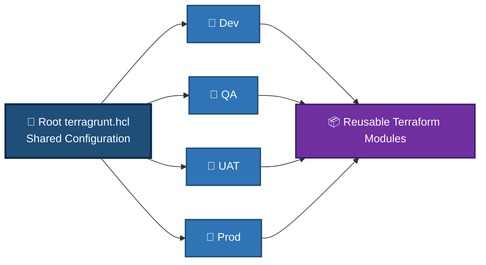
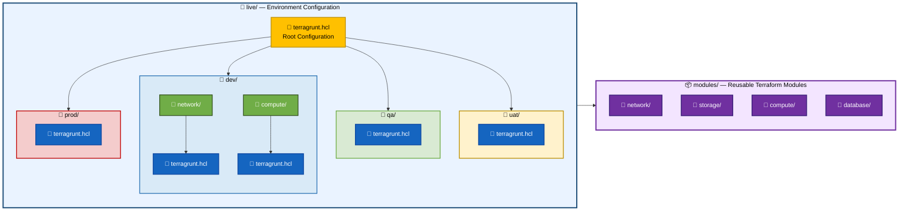
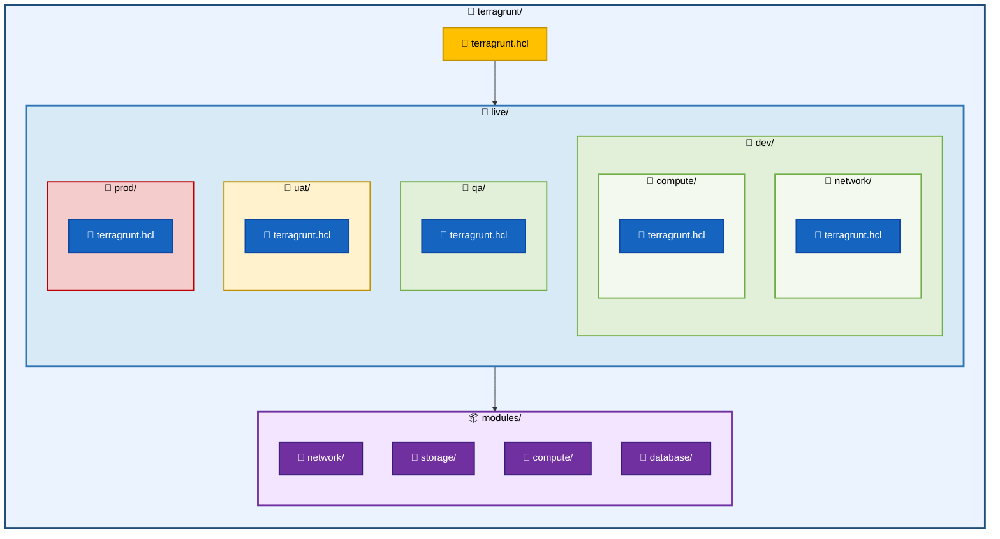
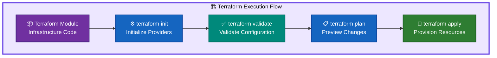
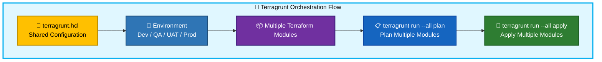
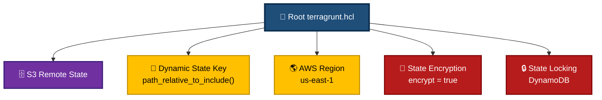
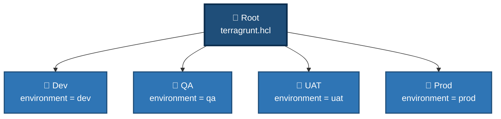
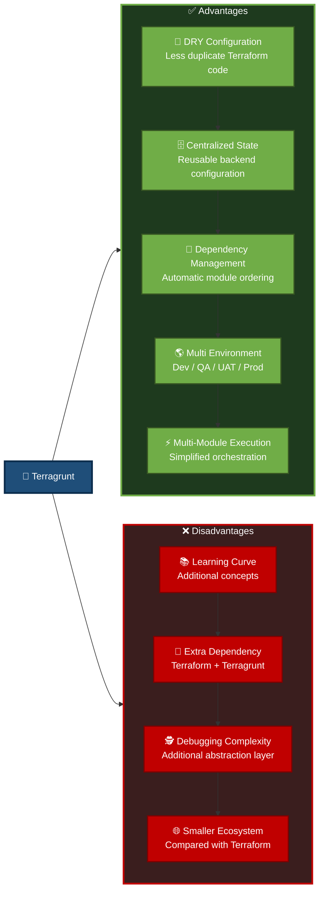
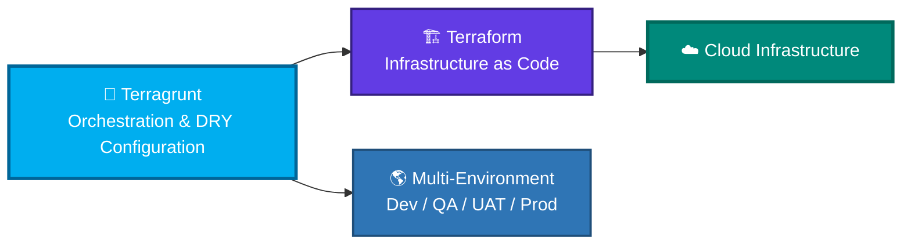

# 🚀 Terragrunt Module Architecture and Usage Guide

This directory provides a **practical, hands-on demonstration of Terragrunt and its integration with Terraform**. The goal is to show how Terragrunt can simplify the management of Terraform infrastructure as the number of **modules, environments, and deployment dependencies** grows.

Throughout this guide, the focus is on understanding how Terragrunt helps build a **clean, scalable, and maintainable Infrastructure as Code (IaC) architecture** by introducing:

- ♻️ **DRY Configuration** — Reduce duplication across Terraform environments.
- 🗂️ **Structured Environment Management** — Organize Dev, QA, UAT, and Production configurations consistently.
- 🗄️ **Centralized State Configuration** — Define and reuse remote-state settings across environments.
- 🔗 **Dependency Management** — Establish relationships and execution order between Terraform modules.
- 📦 **Reusable Terraform Modules** — Separate infrastructure logic from environment-specific configuration.
- ⚡ **Multi-Module Orchestration** — Execute Terraform operations across multiple modules using Terragrunt.
- 🔐 **Consistent Infrastructure Practices** — Apply common configuration and deployment patterns across environments.

> The objective is not to replace Terraform, but to demonstrate **where Terragrunt adds value on top of Terraform** and how it can help teams manage infrastructure more effectively at scale.

## 📚 Core Concepts & Educational Overview
**Terraform defines and provisions infrastructure, while Terragrunt helps organize, configure, and orchestrate Terraform across multiple modules and environments.**---

### 🏗️ What is Terragrunt?

**Terragrunt** is a thin wrapper around Terraform that provides additional capabilities for managing **large-scale, multi-environment infrastructure deployments**.

It helps teams:

* ♻️ Reduce duplicated Terraform configuration
* 📂 Organize infrastructure by environment
* 🗄️ Centralize remote state configuration
* 🔗 Manage dependencies between Terraform modules
* 🌎 Maintain Dev, QA, UAT, and Production environments
* ⚡ Execute Terraform operations across multiple modules

The primary goal is to keep the infrastructure code **DRY — Don't Repeat Yourself**.

---

## 🎯 Why Use Terragrunt?

A traditional Terraform implementation may require repeating the same configuration across multiple environments.



### 🔄 Terragrunt Approach

You can immediately follow it with the **Terragrunt solution**, which makes the contrast much clearer:

Terragrunt allows common configuration to be defined once and inherited by multiple environments.



### 🔑 Key Benefits

* **🧩 Single Source of Truth** — Common configuration is defined centrally.
* **♻️ DRY Configuration** — Reduces repeated Terraform configuration.
* **🗄️ Centralized State Management** — Remote state configuration can be shared.
* **🔗 Dependency Management** — Modules can be executed according to their dependencies.
* **🌎 Environment Isolation** — Each environment maintains its own configuration and state.
* **⚡ Multi-Module Execution** — Multiple Terraform modules can be planned or applied together.

---

# 📂 Terragrunt Directory Architecture

A typical Terragrunt project separates **live environment configuration** from **reusable Terraform modules**.



---

## 🗂️ Directory Structure


---

# ⚙️ Terraform vs Terragrunt Workflow

Terragrunt does not replace Terraform. Instead, it **orchestrates Terraform modules and configurations**.

## 🏗️ Terraform Workflow



## 🚀 Terragrunt Workflow



---

# 🛠️ Demo Execution & Usage

Navigate to the Terragrunt working directory:

```bash
cd terragrunt
```

Initialize the configuration:

```bash
terragrunt run --all init
```

Generate execution plans:

```bash
terragrunt run --all plan
```

Apply the infrastructure:

```bash
terragrunt run --all apply
```

Destroy the demonstration infrastructure when finished:

```bash
terragrunt run --all destroy
```

> 💡 **Demo Recommendation:** Run `plan` before `apply` during demonstrations so that the generated infrastructure changes can be reviewed before provisioning resources.

---

## 🔄 Terragrunt Execution Flow

```mermaid
flowchart TD

START(["🚀 Start Demo"]):::start

INIT["⚙️ terragrunt run --all init"]:::command

PLAN["📋 terragrunt run --all plan"]:::command

DECISION{"❓ Plan<br/>Reviewed?"}:::decision

APPLY["🚀 terragrunt run --all apply"]:::success

DESTROY["🗑️ terragrunt run --all destroy"]:::cleanup

END(["✅ Demo Completed"]):::end


START --> INIT
INIT --> PLAN
PLAN --> DECISION

DECISION -->|✅ Yes| APPLY
DECISION -->|❌ No| PLAN

APPLY --> DESTROY
DESTROY --> END


classDef start fill:#1F4E79,stroke:#0B2D4D,color:#FFFFFF,stroke-width:3px
classDef command fill:#1565C0,stroke:#0D47A1,color:#FFFFFF,stroke-width:2px
classDef decision fill:#F9A825,stroke:#F57F17,color:#000000,stroke-width:3px
classDef success fill:#2E7D32,stroke:#1B5E20,color:#FFFFFF,stroke-width:2px
classDef cleanup fill:#B71C1C,stroke:#7F0000,color:#FFFFFF,stroke-width:2px
classDef end fill:#00897B,stroke:#00695C,color:#FFFFFF,stroke-width:3px
```

---

# 🧩 Key Configuration Patterns

## 📄 Root `terragrunt.hcl`

The root configuration acts as the **common configuration layer** for the environments.

```hcl
remote_state {
  backend = "s3"

  config = {
    bucket = "knight-tfstate-${get_aws_account_id()}"
    key    = "${path_relative_to_include()}/terraform.tfstate"
    region = "us-east-1"

    encrypt        = true
    dynamodb_table = "knight-terragrunt-locks"
  }
}
```

### 🔍 Configuration Breakdown



> ⚠️ **Note:** Remote-state locking configuration depends on the Terraform/AWS/Terragrunt versions used in the demo. Validate the chosen backend configuration against the versions installed in the environment before presenting it as a production pattern.

---

## 🌎 Environment-Specific Configuration

Each environment can inherit the root configuration using `include`.

```hcl
include {
  path = find_in_parent_folders()
}

inputs = {
  environment = "dev"
  project     = "KNIGHT"
}
```

The same pattern can be used for QA, UAT, and Production while changing only the environment-specific inputs.



---

# 🔗 Dependency Management

One of Terragrunt's useful capabilities is managing dependencies between infrastructure components.

For example:


The dependency relationship can ensure that infrastructure is processed in an appropriate order.

---

# 📊 Terragrunt Advantages & Disadvantages



---

# 🧪 Provisioned Resources & Demo Scope

This demonstration is designed to focus on **Terragrunt architecture and orchestration** rather than maintaining long-running cloud infrastructure.

The demo can demonstrate:

* 🗄️ Remote Terraform state management
* 🔒 State locking
* 🧩 DRY configuration
* 🌎 Multi-environment configuration
* 🔗 Module dependencies
* ⚡ Multi-module execution
* 📋 Terraform plan generation
* 🚀 Terraform infrastructure deployment
* 🗑️ Automated teardown

### 🧹 Cleanup

After completing the demonstration, remove the demonstration infrastructure:

```bash
terragrunt run --all destroy
```

Verify that the demonstration resources have been removed before considering the demo complete.

---

# 🏁 End-to-End Terragrunt Architecture


---

## 🎯 Learning Objectives

After completing this demonstration, you should understand:

* [ ] What Terragrunt is and how it complements Terraform
* [ ] Why DRY configuration is useful for multi-environment infrastructure
* [ ] How `terragrunt.hcl` inheritance works
* [ ] How `path_relative_to_include()` can create environment-specific state paths
* [ ] How Terragrunt organizes reusable Terraform modules
* [ ] How dependencies can be represented between modules
* [ ] How to execute Terraform operations across multiple modules
* [ ] How to manage Dev, QA, UAT, and Production configurations
* [ ] How remote state and state locking fit into the architecture
* [ ] How to safely plan, apply, and destroy demonstration infrastructure

---

## 🚀 Key Takeaway

> **Terraform provisions infrastructure. Terragrunt organizes, configures, and orchestrates Terraform at scale.**

The key architectural pattern demonstrated in this directory is:



**Terragrunt is most valuable when Terraform infrastructure grows beyond a small number of modules and environments, where configuration reuse, dependency management, state consistency, and orchestration become increasingly important.**
